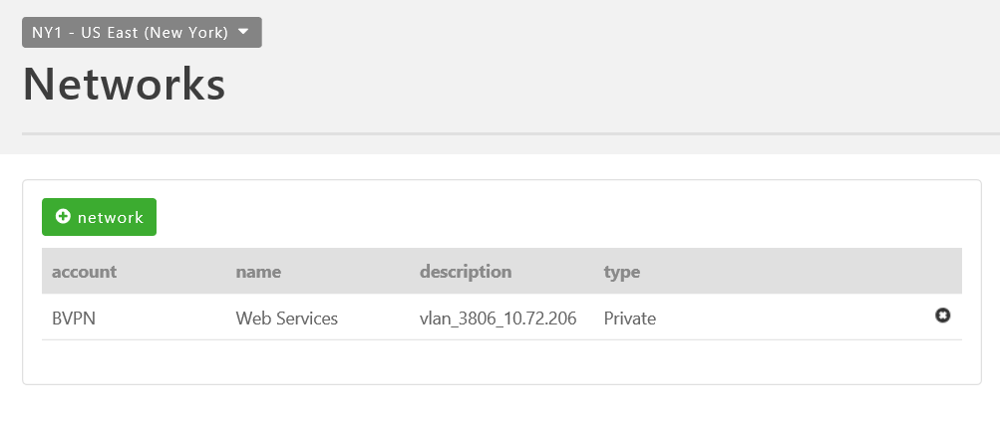

{{{
  "title": "Creating Cross Data Center Firewall Policies",
  "date": "9-23-2016",
  "author": "",
  "attachments": [],
  "contentIsHTML": false
}}}

### Creating Cross Data Center Firewall Policies

In addition to being able to connect networks within a particular data center through [Intra Data Center](../CenturyLink Cloud/connecting-data-center-networks-through-firewall-policies.md) firewall policies, users can also create firewall policies that span cloud data centers. This helps enterprises build sophisticated and secure network topologies that take advantage of our global footprint while meeting an organization's functional needs.

### General Notes

 * In the current iteration customers cannot apply Firewall ACL's to traffic traversing cross data center policies.
 * Each CenturyLink Cloud Data Center location provides unique private IP networks to customers. This eliminates the risk of overlapping IP space, hence no NAT is required in the implementation.
 * Policies between sub-accounts must be made from the shared parent account.

### Connecting Networks within a Single Account

1. [Create network VLAN(s)](../CenturyLink Cloud/creating-and-deleting-vlans.md) in each of the respective CenturyLink Cloud Data Centers.
2. Validate the networks are in place in your CenturyLink Cloud account using the **Network** menu item and selecting the appropriate Data Center. In the sample below, networks exists in both UC1 (Santa Clara) & DE1 (Germany).

  

  

**OPTIONAL:** Perform a test ICMP ping between virtual instances private IP addresses in different Cloud Data Centers. This test should fail as no Cross Data Center Firewall Rule is in place between networks in UC1 & DE1.

  

3. Using the left side navigation bar, click on **Network** > **Firewall**.

  

4. Select **Either** the source or destination CenturyLink Cloud Data Center node (as policies when applied are two-way rules). Next, choose to the **Cross Data Center** tab.

  

5. Choose **Add Policy**, **Set Local Address**.

  

6. Select the appropriate network or CIDR IP range for the local address(es). In this example, we are using the entire 10.120.69.0/24 network block for a local address in UC1.

  

  

7. Choose **Set Remote Address(es)**. Select the appropriate network or CIDR IP range for the remote address(es). In this example, we are using the entire 10.110.226.0/24 network block for a remote address in DE1.

  

8. Once complete, press the **Save** button. Your new Cross Data Center Rule will take about 60 seconds to process in the Queue. You can review its progress using the Queue Menu item.

  

9. Confirm the Cross Data Center Firewall Policy is functional by performing another ICMP ping test between virtual instances located in the two networks in different Data Center nodes. In this example, we are able to ping a virtual instances in Germany (DE1) from Santa Clara (UC1).

  

### Connecting Networks Across a Parent & Sub-Account Hierarchy

1. Create the appropriate Parent & Sub-Account Hierarchy. Refer to the [Account Hierarchy Primer](../Accounts & Users/account-hierarchy-user-network-and-firewall-policy-primer.md) for more information. **Note**, policies between sub-accounts must be made from the shared **parent account**.

2. Create network VLAN(s) in the respective CenturyLink Cloud Data Center and Accounts.  We recommend [applying friendly names](../CenturyLink Cloud/add-a-user-friendly-name-to-vlans.md) to Networks.

3. Validate the networks are in place in your CenturyLink Cloud accounts using the Networks menu item and selecting the appropriate Data Center.  In the sample below, a "Web Services" network in NY1 & a "DB VLAN" network in IL1 are provisioned under unique sub-accounts BVPN and MMTM.  

  

  

4. Create Virtual Instances within the appropriate network (VLAN). In this example, we have created two VMs as follows:

  * Web VM (IP 10.72.206.12) in "Web Services" 10.72.206.0/24 Network (VLAN)

  * DB VM (IP 10.99.18.12) in "DB VLAN" 10.99.18.0/24 Network (VLAN)

  **OPTIONAL:** Perform a test ICMP ping between the networks.  This test should fail as no Firewall Rule is in place between these networks in NY1 and IL1. In this example, a test from Web VM (IP 10.72.206.12) to DB VM (IP 10.99.18.12):

  

5. From the **parent account**, using the left side navigation bar, click on **Network** > **Firewall**.

  

6. Select **Either** the source or destination CenturyLink Cloud Data Center node (as policies when applied are two-way rules). Next, choose to the **Cross Data Center** tab.

7. Choose the desired **Source Account** and **Destination Account** in which the desired networks reside. The "Business Name" of the account is displayed. The Business Name can be viewed or edited by navigating from the left side navigation bar selecting Setttings > Profile. In this example, in NY1 we chose Sub-account 1 and Sub-account 2.  

  

8. Choose **Add Policy**, then **Set Local Address**.

  

9. Select the appropriate source network followed by the subnet size.  Customers can choose to allow an entire network (VLAN), CIDR blocks, or individual IPs in the rule set.  In this example, we are choosing the Web Services (10.72.206.0/24) network and the entire /24 range of the subnet.

  

  

10. Choose **Select Remote Address**.  Select the appropriate destination network followed by the subnet size.  Customers can choose to allow an entire network (VLAN), CIDR blocks, or individual IPs in the rule set.  In this example, we are choosing the DB VLAN (10.99.18.0/24) network and the individual DB VM (10.99.18.12) for this rule set.

  

11. Once complete, press the **Save** button.  Your new Cross Data Center Rule will take on average about 60 seconds to process in the Queue.  You can review its progress using the Queue Menu item.

  

12. Confirm the Cross Data Center Firewall Policy is functional by performing an ICMP Ping test between virtual instances located in the two networks.  In this example, we are now able to ping from the Web VM (10.72.206.12) to the DB VM (10.99.18.12).  

  
