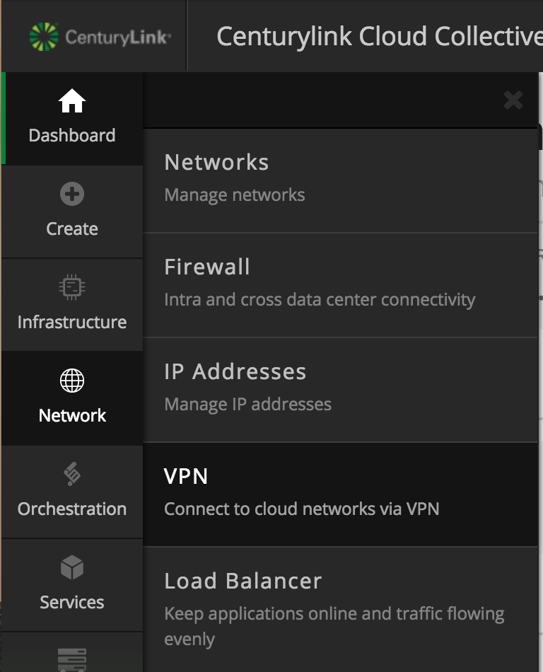

{{{
  "title": "How To Configure Client VPN",
  "date": "3-21-2018",
  "author": "john.mastin@ctl.io",
  "attachments": []
}}}

### Overview

Client VPN enables users to connect to their secure isolated network. Each account has their own isolated VPN service that is provided at no charge. This service is built into the platform and managed by the network operation center.

The initial configuration just requires a certificate to be downloaded and used for connecting to the VPN service. You can also [configure two-factor authentication](../CenturyLink Cloud/configure-two-factor-authentication-for-client-vpn.md) to require both a username and password. To learn more about ways to connect such as persistent VPN or direct connection, please review [Network Access Options for Connecting to the CenturyLink Cloud Platform](../CenturyLink Cloud/network-access-options-for-connecting-to-centurylink-clouds-platform.md).

### Current Limitations

There are only a few limitations on this service as it is based on the [OpenVPN](http://www.openvpn.net) project.

- Maximum default concurrent users is 19.  This number can be increased to 200 via a [Service Task](https://www.ctl.io/knowledge-base/service-tasks/requesting-service-tasks-on-centurylink-cloud/) (if you need more connections, review the different [Network Access Options for Connecting to the CenturyLink Cloud Platform](../CenturyLink Cloud/network-access-options-for-connecting-to-centurylink-clouds-platform.md))
- Maximum Connection: 1Gbps

### Getting Connected

In order to maximize resource efficiency on the platform, the Client VPN service will **not be activated** until after you have built your first server. _Make sure you first deploy a server in order to have your VPN server activated._

#### Downloading VPN Configuration Files

1. Log on to the [Control Portal](https://control.ctl.io/). Using the left side navigation bar, click on **Network** > **VPN**.
  

2. On the VPN Configuration page, find the existing VPN certificate and click the "download" button. (You may also use the "create certificate" button to create separate VPN certificates for other users.)
  

#### Installing the Client

**How to Configure Client VPN – Windows**

1. **Download and install the latest OpenVPN client for Windows**
  1. Download the OpenVPN client from the [OpenVPN client](https://openvpn.net/index.php/open-source/downloads.html) website. There is currently a known issue when using OpevnVPN client version 2.4.5 with OpenVPN servers provisioned prior to June 2017, to resolve use  2.3.18-I602 64-bit release. Additional information can be found in our [Troubleshooting Article](../CenturyLink Cloud/vpn-client-connection-troubleshooting.md).
  2. Double-click the installer and accept the UAC prompt.
  3. Accept all of the default options.
2. **Copy the downloaded OpenVPN configuration files into place**
  1. Extract all of the files contained the downloaded zip file from the Control Portal.  Allow it to create a directory named after the configuration.
  2. Navigate to the C:\Program Files\OpenVPN\config directory.
  3. Move the directory containing your configuration files out of Downloads and into the C:\Program Files\OpenVPN\config directory.  Moving the whole directory will allow you to setup the ability to connect to [multiple OpenVPN](https://www.ctl.io/knowledge-base/network/connect-to-multiple-openvpn-instances/) instances in the future, if necessary.  Accept any prompts for administrative access to copy these files.
3. **Setup the OpenVPN GUI to always run as Administrator** The OpenVPN GUI needs to be run as Administrator in order to properly set up additional routes in the routing table on your Windows PC.
  1.	Press the Start button and navigate to the OpenVPN application folder (via All Programs or All Apps)
  2.	If on Windows 8.1/10, right click on the OpenVPN GUI and select Open File Location
  3.	Right click on the OpenVPN GUI and select Properties
  4.	On the Properties screen, select the Shortcut tab, and click on the Advanced… button.
  5.	On the Advanced Properties pop-up, select the checkbox for Run as Administrator.  Click the OK button.
  6.	Click the OK button on the OpenVPN GUI Properties pop-up.
  7.	Click the Continue button to allow this change with Administrator permissions.
  8.	Exit out of Windows Explorer.
  9.	Right click on the OpenVPN GUI shortcut on your desktop and select Properties.
  10.	Follow steps 4-7 to setup your desktop shortcut to always run as Administrator.
4. **Connect to your datacenter using the OpenVPN client**
  1.	Press the Start button and navigate to the OpenVPN folder.  Click on OpenVPN GUI.  Alternately, you can double-click on the OpenVPN GUI shortcut on your desktop.
  2.	Accept the UAC prompt to run the OpenVPN GUI as Administrator.
  3.	The OpenVPN GUI icon will appear in your System Tray.  It will appear as a computer screen with a lock in front of it.
  4.	Right click on the OpenVPN GUI and select Connect.
  5.	The OpenVPN client will connect using your newly installed certificate.
  6.	Once it successfully connects, it will minimize back to your System Tray.  
  7.	You are now connected to your home datacenter.
5. **Connect to servers**
  1.	Use the native Remote Desktop Client to connect to Windows servers.
  2.	Download and install [PuTTY](http://www.chiark.greenend.org.uk/~sgtatham/putty/download.html) to connect to Linux servers.
6. **Disconnect from OpenVPN**
  1. Right click on the OpenVPN GUI icon in the system tray.
  2. Select Disconnect.

**How to Configure Client VPN – Mac**

1.	**Download and install the latest Tunnelblick OpenVPN client**
  1.	Download the latest stable release from the [Tunnelblick](https://tunnelblick.net/downloads.html) website.
  2.	Double click the disk image (.dmg) to mount it
  3.	Double click the Tunnelblick icon to install it.
  4.	Click the **Open** button to accept the warning about opening downloaded files.
  5.	Supply your Mac user account and password in order to install Tunnelblick into the Applications folder.
  6.	After installation, click the **Quit** button to finish.
  7.	Reboot your Mac so that the newly added kernel extensions will properly load.
2.	**Copy the downloaded OpenVPN configuration files into place**
  1.	Extract the downloaded zip file from the Control Portal.
  2.	Create a new folder in your Documents directory called tunnelblick_config.
  3.	Copy the extracted configuration directory to the ~/Documents/tunnelblick_config folder.
  4.	Navigate to the ~/Documents/tunnelblick_config/<config_dir> folder and double-click the .ovpn file.
  5.	Click the **Open** button to accept the warning about opening downloaded files.
  6.	Choose **All Users** or **Only Me** to add the configuration to Tunnelblick.
  7.	Supply your Mac user account and password in order to add the configuration to Tunnelblick.
  8.	Click on the **Do not check for a change** button to not check for public IP address changes.
  9.	Select the **Check Automatically** button so that Tunnelblick will periodically check for updates.
3.	**Connect to your datacenter using Tunnelblick**
  1.	Click on the Tunnelblick icon in the menu bar.
  2.	Select **Connect**.  You may get a pop-up window stating that 'ns-cert-type' was deprecated in OpenVPN 2.4 and removed in OpenVPN 2.5.  It is safe to click the OK button to dismiss the pop-up.  You should still be able to connect.
  3.	The Tunnelblick icon will change to show you that you have successfully connected.
  4.	If you get any warnings about public IP address not changing, you can click on the box for **Do not check for IP address changes** and then the **OK** button.
4.	**Connect to servers**
  1.	Use the native **Terminal** app to ssh to Linux servers.
  2.	Download and install an RDC client such as **Microsoft Remote Desktop** from the Mac App Store to connect to Windows servers.
5.	**Disconnect from OpenVPN**
  1.	Click on the Tunnelblick icon in the menu bar.
  2.	Select **Disconnect**.
  3.	The Tunnelblick icon will change to show you that you have successfully disconnected.

**How to Configure Client VPN – Linux**

1.	**As root, download and install the latest OpenVPN client and its dependencies**

**Ubuntu**: apt-get install openvpn -y

**RHEL/CentOS/Fedora**: yum install openvpn –y

**Note**: For CentOS, you may need to also add the epel-release repo to yum
	    yum install epel-release

2.	**As root, copy the downloaded OpenVPN configuration files into place**
  1.	Extract the downloaded zip file from the Control Portal.
  unzip default.zip
  2.	Copy the extracted configuration directory to the /etc/openvpn directory.
  mv ./<config_dir> /etc/openvpn
  3.	Rename the .ovpn file to have a .conf extension in the /etc/openvpn/<config_dir> directory
  mv default.ovpn default.conf
3.	**As root, connect to your datacenter using the OpenVPN client**
  1.	If you are using RHEL/CentOS/Fedora, export the following variable prior to starting the OpenVPN client.  If you do not do this step, you will see the OpenVPN client connect, fail with a TLS handshake error and retry in an endless loop.
  export OPENSSL_ENABLE_MD5_VERIFY=1
  2.	Change directories to /etc/openvpn/<config_dir> and run openvpn command with the .conf file as your argument.
  cd /etc/opevpn/<config_dir>
  openvpn ./default.conf
  3.	You have successfully connected when you see the message “Initialization Sequence Completed”
4.	**Connect to servers**
  1.	Use the native Terminal app to ssh to Linux servers.
  2.	Use an RDC client to connect to Windows servers.
5.	**Disconnect from OpenVPN**
  1.	Go back to the Terminal window where you started the OpenVPN client and type Control-C to disconnect.

### FAQ

**Q: After I select "Connect", my OpenVPN client never establishes a connection (or the icon does not turn "green"). What could be wrong?**

A: Review the tips described in [VPN Client Connection Troubleshooting](../CenturyLink Cloud/vpn-client-connection-troubleshooting.md).

**Q: I have multiple sub accounts and want to be able to connect to each one's VPN individually. How can I do that?**

A: By default, connecting to the VPN of a parent account will NOT provide access to the sub account networks as well. One option would be to [Connect Networks Across a Parent & Sub-Account Hierarchy](../CenturyLink Cloud/connecting-data-center-networks-through-firewall-policies.md).  This way, when you can log into OpenVPN on the parent account, you will be able to RDP/SSH to servers on the sub account network.  Another option would be to maintain multiple OpenVPN connections on your machine.  Please follow the steps describing how to [Connect to Multiple OpenVPN Instances](../CenturyLink Cloud/connect-to-multiple-openvpn-instances.md).

**Q: Can I configure my VPN to require two-factor authentication?**

A: Yes, just follow the steps describing how to [Configure Two-Factor Authentication for Client VPN](../CenturyLink Cloud/configure-two-factor-authentication-for-client-vpn.md) to require both a username and password along with the certificate.

**Q: Is this service using secure SSL?**

A: This service uses SSL certificates but does not run on the standard SSL port. In your configuration file (ends in OVPN) you can see the remote information such as: `remote [IPHOST] [PORT]` (example: `remote 64.94.142.9 1194`).

**Q: Is this a shared or isolated service?**

A: This is an isolated service for every account. Each account receives their own VPN instance to keep isolation and high security.

**Q: Who handles the patching/maintenance of this service?**

A: The platform handles all of the VPN instance patching and maintenance. Occasionally you will need to upgrade you VPN client application.

**Q: What if I want to use my own VPN service?**

A: There are two ways you can do this:
  1. If it is a physical device, you will need to have a persistent connection to your secure network. This will allow you to host a physical VPN server yourself and route across the persistent connection.
  2. If you would like to use a software-based VPN server, you can install it on a virtual server and configure the firewall rules to allow access. Many of our customers have done this but it will not be supported by the NOC.

**Q: When I connect to the service, why can't I ping/connect to the server?**

A: This is one of the most common issues with Windows and the OpenVPN client. Make sure to right-click on the application and selecting "Run as Administrator" when launching the OpenVPN client.

**Q: Can I use this to connect to my office?**

A: You cannot use it as a direct connect. To learn more about ways to connect such as persistent VPN or direct connection, please review [Network Access Options for Connecting to the CenturyLink Cloud Platform](../CenturyLink Cloud/network-access-options-for-connecting-to-centurylink-clouds-platform.md).

**Q: Do I need to install an OpenVPN server?**

A: No, every customer account receives a dedicated OpenVPN server by default. Please note that it cannot be removed or disabled due to platform dependencies.
