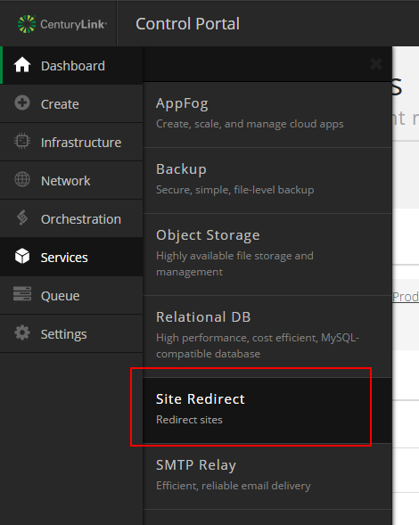
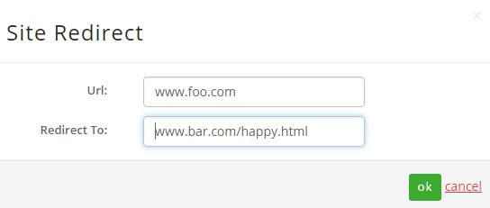

{{{
  "title": "How to Enable Website Redirect",
  "date": "8-2-2016",
  "author": "Chris Little",
  "attachments": [],
  "contentIsHTML": false
}}}

### Overview
Site Redirect enables the ability to do a HTTP based redirect of a web site domain name to any URL. This can be enabled self service via the Control Portal.

### Steps

1. In the Control Portal, navigate to **Services, Site Redirect**.

    

2. Select **Create Redirect**.

3. Populate the **URL** and **Redirect To** fields appropriately.  For example, if you'd like to redirect www.foo.com to www.bar.com/happy.html the entry would be performed as follows:

    

3. Once that is entered then you need to edit the DNS entry for www.foo.com to point to the correct site:
  * For a CNAME record: www CNAME siteredirect.tier3.com (point the CNAME to siteredirect.tier3.com)
  * For a A record: www A 70.42.161.28 (point the A record to 70.42.161.28)

Once that is completed and DNS for www.foo.com now points to siteredirect.tier3.com or 70.42.161.28 it can take up to 1 hour to replicate the
redirection settings.
