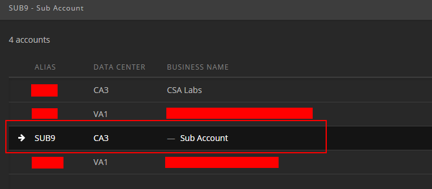
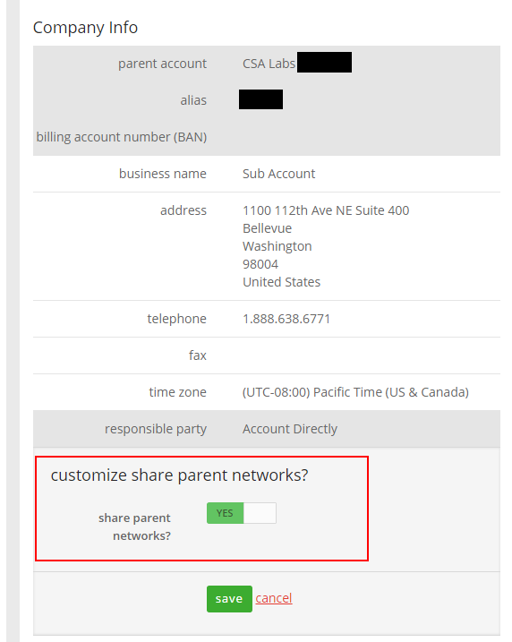

{{{
  "title": "Enable Share Parent Networks Feature",
  "date": "8-2-2016",
  "author": "Chris Little",
  "attachments": [],
  "contentIsHTML": false
}}}

### Overview
The CenturyLink Cloud platform has the capability to share networks within a parent account downward into sub-accounts.  This feature is disable by default but can be enabled in a self-service manner.

### Audience
* CenturyLink Cloud Users

### Steps

1. Login as an Account Administrator role in the parent account.

2. Navigate to the sub-account in which you want to leverage networks from the parent account.

    

3. Select **Settings, Account Profile** to open the Account information page.

4. Click on the **Share Parent Networks** option and toggle it to **enabled.**  Finally, **save** the change.

    
