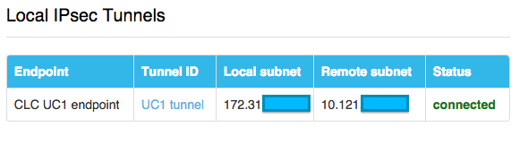

{{{LumenLumenLumenLumenLumenLumenLumenLumenLumenLumenLumenLumenLumenLumen
  "title": "Lumen Cloud Guide to Cohesive VNS3 Network Appliance ",
  "date": "9-24-2015",
  "author": "Eric Schubert",
  "attachments": [],
  "contentIsHTML": false,
  "sticky": false
}}}

### Table of Contents

* [Cohesive VNS Overview](#Cohesive-VNS-Overview)
* [Prerequisites](#Prerequisites)
* [General Notes](#General Notes)
* [Use Cases (Where it’s a good fit)](#Use-Cases-Where-it’s-a-good-fit)
* [Limitations](#Limitations)
* [Conclusions](#Conclusions)

### Cohesive VNS Overview
The Cohesive VNS3 Network Appliance is an OpenVPN based solution that can be configured for separating network location and network identity by way of overlay networks. In addition the VNS3 appliance can also be a VPN tunnel endpoint providing end-to-end encryption of data in transit.

### Prerequisites
Installation is very well documented here in the Lumen Cloud Knowledge Base and also on the Cohesive site. There are a few prerequisites to work through in order to ensure a seamless set up. Start here with this Lumen Cloud focused set up guide from Cohesive: [Cohesive Setup Guide](//cohesive.net/dnld/Cohesive-Networks_VNS3-3.5-CenturyLink.pdf)

In order to install a Cohesive VNS3 appliance within Lumen Cloud please follow this KB article: [Getting Started with Cohesive](../../Ecosystem Partners/Marketplace Guides/getting-started-with-cohesiveft-vns3-partner-template.md)

Once the device is installed it will still require some basic configuration. [Look here](//cohesive.net/vns3/centurylink)  for some key resources including a link to the current VNS3 Config Guide. Follow the config guide to complete the set up of the device. The set up requirements will vary based on what use case is being implemented so typically just the relevant sections of the config guide will need to be followed.

The Cohesive VNS3 appliance has a very easy to use web based interface.

A look at the menu options for the Cohesive VNS3 Network Appliance

### General Notes

As the setup and configuration of the Cohesive VNS3 device has already been well documented (see the links under the previous section titled – Prerequisites) this article will focus on primary use cases for the device with in Lumen Cloud.

### Use Cases (where it’s a good fit)
Two primary use cases for the VNS3 appliance within Lumen Cloud:

1.	IP Addressing Flexibility with an Overlay Network
2.	End-to-End Encryption with VPN tunneling

Let’s explore each of these in greater detail.

### Use Case #1: Overlay Network allows limited IP address spacing flexibility

In the above diagram, we have 3 separate VMs, 2 on a VLAN in VA1 and 1 in UC1. All 3 are sharing the same address space of 172.31.1.0/24. All 3 servers can communicate on this network and function as if they were on the same network when in fact they can be spread across datacenters and across customer locations.

This overlay network configuration is accomplished by adding an OpenVPN client to each VM and connecting it to the VNS3 appliance, which operates as the OpenVPN server.

Pros and Cons
The overlay network configuration provides great flexibility for address spacing as it is now possible to configure a single IP space that can span multiple locations. However, there is a performance hit on communications relayed through the VNS3 appliance. See the Limitations section for further details.

### Use Case #2: End-to-End Encrypted traffic over a VPN

Certain applications or security polices may require end-to-end encryption of data in transit. The Cohesive VNS3 appliance can meet the requirement for end-to-end encryption as it encrypts both the tunnel and the traffic traversing the tunnel.
The VNS3 appliance can be configured as an IPSEC VPN endpoint. While a typical VPN connection provides an encrypted tunnel the data itself is not typically encrypted.

There are two ways to configure the Cohesive VNS3 appliance as an IPSEC VPN tunnel endpoint for providing end-to-end encryption of data in transit.

One is to use the appliance as an endpoint connecting Lumen Cloud with a customer’s on-prem or colo environment. This type of connection would replace using Lumen Cloud’s built in Site-to-Site VPN Tunnel endpoint.

The 2nd is to use the appliance as an endpoint between Lumen Cloud data centers. Configure the VNS3 appliance in one Lumen Cloud data center and use the built in Site-to-Site VPN Tunnel option in a 2nd or 3rd Lumen Cloud data center. This option replaces the built in Cross Data Center Firewall policy.

Lumen Cloud provides both of these connections options natively but for the select use cases that require end-to-end encryption of data in transit the Cohesive VNS3 may be a good option as an ‘upgrade’ to what is built into the platform.

An important point to note is the overlay network does not need to be deployed in order to take advantage of the VPN capabilities. The two use cases are independant of each other.

#### Best Practice for configuring the VPN tunnel:

Take note of the following settings that worked well when configuring the device for the 2nd option of data center to data center IPSEC tunnel:

#### On the VNS3 appliance:

#### Settings on the Site to Site VPN for Lumen Cloud

Most important call outs in the configuration are ensuring that NAT-T is on and that the Remote Identity matches what is configured on the VNS3 appliance. The other encryption settings should be flexible as long as they match on each side.

### Limitations

#### Performance Overhead
File transfer testing comparison between native cloud and traversing the Cohesive VNS3 appliance via the overlay network proved a not surprising performance hit on transfer speeds. This was most noticeable for traffic within a single VLAN and across multiple VLANs within the same data center. Tests on transfer speeds between datacenter locations performed quite while and here the overhead was minimal.

When designing an application for use with the Cohesive VNS3 appliance the recommendation is to leverage the capabilities of the appliance primarily for cross data center traffic.

#### Manageability

A couple of things to note here. First, it’s not easy to tell which VM is which within the VNS3 appliance interface. Also, each VM requires manual configuration of the OpenVPN config file in order to point back to the appliance. In a larger environment this could get difficult to manage. The Cohesive VNS3 appliance is well suited for a smaller environment where the number of machines is easier to manage.

### Conclusions

The Cohesive VNS3 appliance has a lot of options and a lot of flexibility much of which could be overwhelming to those just starting out. Following this top use cases guide should provide a starting point for success with the appliance within Lumen Cloud for the use cases described. This is especially true for those customers that have specific IP addressing and/or end-to-end encryption needs based on application or compliance requirements. To get started follow [this KB from Cohesive:](//cohesive.net/dnld/Cohesive-Networks_VNS3-3.5-CenturyLink.pdf)
