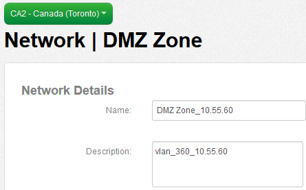

{{{
  "title": "Add a User Friendly Name to VLANs",
  "date": "10-26-2021",
  "author": "Mark Turpin",
  "attachments": [],
  "contentIsHTML": true
}}}

Add a User Friendly Name to VLANs

Lumen Cloud customers may wish to provide a friendly name to the VLAN(s) in their account. Now available globally, this feature&nbsp;makes it easy to identify the role of that specific network in the overall Cloud topology.&nbsp;

<h3>Audience</h3>

Lumen Cloud Control Portal Administrators.&nbsp;&nbsp; &nbsp;

<h3>Prerequisites</h3>
<ul>
  <li>A Lumen Cloud Account</li>
  <li>Account Admin Permissions</li>
</ul>
<h3>Detailed Steps</h3>

1. Navigate to Networks and select the existing VLAN you wish to add a friendly name.

2. Select the edit button

3. Input a new friendly name and description for the VLAN

   Alternatively, you can input a new friendly name with the subnet included.  This allows you to see the subnet on the "create server" page as the description will not be viewable there.

4. The newly assigned VLAN friendly name is now available and will be shown in the Control Portal.

