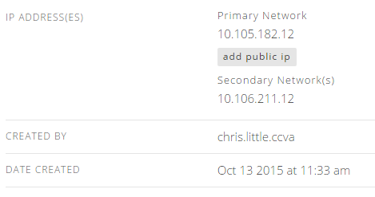
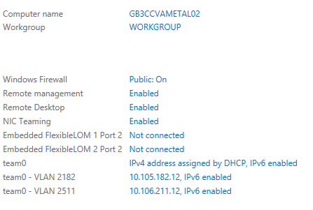

{{{
  "title": "Add or Remove Network Interface to Server using Go CLI",
  "date": "3-28-2016",
  "author": "Chris Little",
  "attachments": [],
  "contentIsHTML": false
}}}

### Overview
Customers may wish to implement additional network interfaces (NICs) on Lumen Cloud [Virtual](//www.ctl.io/servers/) or [Bare Metal](//www.ctl.io/bare-metal/) Servers.  To implement this Lumen has provided an API to [add](//www.ctl.io/api-docs/v2/#servers-add-secondary-network) or [remove](//www.ctl.io/api-docs/v2/#servers-remove-secondary-network) network interfaces.  Customers who wish to simply use a CLI tool to implement these additional interfaces can leverage our [Go CLI.](//github.com/CenturyLinkCloud/clc-go-cli)

Note: Only one vNIC per VLAN is permitted.

### Prerequisites
* A Lumen Cloud Account
* [Go CLI](//github.com/CenturyLinkCloud/clc-go-cli)
* Server Name, Network Name and optionally the IP address you wish to leverage for this additional network interface

### Required Data
* Control Portal Username and Password
* Server name you wish to add/remove an additional network interface
* Network name you wish to add/remove
* Account Alias if you wish to add/remove a network interface to a server in a sub-account

### Add a Network Interface to a Server

1. [Login to your account with the Go CLI.](//github.com/CenturyLinkCloud/clc-go-cli#log-in-to-your-centurylink-cloud-account)

    ```
    clc login --user XXX --password XXX
    ```

2. Run the add-secondary-network Go CLI command. Use the optional fields below if necessary.
  * The --ip-address field is optional if you want to set a specific IP that is free in your network.  If not specified the next available IP will be used.
  * The --account-alias field is only required if you wish to add a network interface to a server located in a sub-account

    ```
    clc server add-secondary-network --server-name XXXXX --network-name XXXXX --ip-address XXXXX --account-alias XXXX
    ```

    ```
    {
      "OperationId": "ad4a8656162649c389ca5e840c2cb623",
      "URI": "http://api.ctl.io/v2-experimental/operations/CCVA/status/ad4a8656162649c389ca5e840c2cb623"
    }
    ```

3. Validate the new interface is shown in Control and the Server.

    

    

### Remove a Network Interface from a Server

1. Run the remove-secondary-network Go CLI command.  Use the optional --account-alias field is only required if you wish to remove a network interface from a server in a sub-account

    ```
    clc server remove-secondary-network --server-name XXXXX --network-name XXXXX --account-alias XXXX
    ```

    ```
    {
      "OperationId": "f31a59e3fbff4458a988f00e9a8e97fe",
      "URI": "http://api.ctl.io/v2-experimental/operations/CCVA/status/f31a59e3fbff4458a988f00e9a8e97fe"
    }
    ```

2. Validate the network interface you requested be removed is in fact removed in Control and the Server.

    

    

**Note:** You can use these API calls to move a Server from one VLAN to another, however you will need to open a support ticket ([help@ctl.io](mailto:help@ctl.io) or [support website](https://support.ctl.io/access/unauthenticated?return_to=https%3A%2F%2Ft3n.zendesk.com%2Ftickets%2Fnew)) to coordinate the swap of primary and secondary designations for the NICs in Control to allow for the deletion of the secondary NIC.  Default and static routes will need to be reviewed and possibly updated to match the new primary.
