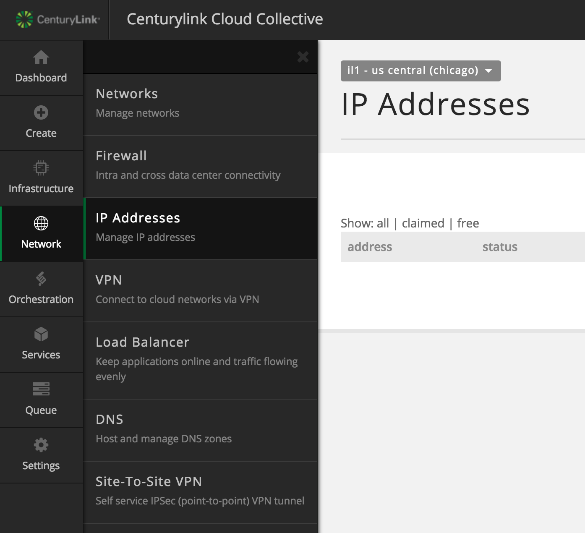
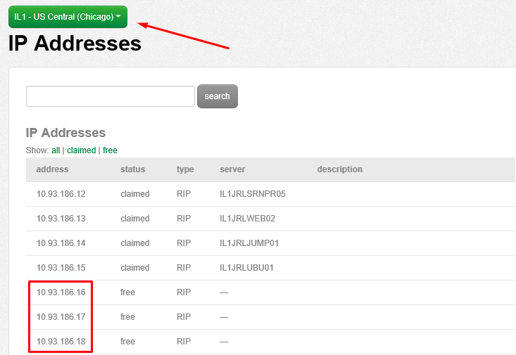
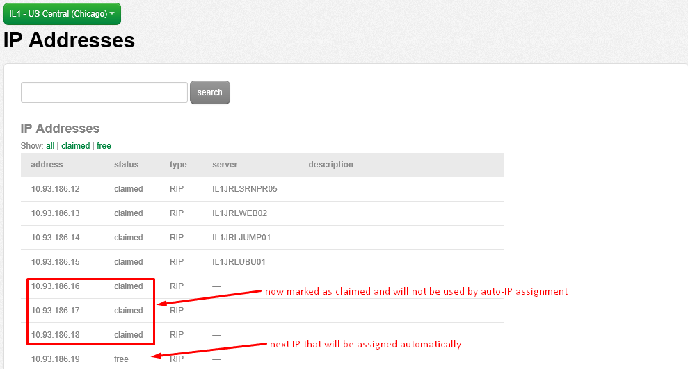

{{{
  "title": "How to Reserve IP Addresses",
  "date": "11-24-2015",
  "author": "Josh Leporati",
  "attachments": [],
  "contentIsHTML": false
}}}

### Article Overview
This article will walk you through the process of reserving IP addresses in the platform.  

There may be times when you need to prevent the auto-assignment of the next available IP in your datacenter.  One common occurrence of needing to reserve an IP would be if you need to assign a clustered resource an IP within the same network as its host services.  In this scenario, assigning the next IP would work fine, until you created a new server in the datacenter.  At that time the next available IP would get assigned from the platform, and without the IP being reserved, you would inadvertently assign the used IP to a new server since the platform does not know the IP was assigned to another resource.

### Steps to reserve an IP Address

The following steps will walk you through reserving IP addresses in the CLC Portal

1. Log on to the [Control Portal](https://control.ctl.io/). Using the left side navigation bar, click on **Network** > **IP Addresses** and browse to your IP Address list.

  

2. Ensure that you are in the correct datacenter, then identify the IP addresses you wish to mark as reserved.  In this scenario, we'll be reserving 10.93.186.16 / 10.93.186.17 / 10.93.186.18

  

3. With your IP's noted, send an email to help@ctl.io and request for the IP's to be marked as reserved.  Don't forget to specify your account information, including your PIN and the datacenter these IP's reside in.  Utilize the following template and send the required information to help@ctl.io:

  ```
  NOC,
  please mark the following IPs reserved:

  ALIAS:
  Data Center:
  Pin:
  IP List:
  ```

4. Once the reservation completion from the NOC has been completed you will see your IP's marked as claimed without any server listed for them.  Upon the next infrastructure build request the next free IP will be used, skipping those we have marked as claimed.  From here you can assign your IP's out to the solutions that require them.

 
