{{{
  "title": "Network Exchange Getting Started Guide",
  "date": "07-02-2018",
  "author": "Jason Holland",
  "attachments": [],
  "related-products" : [],
  "contentIsHTML": false,
  "sticky": false
}}}

### Product Overview

[Network Exchange](https://www.ctl.io/network-exchange/) provides secure, high-speed, redundant, automated network connections between disparate IT environments allowing for a true hybrid environment. Common environments include CenturyLink Cloud (CLC), CenturyLink Private Cloud on VMware Cloud Foundation (VCF), Colocation environments, CenturyLink Managed Hosting, CenturyLink Dedicated Cloud Compute, 3rd party networks and customer owned devices. Network Exchange is ideal for your hybrid environment as well as capacity augmentation or cloud bursting, data migration, and disaster recovery.

An instance of Network Exchange is referred to as an Exchange. An Exchange is an interconnect between two or more IT environments. A Network Exchange customer may have one or more Exchanges. A connectivity point, such as a Colocation, in an Exchange is referred to as an Endpoint.

Network Exchange is offered in a fixed monthly billing model preventing customers from experiencing unexpected charges. Please refer to the Knowledge Base article [Network Exchange Billing Guide ](network-exchange-billing-guide.md) for details on how billing is calculated.

**Note:** Redundancy to all Endpoint types are supported in Network Exchange. Non-redundant connectivity is also available for Colocation environments or Endpoints required Dedicated Access.

### Glossary

* **Network Exchange:** Provides secure, reliable, automated interconnectivity between Endpoints within a metro-area.
    * **Exchange:** An instance of Network Exchange with an interconnect between two or more IT environments. A Network Exchange customer may have one or more Exchanges.
    * **Endpoint:** A connectivity point for a given Exchange.

* Common Provider business models include:
  * **Hosted Service Provider:** Primarily provides SaaS or managed services on infrastructure hosted by CenturyLink o External Managed Service Provider: Primarily provides services to others on infrastructure not operated by CTL, i.e. IaaS clouds, SaaS platforms, Colocation providers.
  * **External Network Service Provider:** Primarily provides WAN services, e.g. Level3, Comcast.
  * **CenturyLink Managed Service Provider:** Any CTL-provided service, e.g. CLC, DCC, Managed Hosting, Network Exchange or CenturyLink Managed Network Provider: Any CTL-provided network, e.g. IQ, CTL-SDWAN
* **On-Net Provider:** A service provider, fitting any of the above sub-models, who is directly or indirectly reachable via Network Exchange

### Prerequisites

* You must be logged in to perform the functions outlined in this guide.
* The desired Endpoint should be verified as supported at the desired data center(s). Please refer to the Knowledge Base article [Network Exchange Availability Matrix](network-exchange-connectivity-matrix-configuration-guide.md).
* The desired Endpoint / data center combination(s) per Exchange should be validated as a supported configuration in the Knowledge Base article [Network Exchange Availability Guide](network-exchange-connectivity-matrix-configuration-guide.md) once Endpoint availability has been validated, per the previous step.
* Each Endpoint type has certain prerequisites, capabilities and caveats that should be understood before setting up an Exchange. Please see the following Knowledge Base documents for details:
	* [Network Exchange CenturyLink Cloud Endpoint Guide](network-exchange-clc-endpoint-guide.md)
	* [Network Exchange Colocation Endpoint Guide](network-exchange-clc-colocation-endpoint-guide.md)
	* [Network Exchange Managed Hosting via HAN Endpoint Guide](network-exchange-clc-managed-hosting-endpoint-guide.md)
	* [Network Exchange Dedicated Access Endpoint Guide](network-exchange-clc-dedicated-access-endpoint-guide.md)
	* [Network Exchange CenturyLink Private Cloud on VMWare Cloud Foundation Endpoint Guide](network-exchange-centurylink-private-cloud-endpoint-guide.md)

### Exceptions

Network Exchange is designed to enable connectivity between any supported Endpoint type in any supported data center. Under certain circumstances, not all supported Endpoint types will be available at every supported data center. Any exceptions to this general rule will be noted in the Knowledge Base article [Network Exchange Availability Matrix and Configuration Guide](network-exchange-connectivity-matrix-configuration-guide.md) in the addendum.

### Log-in to Network Exchange

1. Navigate to the Cloud Application Manager Internet site and click on Log In and select Cloud Application Manager.

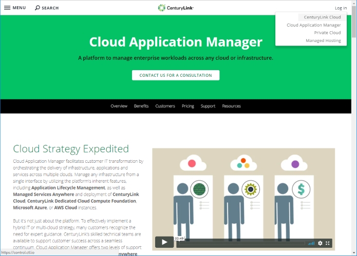

2. Login using your Cloud Application Manager or CenturyLink Cloud username and password   

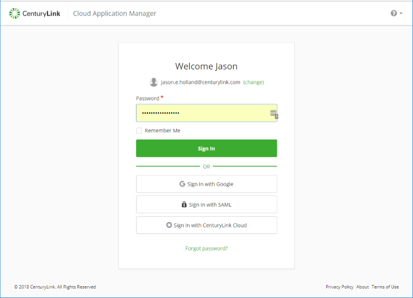

3. In the top navigation bar, select **Network Exchange** in the Site Switcher.

### Creating An Exchange

1. Click on the "Create an Exchange" button.

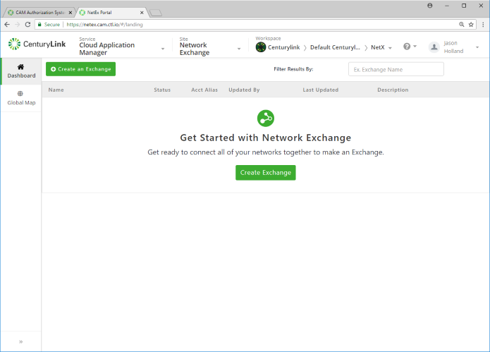

2. In the **Name Your Exchange** screen:

Enter the **Exchange Name**. This name will be appended with a randomly generated
number to create a unique identifier for this Exchange. Note that this field may not contain spaces.

Enter the **Description**. This free form text is used to describe the Exchange you are
creating. This field should be utilized to differentiate amongst Exchanges.

Click **Next**

3. In the Network Exchange **Select Endpoint 1** screen:

Select the Endpoint from the drop down menu for **Select Endpoint Type** from the options of **Colocation**, **Cloud**, **Managed Hosting**, **Dedicated Access**. Endpoints may be added in any order.

Click **Next**.

**Follow the instructions for the selected endpoint type from the options, stated below**. You may add endpoints in any order and in any combination per supported configurations. The desired Exchange Ports / data center combination(s) per Exchange should be validated as a supported configuration in the Knowledge Base article [Network Exchange Configuration Guide](network-exchange-connectivity-matrix-configuration-guide.md).

### Create a Cloud Endpoint

Select **Cloud** from the **Select Endpoint Type** drop down menu.

Click **Next**.

    **Note:** You may cancel this operation by clicking the red X on the screen, or, by selecting the **Back** button.

Select the Provider from the **Select Provider** drop down menu.

Click **Next**.

    **Note:** You may cancel this operation by clicking the red X on the screen, or, by selecting the **Back** button.

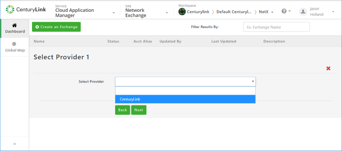

Enter a Description in the Description text field.

Select a CLC Provider Identity from the **Select Provider Identity** drop down.

Select a Data Center from the **Datacenter** drop down.

Select a Rate Limit from the **Select rate limit** drop down.

Click **Next**.

    **Note:** You may cancel this operation by clicking the red X on the screen, or, by selecting the **Back** button.

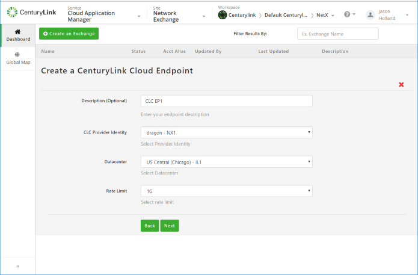

### Create a Colocation or “Dedicated Access" Endpoint

Select **Colocation** or **Dedicated Access** from the **Select Endpoint Type** drop down menu.

Click **Next**.
	**Note:** You may cancel this operation by clicking the red X on the screen, or, by selecting the **Back** button.

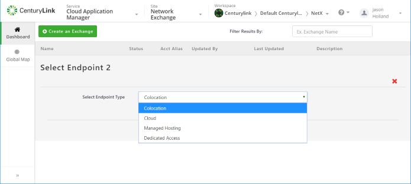

Select the provider from the **Select Provider** drop down menu.

Click **Next**.

    **Note:** You may cancel this operation by clicking the red X on the screen, or, by selecting the **Back** button.

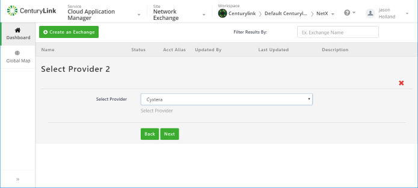

Enter a Description in the Description text field.

Select a Data Center from the **Datacenter** drop down.

Select if Redundancy is desired in the **Select redundancy type** drop down.

Select the Rate Limit and SFP Type in the **Select rate limit and SFP type** drop down.

Select the Routing Type: Static or BGP.

Click "**Next**"

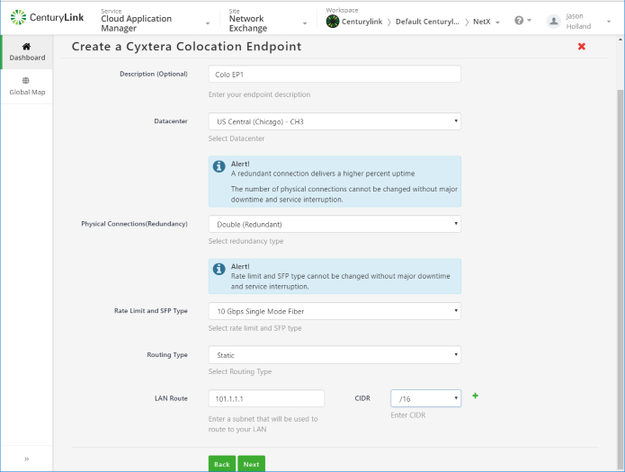

### Create a Managed Hosting Endpoint

Select **Managed Hosting** from the **Select Endpoint Type** drop down menu.

Click **Next**. You may cancel this operation by clicking the red X on the screen, or, by selecting the **Back** button.

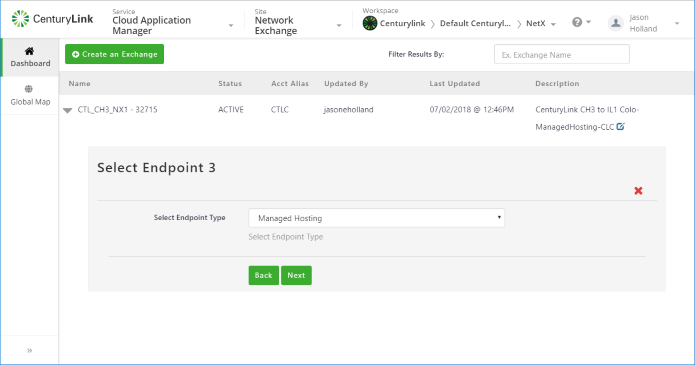

Select the **Provider** from the drop down list.

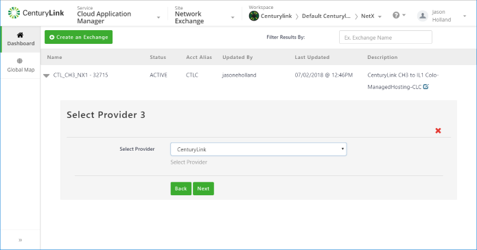

Enter a Description in the Description text field.

Select a Data Center from the **Datacenter** drop down.

Select the Rate Limit in the **Select rate limit** drop down.

Enter the **VLAN A** value.

Enter the **VLAN B** value.

Click **Next**.

**Notes:**

* VLAN "A" and VLAN "B" are provided by a CenturyLink account manager and are based on the VLANs that are set up in the in the CenturyLink data center’s managed hosting network. Please see [Network Exchange Managed Hosting Exchange Ports](network-exchange-clc-managed-hosting-endpoint-guide.md) for details on how to obtain these.
* You may cancel this operation by clicking the red X on the screen, or, by selecting the "Back" button.
* If this is your first endpoint, you will be prompted to enter a second endpoint. If you have entered an endpoint previously, you will be navigated to the **Review Your Request** flyout. See instructions below on how to proceed.

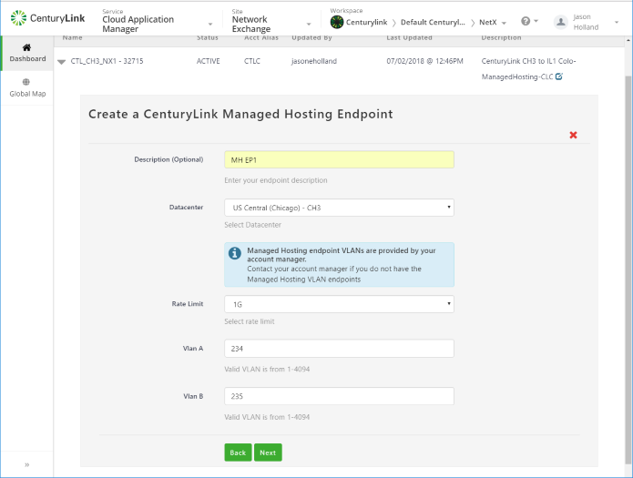

### Completing Your Request

Upon selecting two endpoints, you will reach the “Review Your Request” flyout.

Review your request to ensure the specifications for the Exchange you have configured.

Click on “Submit”. You will be navigated to the main Network Exchange screen which will display the Exchange you have just created and the status of the build. During creation the status will display “BUILDING” and that Exchange will not be accessible. Upon completion, the status will change to “ACTIVE”.

Note: The values displayed will reflect user selections. The image provided is for reference only.

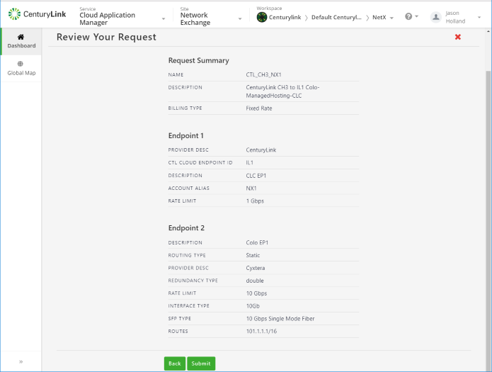

### Adding an Endpoint to an Exchange

Select the desired Exchange, which must have an “ACTIVE” status.

Select **Add Additional Endpoint**.

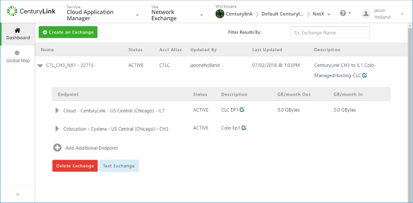

Follow the instructions for the particular endpoint type, above. When adding an additional Endpoint, the **Review Your Request** page will contain configuration information for only the new Endpoint to be added.

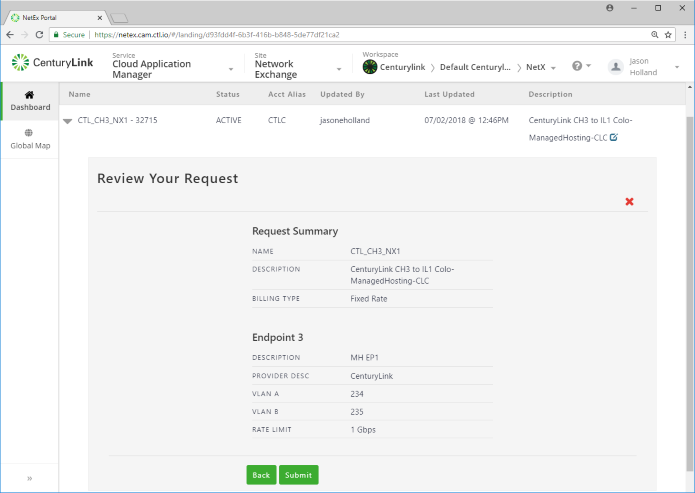

### Removing an Endpoint from an Exchange

**Note:** Endpoints may not be deleted from an Exchange if there are less than three endpoints.

Select the Exchange containing the endpoint you wish to delete.

Select the endpoint you wish to delete.

Click **Delete Endpoint**.

Click **Yes** or **No** when prompted. The status will indicate “UPDATING” during the deletion process.

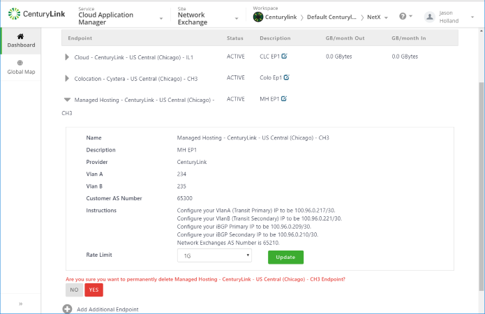

### Q & A

**Q: How many Exchanges may an End User have?**

**A:** There are currently no limitations on the number of Exchanges per End User. See the Knowledge Base article [Network Exchange Configuration Guide](network-exchange-connectivity-matrix-configuration-guide.md) for more details.

**Q: How many endpoints may be in an Exchange?**

**A:** An Exchange may include a number of endpoints up to the maximum Exchange Port
types available in a metro area served by Network Exchange. See the Knowledge Base article [Network Exchange Configuration Guide](network-exchange-connectivity-matrix-configuration-guide.md) for more details.

**Q: How do I convert from Cloud Network Service to Network Exchange?**

**A:** A Knowledge Base article Migrating from Cloud Network Service to Network Exchange will be provided in the future that will discuss this in detail.

**Q: Can I change the name of an Exchange once it’s created.**

**A:** No. You will have to delete and recreate the Exchange with the name of your choice.

**Q: How do I know when I can use an Exchange?**

**A:** Exchanges will pass traffic any time it has an “ACTIVE” status. Note that for
colocation and direct connect endpoints, cross connects must be in place and the destination networks including the connectivity endpoints must be configured correctly
for traffic to pass.

**Q: Who should I contact for Support?**

**A:** Support requests should be emailed to [help@ctl.io](mailto:help@ctl.io).
