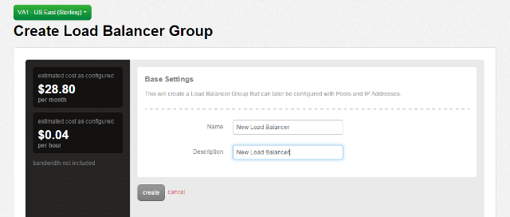

{{{
  "title": "Add Both HTTP and SSL Pools to a Self Service Load Balancer",
  "date": "5-15-2015",
  "author": "Jamie Parker",
  "attachments": [],
  "contentIsHTML": false
}}}

### Overview

Centurylink Cloud offers a self-service load balancer in the portal.  Customers are welcome to configure and use this load balancer to distribute web traffic across multiple servers for redundancy.  This article describes how to add server pools for both HTTP and SSL traffic to one load balancer VIP.

### Prerequisites

* A Centurylink Cloud Account

### General Notes

* It is not possible at this time to use ports other than 80 or 443 on the self-service load balancer VIP.
* Since only ports 80 and 443 can be used on a self-service load balancer VIP, only two pools total can be created on the VIP.

### How to Add Both HTTP and SSL Pools to a Self Service Load Balancer

1. To create a Self Service Load Balancer, first navigate to the dropdown menu, and then under “Services,” select “Load Balancer.”

    

2. At the Load Balancer menu, select the Datacenter where you would like to have the Load Balancer built, and then select “Create Load Balancer Group.”

    

3. On the Base Settings page, type in a name and description for your Load Balancer, then click “Create.”

    

4. Once the Load Balancer has been created, you will be asked to add a pool of servers that will receive traffic from the Load Balancer.  In that pool, select the VIP Port that you want (80 or 443), the balancing algorithm that you want (Round Robin or Least Connection), and the persistence that you want (Standard or Sticky).  Enter the IP addresses and ports that you would like the load balancer to send traffic to, and then click save.

    

5. After the pool is saved, you will see a summary screen for the pool you just created.  If you want to add a second pool to the same VIP, you can do so by selecting “Add Pool.”

    

6. This will bring you back to the Pools screen, where you can enter your second VIP port, and again select the balancing algorithm, persistence, and IP addresses and ports that you want to second VIP port to serve.  When you are done, click save.

    

7. After both pools are saved, your load balancer will be able to send traffic to both ports 80 and 443.

    
