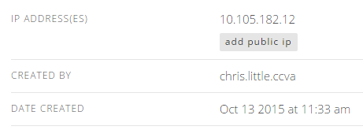
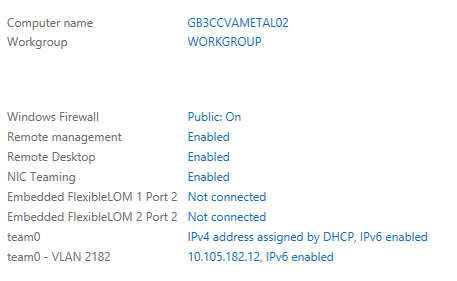

{{{
  "title": "Add or Remove Network Interface to Server using Go CLI",
  "date": "10-13-2015",
  "author": "Chris Little",
  "attachments": [],
  "contentIsHTML": false
}}}

### Overview
Customers may wish to implement additional network interfaces (NICs) on CenturyLink Cloud [Virtual](//www.ctl.io/servers/) or [Bare Metal](//www.ctl.io/bare-metal/) Servers.  To implement this CenturyLink has provided an API to [add](//www.ctl.io/api-docs/v2/#servers-add-secondary-network) or [remove](//www.ctl.io/api-docs/v2/#servers-remove-secondary-network) network interfaces.  Customers who wish to simply use a CLI tool to implement these additional interfaces can leverage our [Go CLI.](//github.com/CenturyLinkCloud/clc-go-cli)

### Prerequisites
* A CenturyLink Cloud Account
* [Go CLI](//github.com/CenturyLinkCloud/clc-go-cli)
* Server Name, Network Name and optionally the IP address you wish to leverage for this additional network interface

### Add a Network Interface to a Server

1. [Login to your account with the Go CLI.](//github.com/CenturyLinkCloud/clc-go-cli#log-in-to-your-centurylink-cloud-account)

    ```
    clc login --user XXX --password XXX
    ```

2. Run the add-secondary-network Go CLI command. The --ip-address field is optional if you want to set a specific IP that is free in your network.  If not specified the next available IP will be used.  

    ```
    clc server add-secondary-network --server-name XXXXX --network-name XXXXX --ip-address XXXXX
    ```

    ```
    {
      "OperationId": "ad4a8656162649c389ca5e840c2cb623",
      "URI": "http://api.ctl.io/v2-experimental/operations/CCVA/status/ad4a8656162649c389ca5e840c2cb623"
    }
    ```

3. Validate the new interface is shown in Control and the Server.

    

    

### Remove a Network Interface from a Server

1. Run the remove-secondary-network Go CLI command.  

    ```
    clc server remove-secondary-network --server-name XXXXX --network-name XXXXX
    ```

    ```
    {
      "OperationId": "f31a59e3fbff4458a988f00e9a8e97fe",
      "URI": "http://api.ctl.io/v2-experimental/operations/CCVA/status/f31a59e3fbff4458a988f00e9a8e97fe"
    }
    ```

2. Validate the network interface you requested be removed is in fact removed in Control and the Server.

    

    
