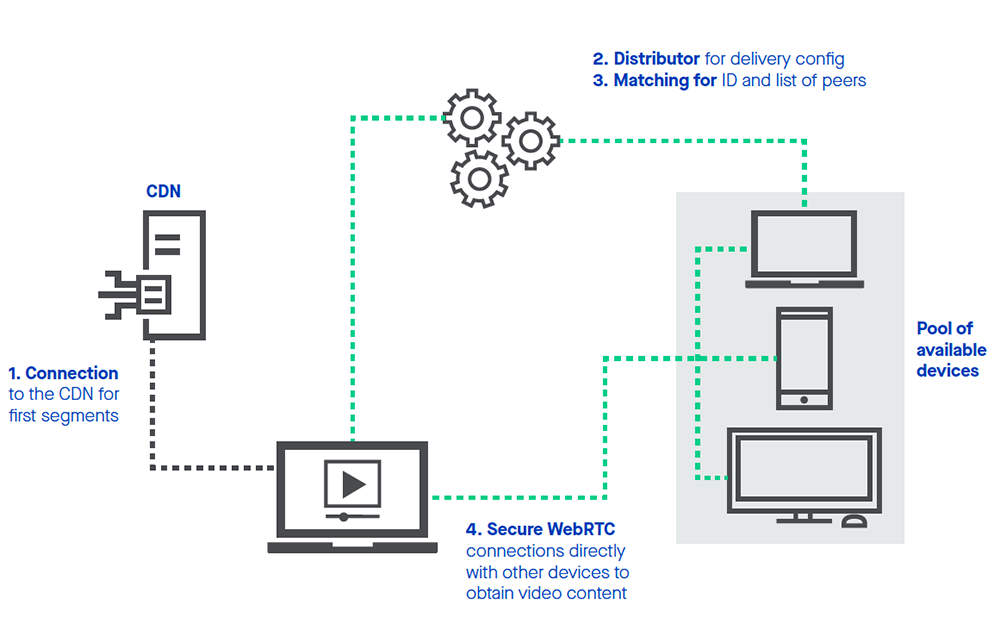

{{{
  "title": "CDN Mesh Delivery: How It Works",
  "date": "02-13-2020",
  "author": "Jim Greene",
  "attachments": [],
  "related-products" : [],
  "contentIsHTML": false,
  "sticky": true
}}}

CenturyLink® CDN Mesh Delivery sources video content from a Content Delivery Network and devices watching the same stream, resulting in rapid scalability and resiliency, even within hard-to-reach markets.

By multi-sourcing content delivery from the CDN or a mesh network of devices, CenturyLink CDN Mesh Delivery dynamically determines the fastest and most efficient delivery source while offering an extra layer of flexibility, scalability and resiliency.

A mesh network of devices creates a more powerful network, so CenturyLink's mesh delivery platform is a powerful solution. The peer-to-peer technology consistently delivers around 75 percent of total traffic, with even more during peak viewing times increasing delivery capacity.

For popular series, catch-up TV, viral social content and more CDN Mesh Delivery allows you to scale during the most demanding traffic spikes without compromising quality.

**What It Is**

CDN Mesh Delivery is an advanced implementation of the WebRTC standard that enables delivery of live and video on-demand (VOD) content from a CDN and between end user devices. CenturyLink’s global CDN point of presence (PoP) footprint extends to six continents and includes a mesh network topology that can deploy practically anywhere.
Customized delivery to every device leverages user location, internet service provider, network topology, device, type of content and bitrate profiles to determine the fastest and most efficient delivery source.

In a mesh network, each device connects to other devices rather than to an Internet Service Provider. Unlike networks built around a centralized hub, a mesh network consists of multiple routers that communicate with each other to deliver fast, stable WiFi.

**How It Works**

1.	On starting the video, the end user starts fetching the first video segments from the CDN.
2.	The client module connects to the distributor service that authenticates the user and returns a specific configuration which has been fine-tuned to maximize QoS and efficiency.
3.	The client module connects to the matching service that assigns the viewer a unique ID. The device periodically requests tracks and peers throughout the session and the matching service provides an updated list of devices with which the peer should connect.
4.	The client module connects to other devices watching the same content at the same time via the signaling service using a WebRTC connection. All WebRTC connections are fully secured via DTLS.
5.	 Once connected, individual device limitations are accounted for so device performance and data consumption are not burdened. A minimum buffer threshold is set for end users so that if the buffer falls below the threshold, the CDN Mesh Delivery client will instantly and seamlessly fall back to CDN delivery.

This delivery approach allows platforms to scale naturally to audiences of practically any size, virtually anywhere, regardless of server infrastructure. CDN Mesh Delivery also allows many of the world’s largest media, internet and entertainment companies to improve video quality, scale in a cost-effective manner and future-proof their platforms from growing demand.

**Benefits**

- **High Performance:** Our combined CDN and peer-to-peer technology is architected to enable high performance and a quality end user experience even during the most demanding traffic spikes.
- **Global Reach:** Peer-to-peer technology establishes a high-speed distributed content delivery network among viewers regardless of the proximity to the CDN, enabling reliable and high-quality video across the globe. 
- **Scale:** CDN Mesh Delivery easily handles traffic spikes by naturally scaling to viewers. More devices mean a more powerful network, increasing your delivery capacity and video quality in a cost-effective manner.
- **Plug-and-Play Integration:** Works with a majority of open-source and proprietary video players on the market — hls.js, dash.js, videojs, Bitmovin, TheoPlayer, JWPlayer, etc. — with support on major web and mobile platforms. This mesh network delivery is also fully compatible with broadcasters’ existing encoding, CDN, load-balancing, analytics, DRM and advertising (CSAI, SSAI) solutions.
