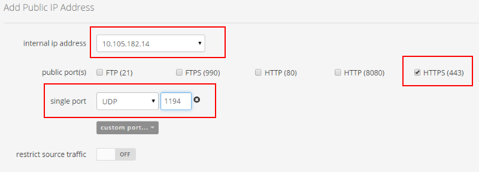
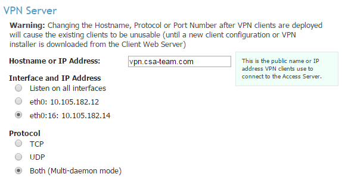
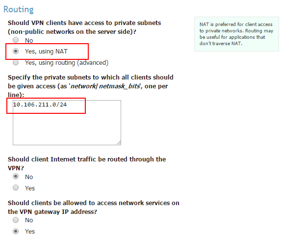
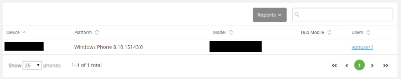
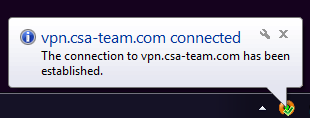

{{{
  "title": "CenturyLink Cloud Guide to Openvpn Access Server",
  "date": "4-5-2017",
  "author": "Chris Little",
  "attachments": [],
  "contentIsHTML": false,
  "sticky": false
}}}

### Table of Contents

* [Overview](#overview)
* [Prerequisites](#prerequisites)
* [Exceptions](#exceptions)
* [Use Cases](#use-cases)
* [Reserving Client VPN DHCP Pool in the Control Portal](#reserving-client-vpn-dhcp-pool-in-the-control-portal)
* [Base Appliance Configuration](#base-appliance-configuration)
* [Performing Updates and Upgrades](#performing-updates-and-upgrades)
* [Implementing High Availability](#implementing-high-availability)
* [Configure Server Network Settings](#configure-server-network-settings)
* [Configuring Client VPN DHCP Pool](#configuring-client-vpn-dhcp-pool)
* [Adding Routes to CenturyLink Cloud VLANs](#adding-routes-to-centurylink-cloud-vlans)
* [Configuring LDAP Authentication](#configuring-ldap-authentication)
* [Installing SSL Web Certificates](#installing-ssl-web-certificates)
* [Two Factor Authentication](#two-factor-authentication)
* [Connecting to Client VPN Services](#connecting-to-client-vpn-services)

### Overview
OpenVPN Access Server is a full featured secure network tunneling VPN software solution that integrates OpenVPN server capabilities, enterprise management capabilities, simplified OpenVPN Connect UI, and OpenVPN Client software packages that accommodate Windows, MAC, Linux, Android, and iOS environments. OpenVPN Access Server supports a wide range of configurations, including secure and granular remote access to internal network and/ or private cloud network resources and applications with fine-grained access control.

### Prerequisites

* A CenturyLink Cloud Account
* OpenVPN AS Licenses
* [Deploy the OpenVPN AS Virtual Appliance.](../Ecosystem Partners/Marketplace Guides/getting-started-with-openvpnas-appliance.md)  We highly recommend the OpenVPN Access Server be deployed in a [dedicated VLAN](../Network/creating-and-deleting-vlans.md) and [given a friendly name](../Network/add-a-user-friendly-name-to-vlans.md).  

### Exceptions

* Support for the OpenVPN AS appliance is provided by OpenVPN Technologies, Inc.
* The OpenVPN AS Appliance and its services or operation have no integration into the 'VPN' portion of the Control Portal

### Use Cases

* **Regional Based Client VPN:** Deliver regional based client vpn services to reduce latency and improve performance to the user community.  
* **Web Based Client VPN Access:** Ease management and improve end user experience by deploying client vpn services via a simple web interface.
* **Highly Available Client VPN:** Deploy OpenVPN Access server with primary and standby nodes to maintain availability of business critical client vpn services.
* **Flexible Authentication:** Leverage LDAP, Radius and even Dual Factor Authentication for client vpn services.
* **Scalable:** Expand concurrent user volumes and performance quickly to adapt to changing business needs.
* **Control:** Maintain complete control of the entire OpenVPN Access Server configuration.


### Reserving Client VPN DHCP Pool in the Control Portal
As part of the OpenVPN AS configuration a pool of DHCP addresses in the OpenVPN vlan must be claimed in the Control Portal to avoid these IP addresses from being allocated to other services on the platform.  

* <.11 & >.230 are reserved and not permitted to be used in this pool on the platform.
* We recommend you allocate this pool using proper CIDR.  [Cheat Sheets are available online.](//www.aelius.com/njh/subnet_sheet.html)

[Open a support ticket](../Support/how-do-i-report-a-support-issue.md) with the CenturyLink Cloud NOC.  You can use the following format:

```
NOC,
Please mark the following IP Addresses as claimed in Control for use with my OpenVPN AS Virtual Appliance.

ALIAS:  Customer ALIAS
Data Center:  Data Center Location
VLAN:  VLAN that contains the IPs you wish to claim for DHCP vpn client
IP Range:  range of private IPs to reserve
PIN:  Your support PIN
```

### Base Appliance Configuration
Customers are encouraged to review the [full explanations](//docs.openvpn.net/how-to-tutorialsguides/virtual-platforms/deploying-openvpn-access-server-from-an-ova-template-in-a-vmware-esxi-environment/) of the server setup wizard for further details on each option.

1. Connect to [Client VPN.](../Network/how-to-configure-client-vpn.md)
2. SSH to the **Private IP Address** of the OpenVPN AS Appliance and login using root.
3. Upon login you will be requested to accept the OpenVPN-AS EULA.

  ```
  Please enter 'yes' to indicate your agreement [no]: yes
  ```

4. As this is the base configuration, select **yes** the appliance will be the primary access server node.

  ```
  Once you provide a few initial configuration settings,
  OpenVPN Access Server can be configured by accessing
  its Admin Web UI using your Web browser.

  Will this be the primary Access Server node?
  (enter 'no' to configure as a backup or standby node)
  > Press ENTER for default [yes]: yes
  ```

5. Select the network interface and private IP address of the appliance to be used to deliver the Admin Web UI.

  ```
  Please specify the network interface and IP address to be
  used by the Admin Web UI:
  (1) all interfaces: 0.0.0.0
  (2) eth0: 10.105.182.12
  Please enter the option number from the list above (1-2).
  > Press Enter for default [2]: 2
  ```

6.  Specify the TCP port number for the admin web UI.  Just press **enter** to accept the default unless you wish to use a unique port.

  ```
  Please specify the port number for the Admin Web UI.
  > Press ENTER for default [943]:
  ```

7.  Specify the TCP port number for the OpenVPN Daemon.  Just press **enter** to accept the default.

  ```
  Please specify the TCP port number for the OpenVPN Daemon
  > Press ENTER for default [443]:
  ```

8.  Choose **No** to routing client traffic through the VPN.

  ```
  Should client traffic be routed by default through the VPN?
  > Press ENTER for default [yes]: no
  ```

9.  Choose **No** to routing DNS traffic through the VPN.

  ```
  Should client DNS traffic be routed by default through the VPN?
  > Press ENTER for default [yes]: no
  ```

10.  Choose **No** to using local authentication.  In this sample guide we plan to use LDAP to Active Directory.  You may elect to rely on an internal database if desired.

  ```
  Use local authentication via internal DB?
  > Press ENTER for default [no]: no
  ```

11.  Input **Yes** to permit all vpn clients access to the VLAN in which the OpenVPN AS Appliance resides.  

  ```
  Private subnets detected: ['10.105.182.0/24']

  Should private subnets be accessible to clients by default?
  > Press ENTER for default [yes]: yes
  ```

12.  Configure an Admin UI userID for web management.  Select **No** when prompted to define a userID and password for web administration.  In the example below we created a userID of **webadmin**.

  ```
  To initially login to the Admin Web UI, you must use a
  username and password that successfully authenticates you
  with the host UNIX system (you can later modify the settings
  so that RADIUS or LDAP is used for authentication instead).

  You can login to the Admin Web UI as "openvpn" or specify
  a different user account to use for this purpose.

  Do you wish to login to the Admin UI as "openvpn"?
  > Press ENTER for default [yes]: no

  > Specify the username for an existing user or for the new user account: webadmin
  Type the password for the 'webadmin' account:
  Confirm the password for the 'webadmin' account:
  ```

13.  Specific your license key (or input it later in the Admin Web UI).

  ```
  > Please specify your OpenVPN-AS license key (or leave blank to specify later):
  ```

14.  The configuration will be executed.

  ```
  Initializing OpenVPN...
  Adding new user login...
  useradd -s /sbin/nologin "webadmin"
  Writing as configuration file...
  Perform sa init...
  Wiping any previous userdb...
  Creating default profile...
  Modifying default profile...
  Adding new user to userdb...
  Modifying new user as superuser in userdb...
  Getting hostname...
  Hostname: GB3CCVAOVPN03
  Preparing web certificates...
  Getting web user account...
  Adding web group account...
  Adding web group...
  Adjusting license directory ownership...
  Initializing confdb...
  Generating init scripts...
  Generating PAM config...
  Generating init scripts auto command...
  Starting openvpnas...

  NOTE: Your system clock must be correct for OpenVPN Access Server
  to perform correctly.  Please ensure that your time and date
  are correct on this system.

  Initial Configuration Complete!

  You can now continue configuring OpenVPN Access Server by
  directing your Web browser to this URL:

  https://10.105.182.12:943/admin
  Login as "webadmin" with the same password used to authenticate
  to this UNIX host.

  During normal operation, OpenVPN AS can be accessed via these URLs:
  Admin  UI: https://10.105.182.12:943/admin
  Client UI: https://10.105.182.12:943/

  See the Release Notes for this release at:
  http://www.openvpn.net/access-server/rn/openvpn_as_2_0_12.html
  ```

### Performing Updates and Upgrades
Once you have deployed the Primary OpenVPN Access Server (or standby node) customers are encouraged to keep their appliance up to date.  This should be performed before any additional configuration via SSH.

1. Upgrade the OpenVPN Access Server to the latest version by [downloading and installing](https://openvpn.net/index.php/access-server/download-openvpn-as-sw/113.html?osfamily=Ubuntu) the appropriate build.  Run `lsb_release -a` to get your Ubuntu release.

  ```
  wget URL_of_new_package
  dpkg -i filename_new_package
  ```

  For current version 2.1.4b the commands are:

  ```
  wget http://swupdate.openvpn.org/as/openvpn-as-2.1.4b-Ubuntu16.amd_64.deb
  dpkg -i openvpn-as-2.1.4b-Ubuntu16.amd_64.deb
  ```

2. Apply the latest Ubuntu updates and upgrades.

  ```
  apt-get update && apt-get upgrade
  ```

### Implementing High Availability
To create an active and standby configuration using OpenVPN Access Server follow the process below:

1. A **Shared Virtual IP Address** is required as part of high availability.  Customers must [Open a support ticket](../Support/how-do-i-report-a-support-issue.md) with the CenturyLink Cloud NOC to claim an **un-used** IP address on the same vlan as the OpenVPN Access Server.  You can use the following format:

  ```
  NOC,
  Please claim the following IP Address in Control for use with my OpenVPN AS Virtual Appliance in a highly available configuration.

  ALIAS:  Customer ALIAS
  Data Center:  Data Center Location
  IP Address:  IP Address you wish to claim
  Virtual Server:  The name of the primary OpenVPN Access Server
  PIN:  Your support PIN
  ```

2. [Deploy a Standby OpenVPN AS Virtual Appliance.](../Ecosystem Partners/Marketplace Guides/getting-started-with-openvpnas-appliance.md) This standby node should be in the same dedicated vlan of the primary node.  

3. Connect to [Client VPN.](../Network/how-to-configure-client-vpn.md)

4. SSH to the **Private IP Address** of the **Standby** OpenVPN AS Appliance and login using root.

5. Upon login you will be requested to accept the OpenVPN-AS EULA.

  ```
  Please enter 'yes' to indicate your agreement [no]: yes
  ```

6. Input **No** as this OpenVPN AS Appliance will be the **Standby** node.

  ```
  Once you provide a few initial configuration settings,
  OpenVPN Access Server can be configured by accessing
  its Admin Web UI using your Web browser.

  Will this be the primary Access Server node?
  (enter 'no' to configure as a backup or standby node)
  > Press ENTER for default [yes]: no
  ```

7. Configure an Admin UI userID for web management.  Select **No** when prompted to define a userID and password for web administration.  In the example below we created a userID of **webadmin**.

  ```
  To initially login to the Admin Web UI, you must use a
  username and password that successfully authenticates you
  with the host UNIX system (you can later modify the settings
  so that RADIUS or LDAP is used for authentication instead).

  You can login to the Admin Web UI as "openvpn" or specify
  a different user account to use for this purpose.

  Do you wish to login to the Admin UI as "openvpn"?
  > Press ENTER for default [yes]: no

  > Specify the username for an existing user or for the new user account: webadmin
  Type the password for the 'webadmin' account:
  Confirm the password for the 'webadmin' account:
  ```

8. Specific your license key (or input it later in the Admin Web UI).

  ```
  > Please specify your OpenVPN-AS license key (or leave blank to specify later):
  ```

9. The configuration will be executed.

  ```
  Initializing OpenVPN...
  Adding new user login...
  useradd -s /sbin/nologin "webadmin"
  Writing as configuration file...
  Getting web user account...
  Adding web group account...
  Adding web group...
  Adjusting license directory ownership...
  Generating init scripts...
  Generating PAM config...
  Generating init scripts auto command...

  NOTE: Your system clock must be correct for OpenVPN Access Server
  to perform correctly.  Please ensure that your time and date
  are correct on this system.

  Initial Configuration Complete!

  This node has been configured as a Secondary Access Server
  node for backup/standby.  Please continue with the redundancy
  configuration on the Primary Access Server node.

  See the Release Notes for this release at:
  http://www.openvpn.net/access-server/rn/openvpn_as_2_0_12.html
  ```

10. Connect via your browser to the **Primary** OpenVPN Access Server node Web Admin UI using the credentials defined previously.  

    

11. Navigate to **Configuration > Failover** in the Web Admin UI.  Select **LAN Model** for redundancy model.  Input the **Shared Virtual IP Address** claimed previously and populate the primary and secondary node IP Addresses, SSH Username (root), SSH Password and SSH Port.

    

12. Select the **Validate** button and verify all results are "good."

    

13. Lastly, select **Commit and Restart.**  

**CRITICAL: Going forward, connect to the Web Admin UI using the Shared Virtual IP Address when managing your environment.**

### Configure Server Network Settings

1. [Add a Public IP](../Network/how-to-add-public-ip-to-virtual-machine.md) to the **Shared Virtual IP Address** previously claimed for your failover services.  The following ports are required to deliver services:

    * UDP/1194
    * TCP/443
    * TCP/943 (Optional if you wish to perform Web Admin on the public IP, not recommended!)

    

2. Navigate to **Configuration > Sever Network Settings** in the Web Admin UI (NOTE: Remember to use the Shared Virtual IP Address if using HA).  

    * Input the FQDN you plan to use for the client vpn web URL (i.e. vpn.mycompany.com) in the **Hostname or IP Address** field.  This FQDN should resolve to the public IP address previously allocated and requires you complete the **Installing SSL Web Certificates** portion of this article.  
    * If using HA, update the **Interfaces and IP Addresses** selection by choosing the **Shared Virtual IP Address** in the VPN server section.

        

    * In the Admin Web UI section, update the **Interfaces and IP Addresses** selection by choosing the **Shared Virtual IP Address**.

        

3. Choose **Save Settings**, followed by **Update Running Server.**

    

### Configuring Client VPN DHCP Pool

1. Navigate to **Configuration > VPN Settings** in the Web Admin UI.  Input the block of IP addresses to be used for DHCP to VPN Clients (previously claimed in the Reserving Client VPN DHCP Pool in the Control Portal portion of this article) in the **Dynamic IP Address Network** field. [Cheat Sheets are available online to assist.](//www.aelius.com/njh/subnet_sheet.html)  In this example the DHCP pool will be 10.105.82.65-10.105.82.126 (62 IP addresses). **CRITICAL NOTE:  <.11 & >.230 are reserved and not permitted to be used in this pool on the platform.**

    

2. Choose **Save Settings**, followed by **Update Running Server.**

### Adding Routes to CenturyLink Cloud VLANs

1. Navigate to **Configuration > VPN Settings** in the Web Admin UI.  In the **Routing** section, confirm **Yes, via NAT** is selected and input the CenturyLink Cloud vlans you wish to allow Client VPN users to access once connected.  Generally, this list includes any vlans that you wish to deliver services from to end users.  CenturyLink Cloud uses /24 networks.

    

2. Choose **Save Settings**, followed by **Update Running Server.**

3. Add [Intra Data Center](../Network/connecting-data-center-networks-through-firewall-policies.md) and [Cross Data Center](../Network/creating-cross-data-center-firewall-policies.md) firewall policies from the OpenVPN Access Server vlan to the vlans (networks) that house your services client vpn users will consume.  

### Configuring LDAP Authentication
While there are various authentication methods (Local, PAM, Radius, LDAP) this example guide will focus on using LDAP.  

1. Deploy [Microsoft Windows Active Directory Services.](../Blueprints/deploy-microsoft-windows-2012-active-directory-domain-services.md) Tip: Keep these services in a 'trusted network' separate from the OpenVPN AS appliance and client VPN users for maximum security.

2. Create users and groups inside Active Directory as follows:

    * Create a Global Security Group named VPN-Users
    * Create (or add existing) domain users to the VPN-Users Group
    * Create a VPN-Auth user with a secure password, set never to expire.  This will be used to do user/group lookups to the directory.  This is safer than using a domain administrator account.

3. [Create a Firewall Rule](../Network/connecting-data-center-networks-through-firewall-policies.md) between the OpenVPN AS Primary, Secondary (if using HA) & Shared Virtual IP Address (if using HA) and the Active Directory Domain Controller(s). **TIP: LDAP requires TCP/389 and UDP/389**

4. Navigate to **Authentication > General** in the Web Admin UI.  Select **LDAP**, Choose **Save Settings**, followed by **Update Running Server.**

    

5. Navigate to **Authentication > LDAP** in the Web Admin UI. Configure LDAP services:

    * Input the Primary (and optionally secondary) Domain Controller IP Address
    * Bind the VPN-Auth user credentials to domain lookups
    * Update the Advanced LDAP portion to require the users be part of the VPN-Users security group created previously

    

6. Choose **Save Settings**, followed by **Update Running Server.**

### Installing SSL Web Certificates

1. Connect to [Client VPN.](../Network/how-to-configure-client-vpn.md)

2. SSH to the **Shared Virtual IP Address** (or primary node for standalone deployments) of the OpenVPN Access Server cluster and login using root.

3. Run the following command to generate the certificate signing request (CSR) and your private key.

    ```
    openssl req -out server.csr -new -newkey rsa:4096 -sha256 -nodes -keyout server.key
    ```

4. Once your certificate authority has approved your certificate signing request (CSR), it will send you the signed certificate and a certificate bundle.

5. Navigate to **Configuration > Web Server** in the Web Admin UI.  Provide the three files necessary for certificate installation, then press the Validate button.

    

6. If you have provided all the necessary files correctly, a successful message should appear. Choose **Save Settings**, followed by **Update Running Server.**

    

### Two Factor Authentication
There is a marketplace of Two Factor Authentication services that can be deployed in conjunction with OpenVPN Access Server. Customers who wish to enable such features should evaluate the community to find the product that fits their needs, not only for client vpn use but a larger corporate strategy for two factor authentication.  As part of this KB, our teams setup two factor authentication using [Duo Security](//www.duosecurity.com) and leveraged their mobile phone applications.  While this guide isn't meant to be a complete configuration guide for [Duo Security](//www.duosecurity.com), a high level approach and diagram is detailed below.


1. Sign up for a [Duo Security](//www.duosecurity.com) account.

2. Choose an Application to Protect, in this case OpenVPN Access Server

    

3. Create Users and Groups for your OpenVPN Application.  [Duo Security](//www.duosecurity.com) has various options to sync with Active Directory, import users to reduce effort.  

    

    

4. Configure 2FA Devices and download Duo Mobile for mobile phones.

    

5. [Configure OpenVPN Access Server](//www.duosecurity.com/docs/openvpn_as) for use with Duo Security

6. Connect to client VPN and use the Duo Mobile application to generate a passcode.

    

    

### Connecting to Client VPN Services

1. Navigate to your OpenVPN AS public URL.  Input your LDAP username and password, select Connect.  If this is the first time using the service the OpenVPN Connect Client will need to be installed.

    

2. A connection will be established.

    

    
