{{{
  "title": "Connecting Data Center Networks Through Firewall Policies",
  "date": "03-27-2015",
  "author": "Chris Little",
  "attachments": [],
  "contentIsHTML": false
}}}

### Overview
The CenturyLink Cloud Platform provides self-service tools to connect networks within a particular data center through the use of configurable firewall policies. This is useful when a customer has multiple networks (vlans) within a particular account, or has a range of sub-accounts with their own vlans, and wants to selectively choose the traffic that can flow among them.

### Connecting Networks within a Single Account

1. Create network VLAN(s) in the respective CenturyLink Cloud Data Center.  We recommend [applying friendly names](../Network/add-a-user-friendly-name-to-vlans.md) to Networks.

2. Validate the networks are in place in your CenturyLink Cloud account using the Networks menu item and selecting the appropriate Data Center.  In the sample below, a Web Services & Database Services VLAN exists in UC1.

  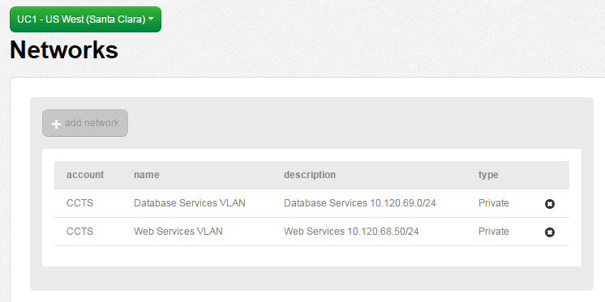

3. Create Virtual Instances within the appropriate network (VLAN).   In this example, we have created (2) VM's as follows:

  Web VM (IP 10.120.68.15) in Web Services 10.120.68.50/24 Network (VLAN)

  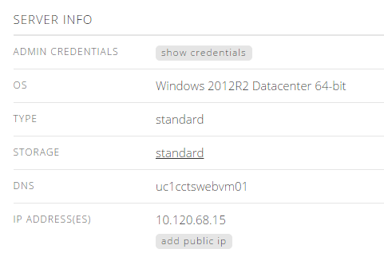

  DB VM (IP 10.120.69.12) in Database Services 10.120.69.0/24 Network (VLAN)

  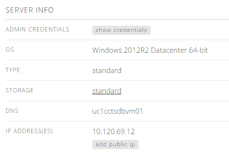

  **OPTIONAL:**  Perform a test ICMP ping between the web server & database server.  This test should fail as no Firewall Rule is in place between networks in UC1.

  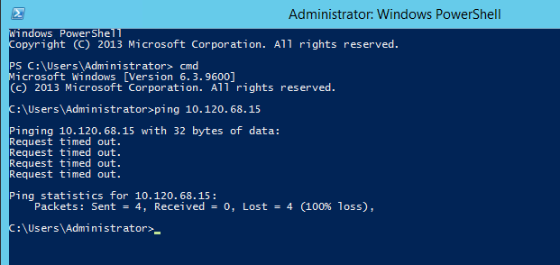

4. Navigate to the Firewall menu in Control.

  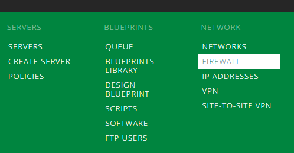

5. Select the desired CenturyLink Cloud Data Center node you wish to create an Firewall rule.  Next, choose to the Intra Data Center tab.  In this example, we used UC1.

  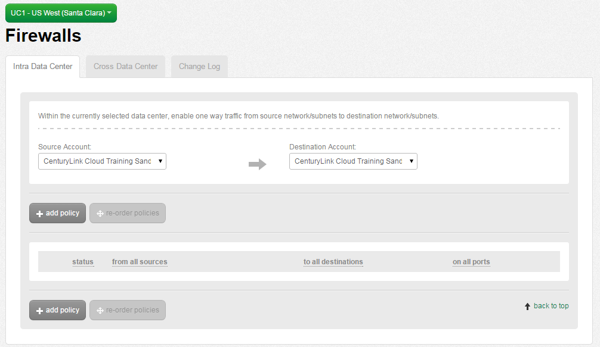

6. Choose Add Policy, Add Source Address.

  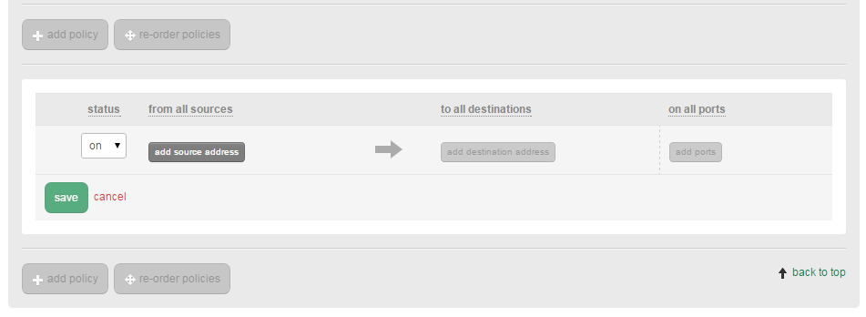

7. Select the appropriate source network followed by the subnet size.  Customers can choose to do an entire network (VLAN), CIDR blocks or individual IPs in the rule set.  In this example, we are choosing the Web Services (10.120.68.0/24) network and the individual Web VM (10.120.68.15) for this rule set.

  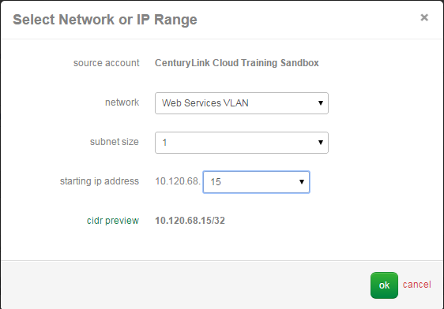

  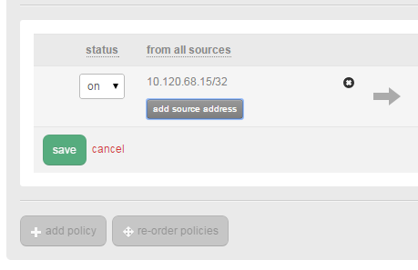

8. Choose Add Destination Address.  Select the appropriate destination network followed by the subnet size.  Customers can choose to do an entire network (VLAN), CIDR blocks or individual IPs in the rule set.  In this example, we are choosing the Database Services (10.120.69.0/24) network and the individual DB VM (10.120.69.12) for this rule set.

  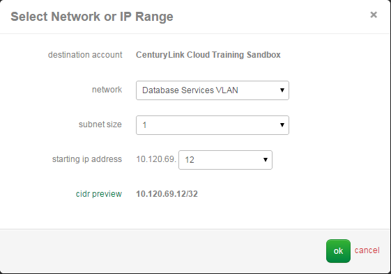

9. Select Add Ports.  Customers can choose from predefined TCP ports (any, FTP, FTPS, HTTP, HTTPS, PING, SSH, RDP), Custom TCP or UDP ports and Custom TCP or UDP port ranges all within the same rule set.  For demonstration purposes, we are simply opening PING.  Choose Ok.

  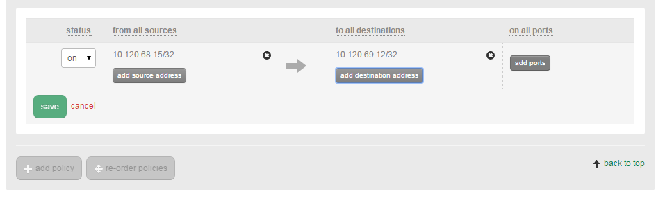

  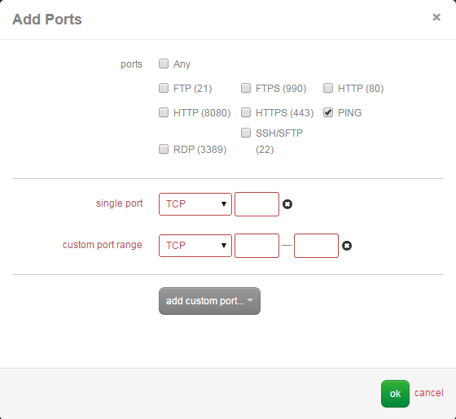

10. Once complete, press the Save button.  Your new Intra Data Center Rule will take less than 60 seconds to process in the Queue.  You can review its progress using the Queue Menu item.  

  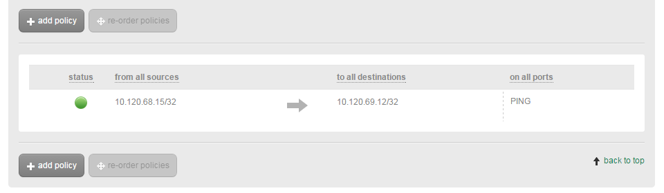

11. Confirm the Intra Data Center Firewall Policy is functional by performing another ICMP Ping test between virtual instances located in the (2) networks.  In this example, we are able to ping from the Web VM (10.120.68.15) to the DB VM (10.120.69.12).  

  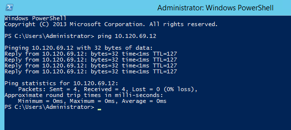

### Connecting Networks Across a Parent & Sub-Account Hierarchy

1. Create the appropriate Parent & Sub-Account Hierarchy.  Refer to the [Account Hierarchy Primer](../Accounts & Users/account-hierarchy-user-network-and-firewall-policy-primer.md) for more information.

2. Create network VLAN(s) in the respective CenturyLink Cloud Data Center and Accounts.  We recommend [applying friendly names](../Network/add-a-user-friendly-name-to-vlans.md) to Networks.

3. Validate the networks are in place in your CenturyLink Cloud accounts using the Networks menu item and selecting the appropriate Data Center.  In the sample below, a Parent Web Services network & a Sub-Account DB VLAN exists in UC1 under unique Accounts.  

  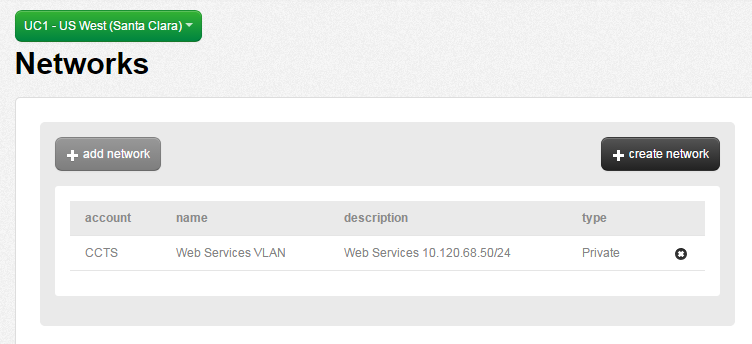

  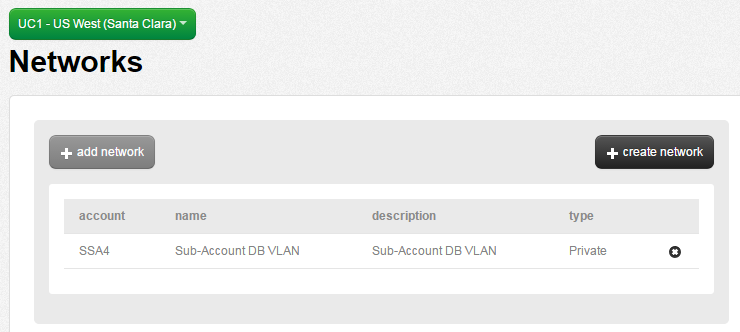

4. Create Virtual Instances within the appropriate network (VLAN).   In this example, we have created (2) VMs as follows

  Web VM (IP 10.120.68.15) in Web Services 10.120.68.50/24 Network (VLAN)

  

  DB VM (IP 10.122.171.12) in Sub-Account DB 10.122.171.0/24 Network (VLAN)

  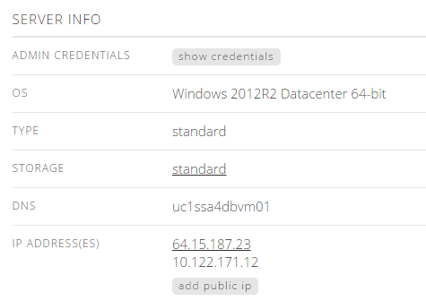

  **OPTIONAL:** Perform a test ICMP ping between the web server (parent account) & database server (sub-account).  This test should fail as no Firewall Rule is in place between these networks in UC1.

5. Navigate to the Firewall menu in Control.

  

6. Select the desired CenturyLink Cloud Data Center node you wish to create an Firewall rule.  Next, choose to the Intra Data Center tab and change the **destination account** to the appropriate sub-account.  In this example, in UC1 we chose a Sandbox Sub Account.  

  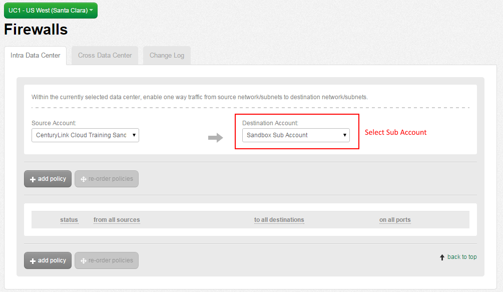

7. Choose Add Policy, Add Source Address.

  

8. Select the appropriate source network followed by the subnet size.  Customers can choose to do an entire network (VLAN), CIDR blocks or individual IPs in the rule set.  In this example, we are choosing the Web Services (10.120.68.0/24) network and the individual Web VM (10.120.68.15) for this rule set.

  

  

9. Choose Add Destination Address.  Select the appropriate destination network followed by the subnet size.  Customers can choose to do an entire network (VLAN), CIDR blocks or individual IPs in the rule set.  In this example, we are choosing the Sub-Account DB (10.122.171.0/24) network and the individual DB VM (10.122.171.12) for this rule set.

  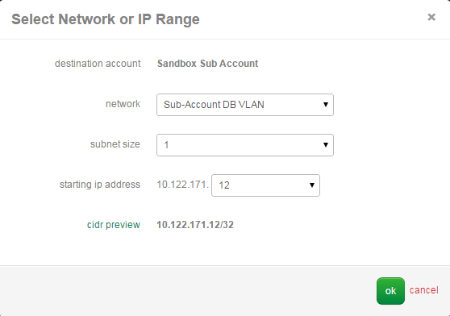

10. Select Add Ports.  Customers can choose from predefined TCP ports (any, FTP, FTPS, HTTP, HTTPS, PING, SSH, RDP), Custom TCP or UDP ports and Custom TCP or UDP port ranges all within the same rule set.  For demonstration purposes, we are simply opening PING.  Choose Ok.

  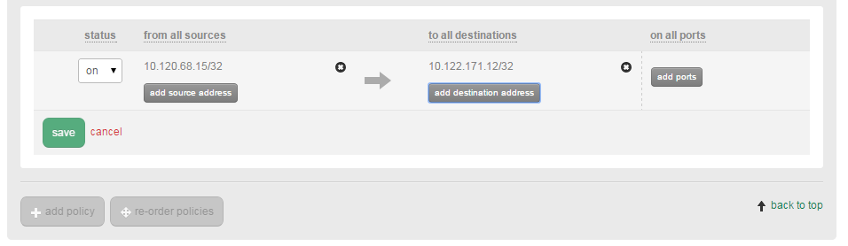

  

11. Once complete, press the Save button.  Your new Intra Data Center Rule will take less than 60 seconds to process in the Queue.  You can review its progress using the Queue Menu item.

  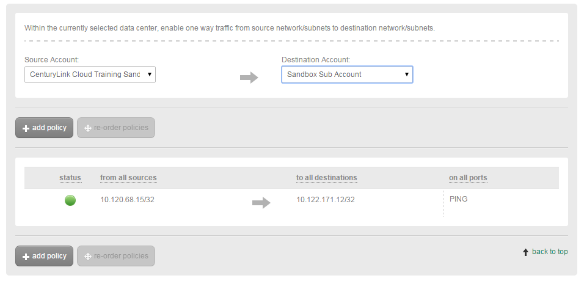

12. Confirm the Intra Data Center Firewall Policy is functional by performing another ICMP Ping test between virtual instances located in the (2) networks.  In this example, we are able to ping from the Web VM (10.120.68.15) to the DB VM (10.122.171.12).  

  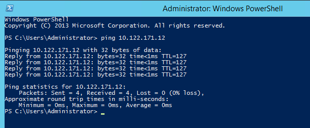
