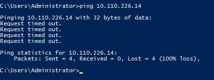
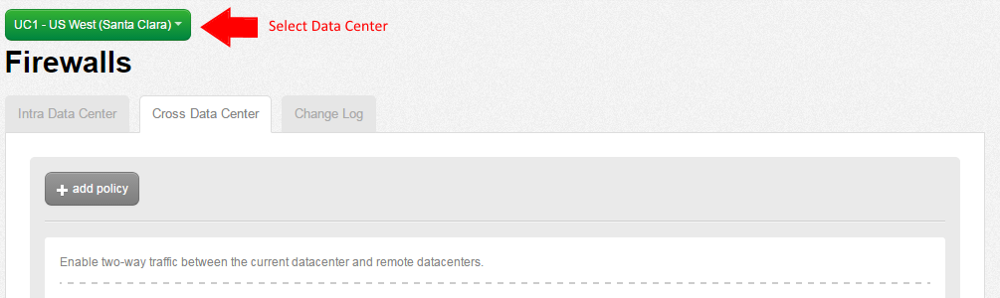
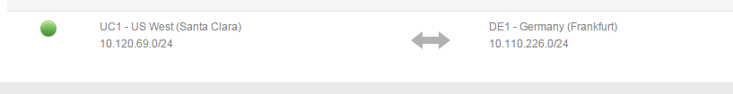

{{{
  "title": "Creating Cross Data Center Firewall Policies",
  "date": "9-23-2016",
  "author": "",
  "attachments": [],
  "contentIsHTML": false
}}}

### Creating Cross Data Center Firewall Policies

In addition to being able to connect networks within a particular data center through [Intra Data Center](../connecting-data-center-networks-through-firewall-policies.md) firewall policies, users can also create firewall policies that span cloud data centers. This helps enterprises build sophisticated and secure network topologies that take advantage of our global footprint while meeting an organization's functional needs.

### General Notes

 * In the current iteration customers cannot apply Firewall ACL's to traffic traversing cross data center policies.
 * Each CenturyLink Cloud Data Center location provides unique private IP networks to customers. This eliminates the risk of overlapping IP space, hence no NAT is required in the implementation.

### Connecting Networks within a Single Account

1. [Create network VLAN(s)](../creating-and-deleting-vlans.md) in each of the respective CenturyLink Cloud Data Centers.
2. Validate the networks are in place in your CenturyLink Cloud account using the **Network** menu item and selecting the appropriate Data Center. In the sample below, networks exists in both UC1 (Santa Clara) & DE1 (Germany).

  

  

**OPTIONAL:** Perform a test ICMP ping between virtual instances private IP addresses in different Cloud Data Centers. This test should fail as no Cross Data Center Firewall Rule is in place between networks in UC1 & DE1.

  

3. Using the left side navigation bar, click on **Network** > **Firewall**.

  
  
4. Select **Either** the source or destination CenturyLink Cloud Data Center node (as policies when applied are two-way rules). Next, choose to the **Cross Data Center** tab.

  

5. Choose **Add Policy**, **Set Local Address**.

  

6. Select the appropriate network or CIDR IP range for the local address(es). In this example, we are using the entire 10.120.69.0/24 network block for a local address in UC1.

  

  

7. Choose **Set Remote Address(es)**. Select the appropriate network or CIDR IP range for the remote address(es). In this example, we are using the entire 10.110.226.0/24 network block for a remote address in DE1.

  

8. Once complete, press the **Save** button. Your new Cross Data Center Rule will take about 60 seconds to process in the Queue. You can review its progress using the Queue Menu item.

  

9. Confirm the Cross Data Center Firewall Policy is functional by performing another ICMP ping test between virtual instances located in the two networks in different Data Center nodes. In this example, we are able to ping a virtual instances in Germany (DE1) from Santa Clara (UC1).

  

