{{{
  "title": "Dedicated Load Balancer Basic Management",
  "date": "3-21-2019",
  "author": "Peter Mendenhall",
  "attachments": [],
  "contentIsHTML": true
}}}

<h3>Description</h3>

This KB will go over the basics of creating a Load Balancer VIP and Service Group when using dedicated Load Balancers

<h3>Prerequisites</h3>
<ul>
  <li>Must have a dedicated Netscaler available in your environment</li>
  <li>Must have an Admin login to your netscaler</li>
  <li>Understand the basic architecture of how a Netscaler works. See KB:<a href="./load-balancing-dedicated-vs-shared.md">Load Balancing Dedicated vs Shared</a>
       
    </a>
  </li>
</ul>
<h3>Notes</h3>
<ul>
  <li>Traffic destined to the Load Balancer will hit the <strong>Virtual Server(VIP)</strong> first. From there it will determine which <strong>member</strong> of the attached <strong>Service Group</strong> to send traffic to based on the <strong>Load Balancing Method.</strong>
  </li>
  <li>For external access to the VIP, use the <a href="./how-to-add-public-ip-to-virtual-machine.md"> Add Public IP</a> function of Control to perform a 1 to 1 NAT <strong>Public IP</strong> to the <strong> VIP</strong>
  </li>
</ul>
<h3>Detailed Steps</h3>
<ul>
  <li>Log into the Netscaler web interface using http://netscalerManagementIP with an Admin account</li>
</ul>

<h3>Add Server</h3>
<ul>
  <li>Navigate to Configuration > Traffic Management > Load Balancing > Servers</li>
  <li>Then click Add</li>
</ul>
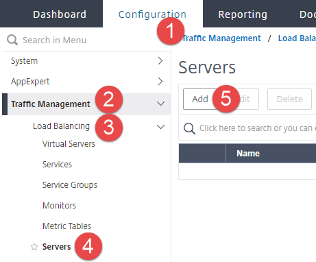
<ul>
  <li>Enter the name of the server, and the IP address of the server</li>
  <li>Then click Create</li>
</ul>
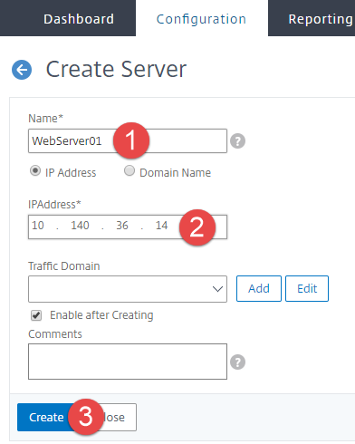
<i>Repeat the above steps to add additional servers.</i>

<h3>Create Service Group</h3>
<ul>
  <li>Navigate to Configuration > Traffic Management > Load Balancing > Service Groups</li>
  <li>Then click Add</li>
  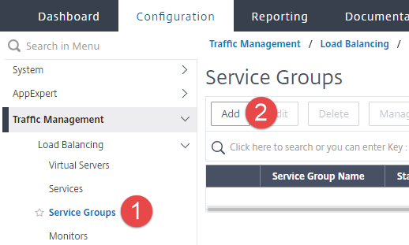
  <li>Enter the Service Group name, and select the desired Protocol</li>
  <li>Then click OK</li>
  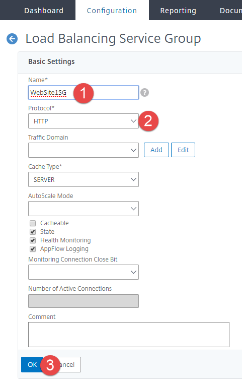
  <li>Click the Server Group Member section</li>
  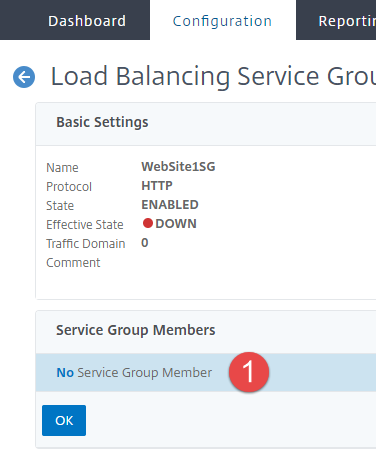
  <li>Select Server Based option</li>
  <li>Then click the arrow in the Select Server drop down</li>
  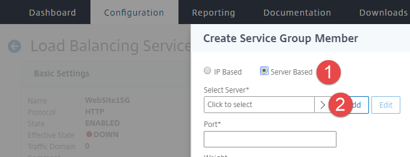
  <li>Click the check box for each server you want to be a member of the service group</li>
  <li>Then click Select</li>
  <i>If you do not see your server listed here, follow the steps detailed in "Add Server" section above.</i>
  
  <li>Enter the Port that will be used to communicate for the selected member servers</li>
  <li>Then click Create</li>
  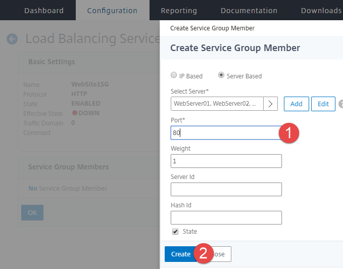
  <li>Click Done</li>
  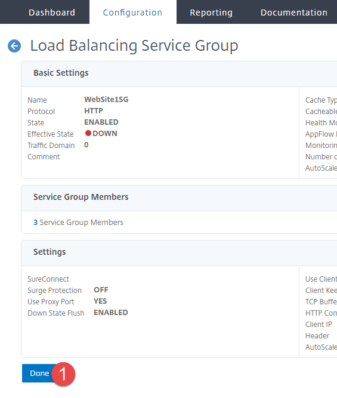
</ul>

<h3>Create Virtual Server</h3>
<ul>
  <li>Navigate to Configuration > Traffic Management > Load Balancing > Virtual Server</li>
  <li>Then click Add</li>
  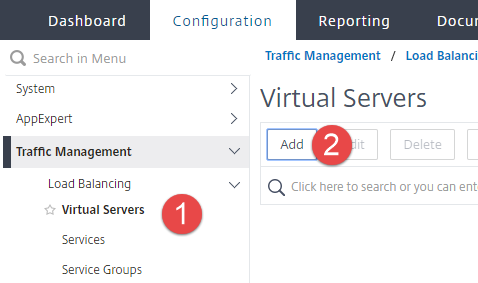
  <li>Enter the name for the Virutal Server, select the desired Protocol, enter the IP address, and enter the Port number</li>
  <li>Then click OK</li>
  <i>The IP entered here will be the VIP for the virtual server</i>
  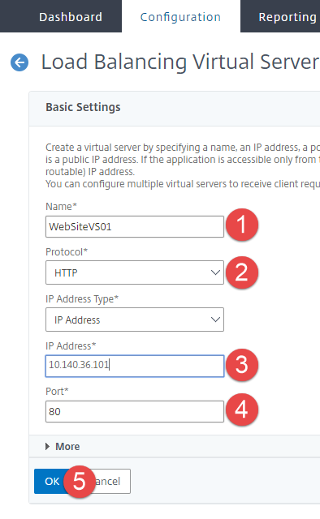
  <li>Click the Load Balancing Virutal Server ServiceGroup Binding section</li>
  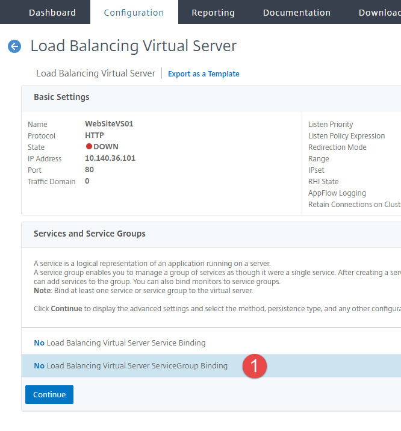
  <li>Click the arrow in the Select Service Group Name</li>
  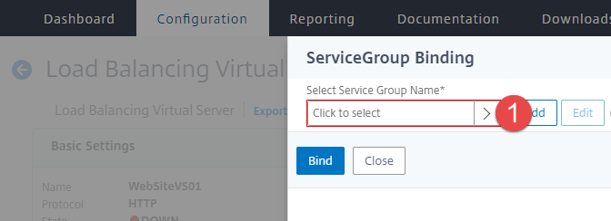
  <li>Click the Service Group option button</li>
  <li>Then click Select</li>
  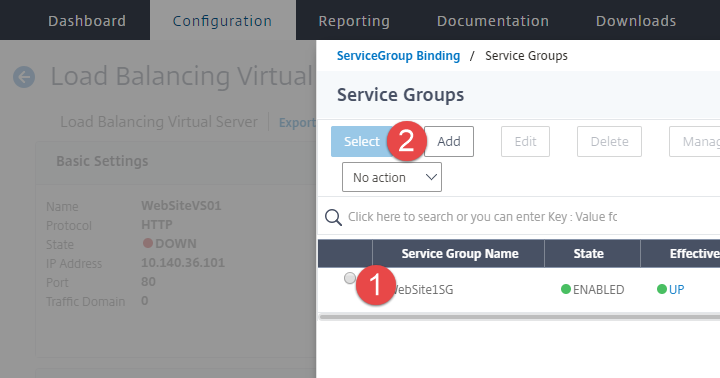
  <li>Click Bind</li>
  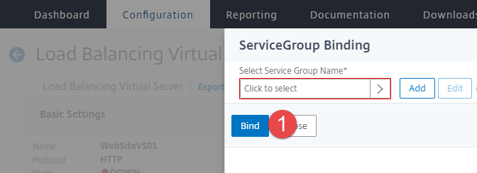
  <li>Click Continue</li>
  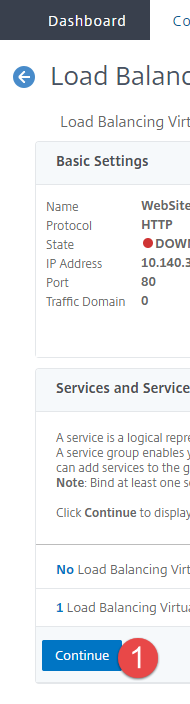
  <li>Click Done</li>
  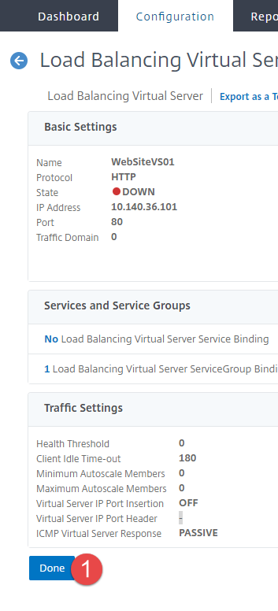
  <li>Congratulations! Your virutal server is ready</li>
  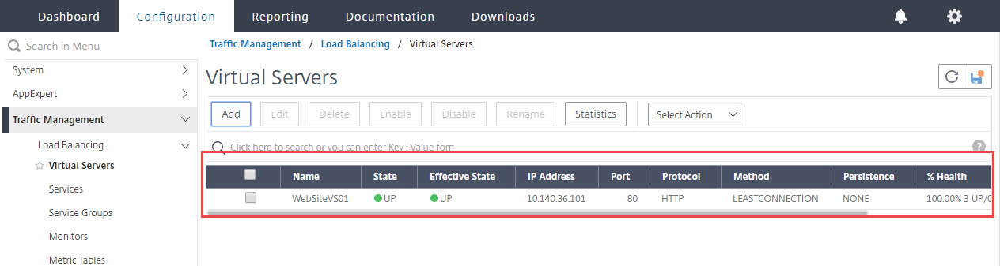
</ul>

<h3>Additional Notes</h3>

<ul>
  <li>In order for the Load Balancer to function correctly , the Management and RNAT IPs need to be able to reach each member of the Service Groups. You can view the RNAT IP by going to Network -> IPs and finding the "Mapped IP". By default, all IPs can talk to all other IPs within the same VLAN. However if you begin to add additional networks to your environment, you will need to create Firewall rules via the portal to allow the traffic. You will also need to add a route on the Load Balancer. You can do this by going to System > Network > NATs > RNAT via the Netscaler UI. Contact the NOC if you need additional help with this.</li>
  <li>When Load Balancing websites, its recommended to setup additional monitors on the Service Group instead of just Ping/TCP. An http-ecv monitor will verify each member of the Service Group is responding correctly before sending traffic to it. You can find assistance with this monitor here: http://support.citrix.com/article/CTX120921</li>
  <li>Tracking a Dedicated Load Balancer license expiration date is performed by the customer, please reference our <a href="./dedicated-load-balancer-license-management.md">License Management Article.</a></li>
</ul
