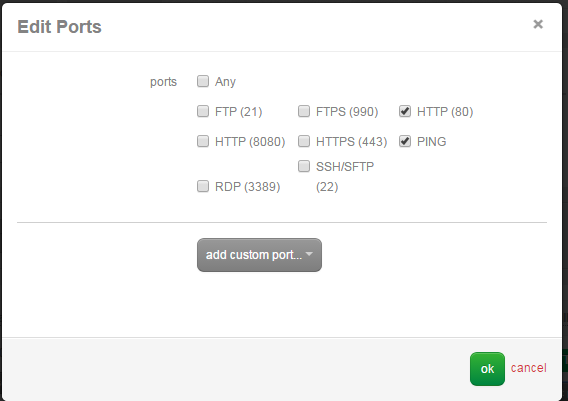
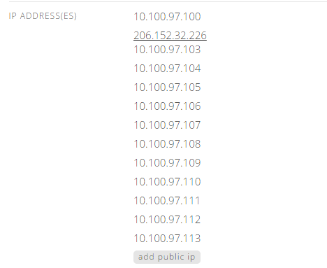
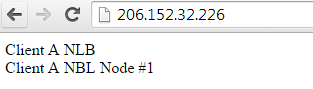

{{{
  "title": "Deploying a Dedicated Citrix VPX Environment in a Multi-tenant Fashion",
  "date": "4-20-2014",
  "author": "Chris Little",
  "attachments": [],
  "contentIsHTML": false
}}}

### Overview
While the CenturyLink Cloud platform provides a [self-service load balancing service](../Network/creating-a-self-service-load-balancing-configuration.md) for public facing web applications there may be times in which this model does not meet a customers use case or technical requirements. CenturyLink Cloud customers can license Citrix VPX dedicated virtual load balancers on a monthly use basis. Internal IT personnel, partners, resellers and other ISV's may wish to deploy dedicated Citrix VPX load balancers for consumption across their application portfolio or client base in a multi-tennant fashion. Using the Citrix VPX platform in a multi-tenant fashion can avoid costs of deploying devices for every application or customer and reduce administrative overhead.

### Use Case
This KB will provide a sample use case in which a highly available pair of Citrix VPX dedicated load balancers are deployed into multi-tier account hierarchy using CenturyLink Cloud Parent and Sub-accounts. The end state will deliver load balancing services to a sub-account of the parent providing account isolation while delivering secure load balancing services.

### Prerequisites
* A CenturyLink Cloud Account
* Hands-On experience deploying Dedicated VPX Appliances and configuration
* Hands-On experience working with Parent-Sub-Account hierarchies and Firewall self-service

### Building a Parent and Sub-Account Hierarchy
Each CenturyLink Cloud client will receive an initial account, this is the Parent Account.  This is the top level of a larger account hierarchy that can be created based on business needs. In this sample we will construct a simple set of 'Client' sub-accounts to the parent to simulate delivery of services to various unique customers of an ISV using CenturyLink Cloud to deliver their own unique service portfolio. The Account Structure will be as follows:

  

* [Creating a sub-account](../Accounts & Users/creating-a-sub-account.md)
* [Account Hierarchy User, Network Firewall Policy Primer](../Accounts & Users/account-hierarchy-user-network-and-firewall-policy-primer.md)
* [Practical guide for using roles](../Accounts & Users/practical-guide-for-using-roles.md)

### Deploy the Dedicated Citrix VPX Appliances
Follow the [Deploy a dedicated Citrix VPX Appliance](../Service Tasks/deploy-a-dedicated-citrix-vpx-appliance.md) knowledge base and for additional information refer to the [Load Balancing Comparison Matrix](../Network/load-balancing-comparison-matrix.md)

For this use case the following information was used.
* The Management IP of the VPX(s) is 10.100.97.100
* The RNAT IP of the VPX is 10.100.97.101
* The VIP's reserved for the VPX are 10.100.97.103 through 10.100.97.113

### Deploy Sub-Account Virtual Instances
With a sub-account named 'Client A' deployed under the Parent Account, its now time to deploy virtual instances you wish to load balance in this sub-account.  In this example, we are going to deploy (2) Windows 2012 R2 Data Center Web Servers running IIS. We will also build a test HTML page to show the load balancing services are functional at the end of configuration.
1. [Deploy a Web VLAN](../Network/creating-and-deleting-vlans.md) in the 'Client A' sub-account within the appropriate data center. Costs for VLANs can be found in our [Pricing Catalog](//www.ctl.io/pricing) or your CenturyLink Cloud MSA. Once this job completes we recommend you [apply a friendly name to this VLAN.](../Network/add-a-user-friendly-name-to-vlans.md) In this sample we used **WEB_10.100.187.0/24**.

    

2. [Create (2) Windows 2012 R2 Data Center Virtual Servers](../Servers/creating-a-new-enterprise-cloud-server.md) into a Group called Web Servers. These VM's should be placed in the WEB_10.100.187.0/24 VLAN.

    

3. Install IIS using the [Install IIS for Windows blueprint](../Blueprints/Install-IIS-on-Windows.md)
4. Use [Client VPN](../Network/how-to-configure-client-vpn.md) to RDP into the (2) newly created Web Servers and create a test page named **default.htm** in the IIS root folder (C:\inetpub\wwwroot). Sample basic HTML code is below:

    **Web Server 1 default.htm file:**
    ```
    <header>Client A NLB</header>
    <body>Client A NLB Node #1</body>
    ```

    **Web Server 2 default.htm file:**
    ```
    <header>Client A NLB</header>
    <body>Client A NLB Node #2</body>
    ```

    Validate the pages load locally on the Web Servers

### Configure Intra Data Center Firewall Policies
Next, we must configure the parent account firewall in which the VPX(s) reside (NLB_10.100.97.0/24) to permit the appropriate HTTP(s) traffic and VPX Service Group health checks into the network in which the (2) Web Servers reside (WEB_10.100.187.0/24).

1. Navigate to the Firewall portion of Control on the 'Parent' Account.
    * Select the Source Account to be the 'Parent' Account.
    * Select the Destination Account to be 'Client A' Sub-Account.

2. Add a Firewall Rule as follows:
    * Source Address network: NLB_10.100.97.0/24
    * Subnet Size: 1
    * Starting IP: RNAT IP of NLB Provided by the Service Task team.  As provided earlier the RNAT IP is 10.100.97.101  

      

    * Destination Address Network: WEB_10.100.187.0/24
    * Subnet Size: 1 (or use another size depending on the number of web servers)
    * Starting IP: Private IP address of your web servers in Client A sub-account.  Our (2) web servers were issued 10.100.187.12 and 10.100.187.13 in this example.  

      **TIP:  Select Add Destination Address a 2nd time to add both Web Server private IPs to the same rule**

      

    * Select HTTP(80) and PING.  Optionally select HTTPS(443) if you plan to implement SSL

      

3. Validate your new Firewall Rule and save it. We now have a Firewall Rule in place permitting tcp/80 and PING from the VPX RNAT IP (in a parent account) to (2) Virtual Web Servers in the Client A sub-account.

    

### Configure Citrix VPX Load Balancers
We now need to configure the VPX load balancer(s) to deliver services to 'Client A' web servers. In this phase we will build service groups, virtual servers (VIP) and update the VPX routes to appropriately route traffic to the networks in 'Client A' sub-account. **NOTE:** This is not meant to be an all encompassing guide to configuring a Citrix VPX but just a basic sample use case to balance (2) web servers over HTTP in another sub-account and network.

1. Create a Service Group
    * Service Group Name: CLIENT_A
    * IP Members: 10.100.187.12 and 10.100.187.13 on Port 80

      

    * Monitors: TCP and PING

      

      

2. Create a Virtual Server
    * Virtual Server Name: CLIENT_A_PROD_WEBSITE
    * IP Address: IP from the reserved VIP list during the setup of the Citrix VPX. We used 10.100.97.103 from the reserved pool in this example.
    * Service Groups: CLIENT_A

      

    * LB Method: Least Connection
    * Persistence: None

      

      

3. Create a route to the 'Client A' sub-account WEB_10.100.187.0/24 VLAN.  Navigate to Network, Routes in the VPX management UI. **TIP:** The gateway IP will be the same gateway IP as the existing route 0.0.0.0. In this use case we used the following configuration:
    * Network: 10.100.187.0
    * Netmask: 255.255.255.0
    * Gateway: 10.100.97.1 (Gateway of the NLB_10.100.97.0/24 VLAN in which VPX Resides)

      

      

4. Configure RNAT on the newly created route using the RNAT IP 10.100.97.101  

    

    

### Add Public IP to VIP for External Access
Finally, as this use case is a public facing website we will use the [Add Public IP](../Network/how-to-add-public-ip-to-virtual-machine.md) function of Control to perform a 1 to 1 NAT public IP to the VIP (Virtual Server) created previously on 10.100.97.103.

1. Navigate to the VPX in Control (TIP: if you have an HA pair the VIPs will be assigned to the primary VPX). Choose Add Public IP, select the VIP 10.100.97.103 (the virtual server created previously) and finally select HTTP(80).

    

2. The Public IP for this new NAT can be found in the Servers Portion of the Control UI. In this example the Public IP is 206.152.32.226.

    

3. Validate the (2) Virtual Web Servers for Client-A sub-account are delivering the Test Page created previously. Use the refresh button a few times to see the page is being delivered by a unique web server and the services are functional.

    

    
