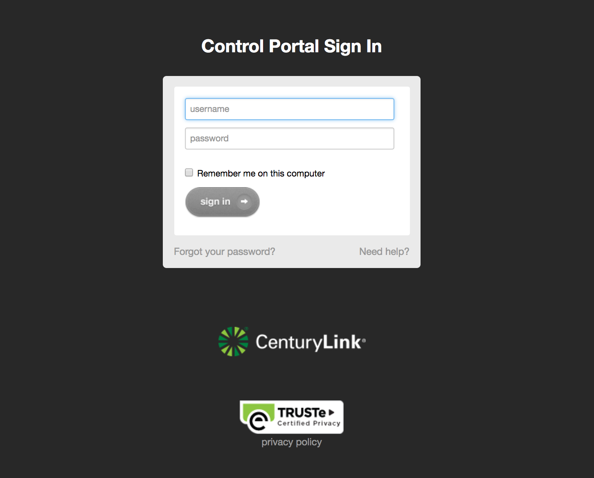
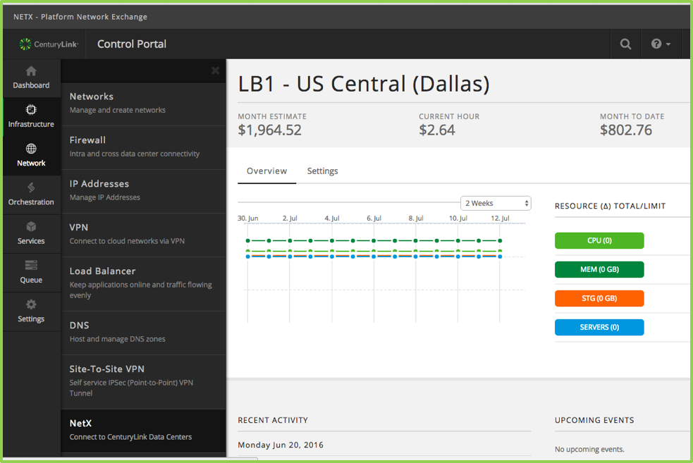
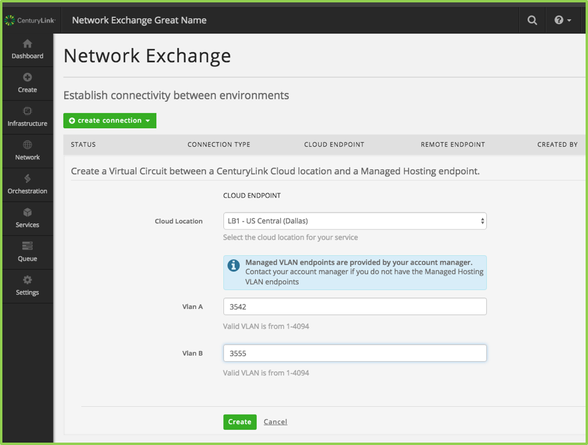
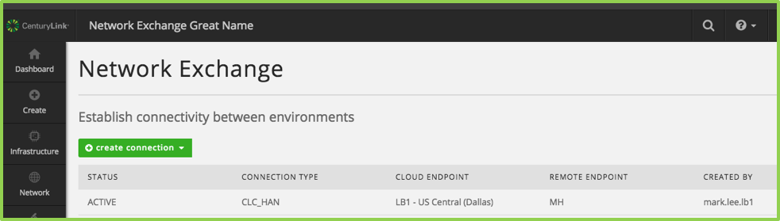
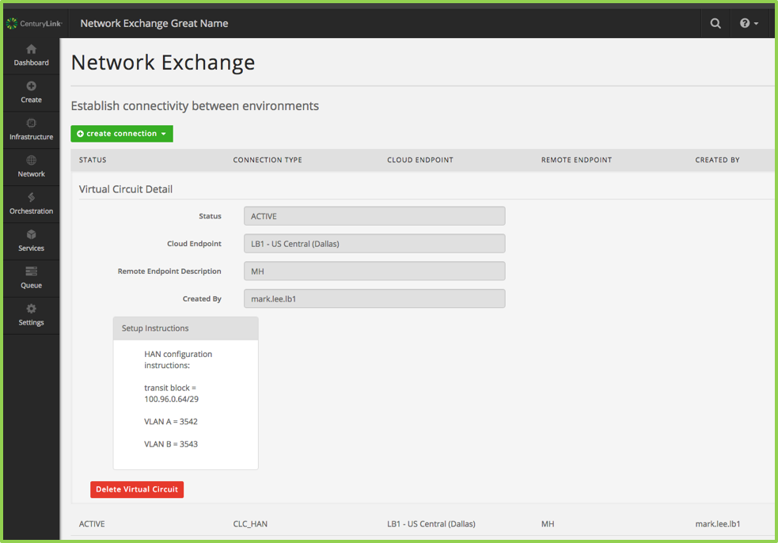
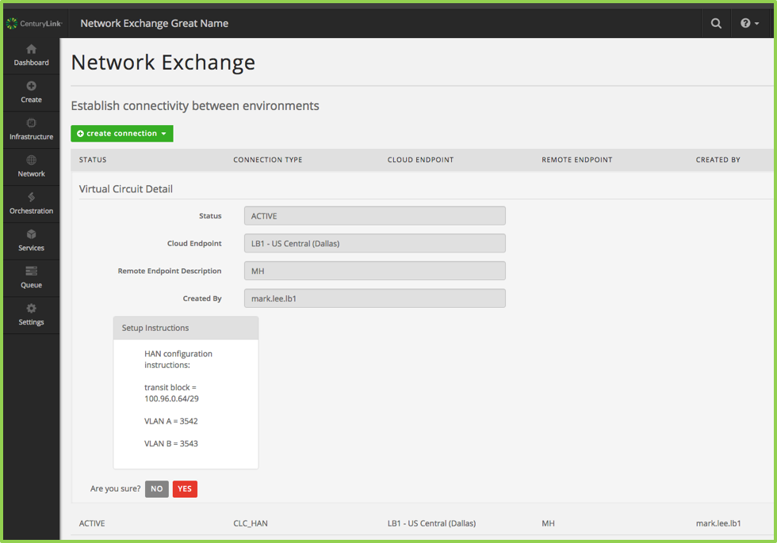
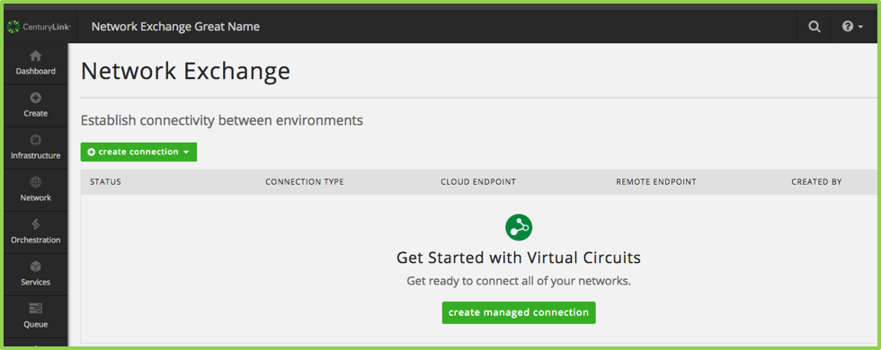

{{{
  "title": "Getting Started with Network Exchange",
  "date": "04-07-2017",
  "author": "Rob Lesieur",
  "attachments": [],
  "related-products" : [],
  "contentIsHTML": false,
  "sticky": false
}}}

### Product Overview

[Network Exchange](//www.ctl.io/network-exchange/ "Network Exchange Landing Page") ("NetX") provides secure, reliable, automated interconnectivity between service networks offered by NetX Providers, including managed hosting, colocation and cloud environments. A NetX Provider is any service provider who has integrated their networking domain for interconnect provisioning by NetX. A NetX User is any credentialed users of NetX who has Provider-defined access privileges to two or more NetX Providers.  This is the party who ultimately consumes Network Exchange, regardless of the Provider with which they have a direct contractual relationship. An instance of Network Exchange is itself referred to as an Exchange. It is an interconnect between two or more NetX Providers. A NetX User may have one or more Exchanges. A connectivity point for a NetX Provider for a given Exchange is referred to as an Exchange Port. For example, "Colocation" is a type of Exchange Port. 

Network Exchange is offered in a pay-as-you-go billing model in which the NetX User pays only for the bandwidth they consume for billable Exchange Port types. Please refer to the Knowledge Base article [Network Exchange Availability Matrix](https://www.ctl.io/knowledge-base/network/netx-exchange-billing)  for details on how billing is calculated. 

### Prerequisites
•	The desired Exchange Port type should be verified as supported at the desired data center(s). Please refer to the Knowledge Base article [Network Exchange Availability Matrix](https://www.ctl.io/knowledge-base/network/netx-exchange-port-availability-matrix).  
•	The desired Exchange Ports / data center combination(s) per Exchange should be validated as a supported configuration in the Knowledge Base article [Network Exchange Valid Exchange Configurations](https://www.ctl.io/knowledge-base/network/netx-valid-exchange-configurations) once Exchange Port availability has been validated, per the previous step.  
•	A CenturyLink Cloud customer environment must be established at the CLC data center(s) that the NetX User wishes to connect to. Please see the Knowledge Base article [Network Exchange CenturyLink Cloud Exchange Ports](https://www.ctl.io/knowledge-base/network/netx-centurylink-cloud-exchange-port) for detailed instructions.  
•	The VLAN IDs supplied from ordering a Cloud Network Service ("CNS") connection to your Managed Hosting environment, if the NetX User wishes to connect a Managed Hosting type Exchange Port. The associated data center ID will also be required for each Managed Hosting Exchange Port. Please see the Knowledge Base article [Network Exchange Managed Hosting Exchange Ports](https://www.ctl.io/knowledge-base/network/netx-managed-hosting-exchange-port) for detailed instructions.  
•	The data center ID is required for each Colocation Exchange Port being connected via NetX. Please see the Knowledge Base article [Network Exchange Colocation Exchange Ports](https://www.ctl.io/knowledge-base/network/netx-colocation-exchange-port) for detailed instructions.  

### Product Overview

[Network Exchange](//www.ctl.io/network-exchange/ "Network Exchange Landing Page") ("NetX") provides secure, reliable, automated interconnectivity between service networks offered by NetX Providers, including managed hosting, colocation and cloud environments. A NetX Provider is any service provider who has integrated their networking domain for interconnect provisioning by NetX. A NetX User is any credentialed users of NetX who has Provider-defined access privileges to two or more NetX Providers.  This is the party who ultimately consumes Network Exchange, regardless of the Provider with which they have a direct contractual relationship. An instance of Network Exchange is itself referred to as an Exchange. It is an interconnect between two or more NetX Providers. A NetX User may have one or more Exchanges. A connectivity point for a NetX Provider for a given Exchange is referred to as an Exchange Port. For example, "Colocation" is a type of Exchange Port. 

Network Exchange is offered in a pay-as-you-go billing model in which the NetX User pays only for the bandwidth they consume for billable Exchange Port types. Please refer to the Knowledge Base article [Network Exchange Billing Guide](https://www.ctl.io/knowledge-base/network/netx-exchange-billing)  for details on how billing is calculated. 

### Prerequisites
•	The desired Exchange Port type should be verified as supported at the desired data center(s). Please refer to the Knowledge Base article [Network Exchange Availability Matrix](https://www.ctl.io/knowledge-base/network/netx-exchange-port-availability-matrix).  
•	The desired Exchange Ports / data center combination(s) per Exchange should be validated as a supported configuration in the Knowledge Base article [Network Exchange Valid Exchange Configurations](https://www.ctl.io/knowledge-base/network/netx-valid-exchange-configurations) once Exchange Port availability has been validated, per the previous step.  
•	A CenturyLink Cloud customer environment must be established at the CLC data center(s) that the NetX User wishes to connect to. Please see the Knowledge Base article [Network Exchange CenturyLink Cloud Exchange Ports](https://www.ctl.io/knowledge-base/network/netx-centurylink-cloud-exchange-port) for detailed instructions.  
•	The VLAN IDs supplied from ordering a Cloud Network Service ("CNS") connection to your Managed Hosting environment, if the NetX User wishes to connect a Managed Hosting type Exchange Port. The associated data center ID will also be required for each Managed Hosting Exchange Port. Please see the Knowledge Base article [Network Exchange Managed Hosting Exchange Ports](https://www.ctl.io/knowledge-base/network/netx-managed-hosting-exchange-port) for detailed instructions.  
•	The data center ID is required for each Colocation Exchange Port being connected via NetX. Please see the Knowledge Base article [Network Exchange Colocation Exchange Ports](https://www.ctl.io/knowledge-base/network/netx-colocation-exchange-port) for detailed instructions.  

### Exceptions
Network Exchange is designed to enable connectivity between any supported Exchange Port type in any supported data center. Under certain circumstances, not all supported Exchange Port types will be available at every supported data center. Any exceptions to this general rule will be noted in the Knowledge Base article [Network Exchange Valid Exchange Configurations](https://www.ctl.io/knowledge-base/network/netx-valid-exchange-configurations) in the addendum. Retirement of known exceptions will be published in the [CenturyLink Cloud release notes](https://www.ctl.io/knowledge-base/release-notes). 

### Creating a Connection

Login to [Control Portal](//control.ctl.io) using your ctl.io username and password.

From the left side navigation menu, click on **Products** > **Network Exchange**

On the Network Exchange main screen, select  “**Create an Exchange**” 

On the Network Exchange “**Create an Exchange**” screen, in the "Name Your Exchange" dialogue box:
a.	Enter the “**Exchange Name**”. This name be appended with a randomly generated number to create a unique identifier for this Exchange.
b.	Enter the “**Description**”. This free form text is used to describe the Exchange you are creating. The account hierarchy can be viewed by clicking the account selector in the top lefthand corner of the screen. 
c.	Enter the “**Account Alias**”. This four character ID must be a valid sub-account within your CenturyLink Cloud account. 
d. Click "**Next**". 
On the Network Exchange “**Select Feature for Endpoint 1**” screen, in the "Name Your Exchange" dialogue box:
a. Select the endpoint from the drop down menu for "Select Endpoint Type" from the options of "COLO" (Colocation), "HAN" (Managed Hosting), or "CTL_CLOUD". Endpoints may be added in any order. 
b. Click "**Next**". 

Follow the instructions for the selected endpoint type from the options, below. You may add endpoints in any order and in any combination per supported configurations. The desired Exchange Ports / data center combination(s) per Exchange should be validated as a supported configuration in the Knowledge Base article [Network Exchange Valid Exchange Configurations](https://www.ctl.io/knowledge-base/network/netx-valid-exchange-configurations) 

#### Create a CTL Cloud Endpoint
a. Select "CTL_Cloud" from the "**Select Endpoint Type**" drop down menu. 
b. Click "**Next**".
You may cancel this operation by clicking the red X on the screen, or, by selecting the "**Back**" button.
You will navigate to the "Create a CTL Cloud Endpoint" flyout. 
a. Select a CLC data center from the "**CTL Cloud Datacenter**" drop down menu. 
b. Click "**Next**".  
You may cancel this operation by clicking the red X on the screen, or, by selecting the "**Back**" button.

#### Create a colocation Endpoint
a. Select "COLO" from the "**Select Endpoint Type**" drop down menu. 
b. Click "**Next**".
You may cancel this operation by clicking the red X on the screen, or, by selecting the "**Back**" button.
You will navigate to the "Create a CTL Cloud Endpoint" flyout. 
a. Select a CLC data center from the "**CTL Cloud Datacenter**" drop down menu. 
b. Click "**Next**".  
You may cancel this operation by clicking the red X on the screen, or, by selecting the "**Back**" button.

#### Create a Managed Hosting Endpoint
b.	Enter the “**Vlan A**” value
c.	Enter the “**Vlan B**” value
d.	Click on “**Create**”
e.	**Note:** VlanA and VlanB are provided by a CenturyLink account manager and are based on the Vlans that are set up in the in the CenturyLink data center’s managed hosting network. Contact your account manager for this information.

The virtual circuit will be created.  The screen will show the following which indicates the virtual circuit has been created and it is active.

### Deleting a Virtual Circuit

While logged into Control Portal, from the Network Exchange main screen, click on the row showing the virtual circuit.

The circuit details will display.  Click on **Delete Virtual Circuit**.

Click **Yes** to acknowledge the delete request.

The virtual circuit will be deleted.  The screen will refresh. The prior virtual circuit will not display (no further user action required).

### Q & A

**Q: Where can I find more information?**

**A:** The [Network Exchange](//www.ctl.io/network-exchange/) product page has additional information and links to resources.

**Q: Where do I obtain the VLANs required for creating a connection?**

**A:** These VLANs are provided by CenturyLink and are part of a CNS (Cloud Network Service) order. CenturyLink account managers, sales engineers, and implementation engineers will work with you to order and implement CNS connection to your DCC environment.

**Q: How many connections can I create?**

**A:** Only one virtual circuit per product type can be created at initial launch.  For example, one virtual circuit can be created between your CLC environment and your DCC environment.

**Q: Who should I contact for Support?**

**A:** For additional information, questions, and support of the CLC Network Exchange UI, please refer to the [Network Exchange](//www.ctl.io/network-exchange/) product page for additional information and resources.  Check back often as the content will be updated frequently.  Support requests should be emailed to [help@ctl.io](mailto:help@ctl.io).
