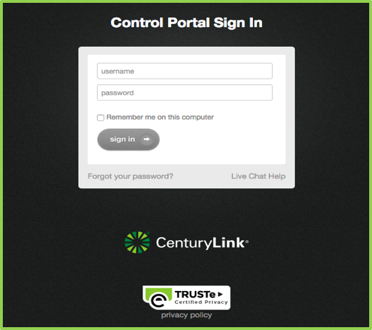
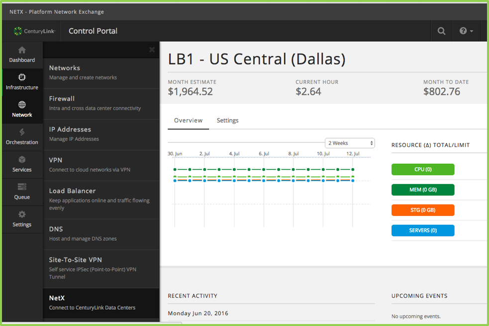
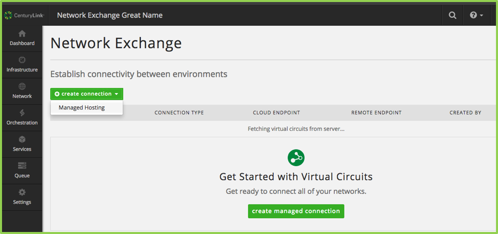

{{{
  "title": "Getting Started with Network Exchange",
  "date": "09-06-2016",
  "author": "Mark Lee",
  "attachments": [],
  "related-products" : [],
  "contentIsHTML": false,
  "sticky": false
}}}

### Product Overview

[Network Exchange](//www.ctl.io/network-exchange/) provides a secure, high speed, redundant, private network to connect your CenturyLink Cloud environment to other environments.  It is the preferred alternative to using the Internet or IPSec for customers needing to connect their CLC environments to other, non-CLC environments.  Network Exchange is ideal for your hybrid environment and applications as well as storage and backups.  Network Exchange includes ease of setup and management via the CLC Portal, coupled with CLC network automation, and pre-deployed network infrastructure.  All with usage based, pay as you go billing.

### Prerequisites

•	CenturyLink Cloud customer environment at UC1
•	A CNS (Cloud Network Service) connection to your DCC (Dedicated Cloud Compute) environment
•	The network VLANs of the CenturyLink Managed Hosting endpoint, as provided by your CenturyLink network rep •

### Exceptions

Although CenturyLink Cloud Network Exchange is designed to provide connectivity between the CLC Platform and other platforms, not all platforms and all locations are tested and ready at this time.  Availability is noted in the Prerequisite section above.  Refer to this document, the location and endpoints document, and the CLC release notes for updates to Network Exchange.

### Creating a Connection

Login to [Control Portal](//control.ctl.io) using your ctl.io username and password.

From the left side navigation menu, click on **Products** > **Network Exchange**

On the Network Exchange main screen, select  “**create managed connection**” or click on the “**create connection**” drop-down and select “**Managed Hosting**”.

On the Network Exchange “**create connection**” screen, select:
a.	Select the “**Cloud Location**”
b.	Enter the “**Vlan A**” value
c.	Enter the “**Vlan B**” value
d.	Click on “**Create**”
e.	**Note:** VlanA and VlanB are provided by a CenturyLink account manager and are based on the Vlans that are set up in the in the CenturyLink data center’s managed hosting network. Contact your account manager for this information.

The virtual circuit will be created.  The screen will show the following which indicates the virtual circuit has been created and it is active.

### Deleting a Virtual Circuit

While logged into Control Portal, from the Network Exchange main screen, click on the row showing the virtual circuit.

The circuit details will display.  Click on **Delete Virtual Circuit**.

Click **Yes** to acknowledge the delete request.

The virtual circuit will be deleted.  The screen will refresh. The prior virtual circuit will not display (no further user action required).

### FAQs

**Q: Where can I find more information?**

**A:** The [Network Exchange](//www.ctl.io/network-exchange/) product page has additional information and links to resources.

**Q: Where do I obtain the VLANs required for creating a connection?**

**A:** These VLANs are provided by CenturyLink and are part of a CNS (Cloud Network Service) order. CenturyLink account managers, sales engineers, and implementation engineers will work with you to order and implement CNS connection to your DCC environment.

**Q: How many connections can I create?**

**A:** Only one virtual circuit per product type can be created at initial launch.  For example, one virtual circuit can be created between your CLC environment and your DCC environment.

**Q: Who should I contact for Support?**

**A:** For additional information, questions, and support of the CLC Network Exchange UI, please refer to the [Network Exchange](//www.ctl.io/network-exchange/) product page for additional information and resources.  Check back often as the content will be updated frequently.  Support requests should be emailed to [help@ctl.io](mailto:help@ctl.io).
