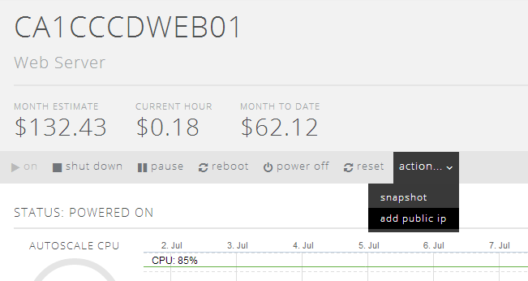
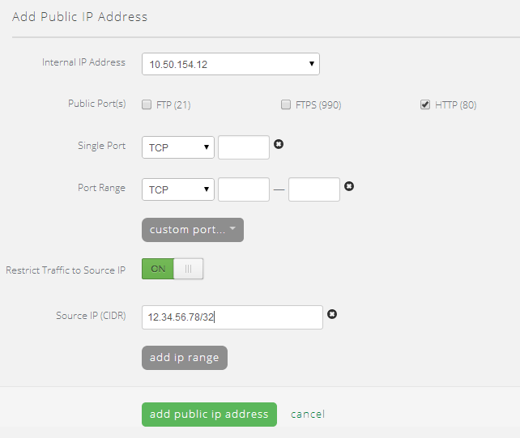
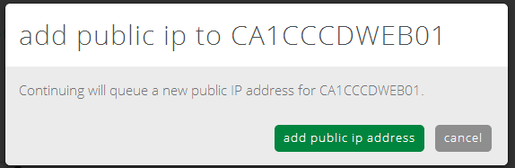
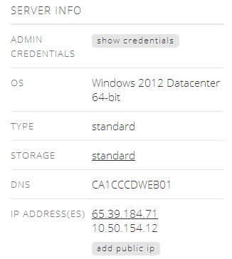
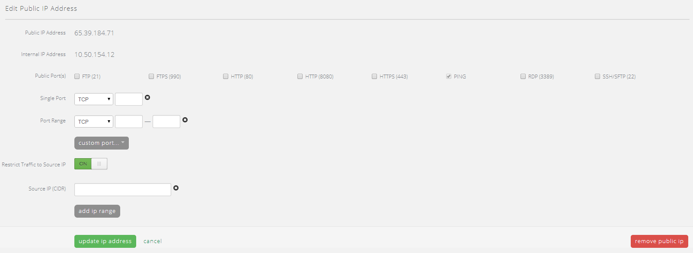

{{{
  "title": "How To: Add Public IP to Virtual Machine",
  "date": "4-9-2014",
  "author": "Chris Little",
  "attachments": [],
  "contentIsHTML": false
}}}

CenturyLink Cloud customers may wish to add a public IP to specific virtual machines in their cloud environment to deliver services.  Public IPs are delivered using a 1 to 1 NAT model.

### General Notes & Best Practices

- In its current iteration setting a source IP filter will secure all public ports, single ports or port ranges specified by the customer. Customers can leverage OS based firewall services if they wish to secure public services in a more granular fashion
- Customers are encouraged to leverage the source IP filter unless delivering completely open public internet services to their user community.
- Customers should avoid opening RDP or SSH to their virtual machines to the public internet. As such the following are recommended access methods.
  1. Use the free OpenVPN client included in every CenturyLink Cloud Account. Refer to [How To Configure Client VPN](../Network/how-to-configure-client-vpn.md). This is the ideal solution for individuals who are mobile and not in fixed office or data center locations.
  2. Build an IPSEC VPN Tunnel from a remote office or data center location. Refer to [Creating a Self-Service IPSEC Site-to-Site VPN Tunnel](../Network/creating-a-self-service-ipsec-site-to-site-vpn-tunnel.md). IPSEC VPN tunnels are best for remote access to Cloud Virtual Machines when administrators are in centralized offices or data centers.
  3. If either of the previous options are not feasible customers should at a minimum use the source IP filter service on the public IP and pair that with local OS firewall policies within the guest VM.

### Add Public IP to Virtual Machine
1. Open the Servers GUI in the Control Portal
2. Navigate to the Virtual Machine you wish to add a public IP, select Action, Add Public IP

    

3. In the Add Public IP Address form customers should populate the appropriate fields that meet their business needs. The GUI allows customers to add multiple single port, port ranges and CIDR Source IP ranges.

  - Internal IP Address: by default the GUI will present the private IP address of the virtual instance currently deployed. As the CenturyLink Cloud leverages a 1 to 1 NAT the public IP will be mapped to this private IP. It is important to note that should a customer require more than 1 public IP on a virtual machine the same process applies _except_ when visiting the GUI the internal IP address field will show **Add new IP address**. During the provisioning of the 2nd Public IP, as we use 1 to 1 NAT, a new private IP will also be bound to the virtual machine.
  - Public Port(s): A fixed, defined list of frequently used TCP ports customers can simple select from to save time.
  - Single Port: A specific TCP or UDP port for an application service
  - Port Range: A specific range of TCP or UDP ports for an application service
  - Restrict Traffic to Source IP: A flag that allows customers to input a source IP filter on the public IP. If this is **not** enabled any ports defined will be accessible by anyone on the public internet.
  - Source IP (CIDR): The list(s) of source IP or IP Ranges, in CIDR format, a customer wishes to permit access to the defined TCP or UDP ports. All other traffic will be blocked. Please see [Wikipedia Classless Inter-Domain Routing](//en.wikipedia.org/wiki/Classless_Inter-Domain_Routing) or [IP Address Guide's CIDR Tool](//www.ipaddressguide.com/cidr) for more details on proper format of CIDR ranges in the interface.

    

    

### Edit or Delete Public IP on a Virtual Machine

1. Open the Servers GUI in the Control Portal
2. Navigate to the Virtual Machine you wish to edit or delete the public IP, select the public IP in Server Info portion of the GUI

    

3. Make the appropriate updates to the Ports, CIDR and other configuration data and select Update IP Address _or_ select the Remove Public IP button to delete the Public IP.

    

### Frequently Asked Questions

**Q: What happens to my Public IP if I use the pause, power off or archive services in CenturyLink Cloud?**

A: Public IP addresses are static and using any of these features does not remove the public IP services from the Virtual Machine. The only time a public IP is removed from a virtual machine is a) when the VM is deleted b) the customer removes the public IP in the GUI or API

**Q: How are customers billed for public IP addresses?**

A: Customers are billed a nominal fee per public IP on a monthly basis. Public IP's are not an hourly billing service and as such using a public IP even for an hour will result in a nominal charge for the public IP address.

**Q: What is the maximum number of Public IPs that can be bound to a Virtual Machine?**

A: As the platform uses a 1 to 1 NAT (public to private) and /24 network sizes the current maximum number of public IPs is 219 per VM.
