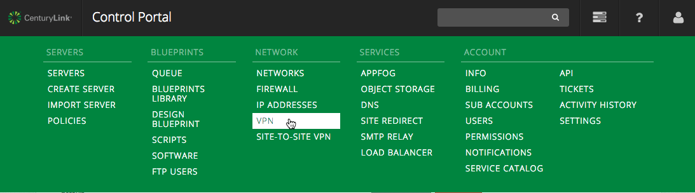
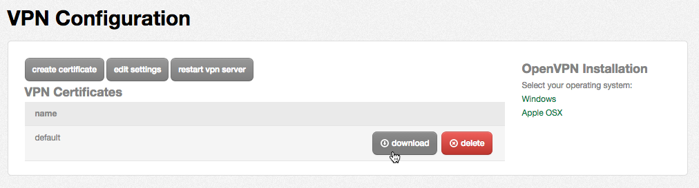

{{{
  "title": "How To Configure Client VPN",
  "date": "12-23-2014",
  "author": "jw@tier3.com",
  "attachments": []
}}}

### Overview

Client VPN enables users to connect to their secure isolated network. Each account has their own isolated VPN service that is provided at no charge. This service is built into the platform and managed by the network operation center.

The initial configuration just requires a certificate to be downloaded and used for connecting to the VPN service. You can also [configure two-factor authentication](configure-two-factor-authentication-for-client-vpn.md) to require both a username and password. To learn more about ways to connect such as persistent VPN or direct connection, please review [Network Access Options for Connecting to the CenturyLink Cloud Platform](network-access-options-for-connecting-to-centurylink-clouds-platform.md).

### Current Limitations

There are only a few limitations on this service as it is based on the [OpenVPN](http://www.openvpn.net) project.

- Maximum Concurrent Users: 19 (if you need more connections, review the different [Network Access Options for Connecting to the CenturyLink Cloud Platform](network-access-options-for-connecting-to-centurylink-clouds-platform.md))
- Maximum Connection: 1Gbps

### Getting Connected

In order to maximize resource efficiency on the platform, the Client VPN service will **not be activated** until after you have built your first server. _Make sure you first deploy a server in order to have your VPN server activated._

#### Downloading VPN Configuration Files

1. From Control Portal, use the menu to navigate to the VPN page listed under Network.
  

2. On the VPN Configuration page, find the existing VPN certificate and click the "download" button. (You may also use the "create certificate" button to create separate VPN certificates for other users.)
  

#### Installing the Client

**Windows**

1. Download the [OpenVPN client](http://openvpn.net/index.php/open-source/downloads.html). (We recommend 2.3.2+ for Windows users.)
2. Find the downloaded executable file and double click to start the installation. (Windows 7 and up users will need to right click and choose to "Run as Administrator.")
3. Accept all the defaults during installation.
4. After installing the client, extract the ZIP file you downloaded from Control Portal (as described above) into the `config` subdirectory under your client install location (generally `C:\Program Files\OpenVPN\config` for Windows XP or `C:\Program Files (x86)\OpenVPN\config` for Windows 7 and up).
6. Start the OpenVPN GUI client. (Windows 7 and up  users will need to right click and choose to "Run as Administrator.") This will place an icon in the notification area. Right click this icon and select "Connect".

**Apple OS X**

1. Download and install the [Tunnelblick OpenVPN client](http://code.google.com/p/tunnelblick/).
2. Accept all the defaults during installation.
3. After installing the client, extract the ZIP file you downloaded from Control Portal (as described above).
4. Run Tunnelblick - it will give you two options, select "Open Configuration Folder".
5. Copy the contents of the unzipped directory (5 files) into this folder.
6. Close Tunnelblick, and re-run.
7. Click the Tunnelblick icon in the Mac menu bar, then select the VPN connection that was added in order to connect.

You should now be connected to the VPN and able to connect to your server.

### FAQ

**Q: After I select "Connect", my OpenVPN client never establishes a connection (or the icon does not turn "green"). What could be wrong?**

A: Review the tips described in [VPN Client Connection Troubleshooting](vpn-client-connection-troubleshooting.md).

**Q: I have multiple sub accounts and want to be able to connect to each one's VPN individually. How can I do that?**

A: By default, connecting to the VPN of a parent account will provide access to the sub account networks as well. However, if you need to maintain multiple OpenVPN connections on your machine, be sure to follow the steps describing how to [Connect to Multiple OpenVPN Instances](connect-to-multiple-openvpn-instances.md).

**Q: Can I configure my VPN to require two-factor authentication?**

A: Yes, just follow the steps describing how to [Configure Two-Factor Authentication for Client VPN](configure-two-factor-authentication-for-client-vpn.md) to require both a username and password along with the certificate.

**Q: Is this service using secure SSL?**

A: This service uses SSL certificates but does not run on the standard SSL port. In your configuration file (ends in OVPN) you can see the remote information such as: `remote [IPHOST] [PORT]` (example: `remote 64.94.142.9 1194`).

**Q: Is this a shared or isolated service?**

A: This is an isolated service for every account. Each account receives their own VPN instance to keep isolation and high security.

**Q: Who handles the patching/maintenance of this service?**

A: The platform handles all of the VPN instance patching and maintenance. Occasionally you will need to upgrade you VPN client application.

**Q: What if I want to use my own VPN service?**

A: There are two ways you can do this:
  1. If it is a physical device, you will need to have a persistent connection to your secure network. This will allow you to host a physical VPN server yourself and route across the persistent connection.
  2. If you would like to use a software-based VPN server, you can install it on a virtual server and configure the firewall rules to allow access. Many of our customers have done this but it will not be supported by the NOC.

**Q: When I connect to the service, why can't I ping/connect to the server?**

A: This is one of the most common issues with Windows and the OpenVPN client. Make sure to right-click on the application and selecting "Run as Administrator" when launching the OpenVPN client.

**Q: Can I use this to connect to my office?**

A: You cannot use it as a direct connect. To learn more about ways to connect such as persistent VPN or direct connection, please review [Network Access Options for Connecting to the CenturyLink Cloud Platform](network-access-options-for-connecting-to-centurylink-clouds-platform.md).
