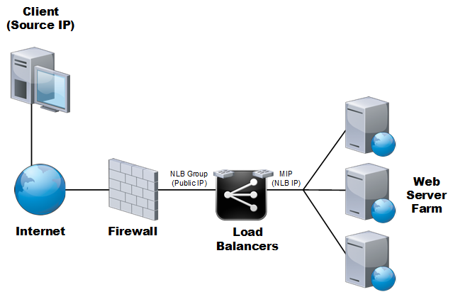

{{{
  "title": "How To:  View Source IP in Web Server Logs when using Load Balancing",
  "date": "4-8-2015",
  "author": "Chris Little",
  "attachments": [],
  "contentIsHTML": false
}}}

### Overview
When using the CenturyLink Cloud load balancing services customers who want to view or analyze web server logs find that these logs, by default, only show the MIP (Mapped IP) of the load balancing device as the Source IP. With this out of the box configuration web statistical analysis is impossible or not useful. 

### Audience
CenturyLink Cloud clients who make use of the Self-Service Load Balancing services.

### Exceptions
Only customers leveraging HTTP (tcp/80) load balancing can take advantage of this functionality. Customers using SSL-passthrough and HTTPS (tcp/443) cannot as the load balancers cannot decrypt packets.

### Graphical Representation
Below is a graphical representation of the CenturyLink Cloud Load Balancing services platform.  As shown, the web server farm receives all traffic from the Mapped IP (MIP) of the Load balancers and as a result web server logs may not be useful for web statistical analysis.

### Solution
CenturyLink Cloud inserts an X-Forwarded-For header that can be used to filter the original source IP on a customers web server logs. The following knowledge base articles from Citrix provide details for various web server platforms on how to configure Source IP logging.

* [Microsoft Windows 2003](//support.citrix.com/article/CTX119347)
* [Microsoft Windows 2008 or Windows 2008 R2](//support.citrix.com/article/CTX125526)
* [Apache 1.3 or 2.0](//support.citrix.com/article/CTX109350)
