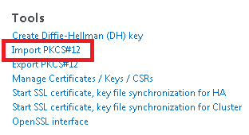
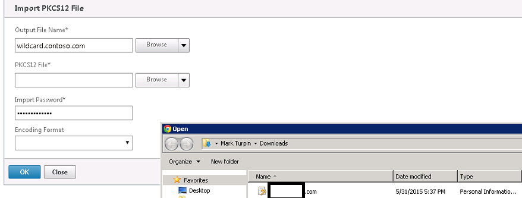
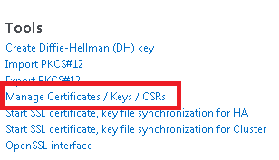

{{{
  "title": "Import Windows Certificate to Dedicated Load Balancers",
  "date": "6-9-2015",
  "author": "Mark Turpin",
  "attachments": [],
  "contentIsHTML": false
}}}

### Import a PFX certificate on Dedicated Load Balancers

Dedicated Load Balancers offer the capability of load balancing SSL traffic.  The easiest way to import a Windows certificate is to export it from a Windows server in PFX format with an assigned password.  PFX is recommended as there is a import PFX wizard native to Netscaler.

### Prerequisites

* HA Dedicated Load Balancers have been deployed to your account
* Must have an Admin login to the Netscaler
* An exported PFX certificate from a Windows machine with password

### Steps

1. Log into your dedicated load balancer RNAT IP (typically ends with .101)
2. Expand Traffic Management > SSL and click on Import PKCS#12 (under the Tools section)

  

3. Enter the output file name (such as wildcard.contoso.com).  Browsing is not required and you don't need to add a file extension
4. Browse and add the PFX from Local (assumes you have the exported PFX on the system you are connecting from)
5. Enter the PFX password

  

6. Once the certificate has been imported, you can view it in the Manage Certificates section:

  

7. The certificate is now available to be assigned to service groups for 443 traffic to service group members (no SSL offload) or virtual servers (SSL Offloading)

### Notes

* This example was performed on Netscaler VPX version 10.5
* Please review [Dedicated LB Basic Management](../Network/dedicated-load-balancer-basic-management.md) for the basics of creating a Load Balancer VIP and Service Group when using Dedicated Load Balancers
