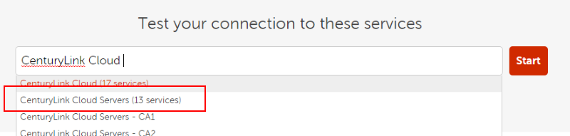
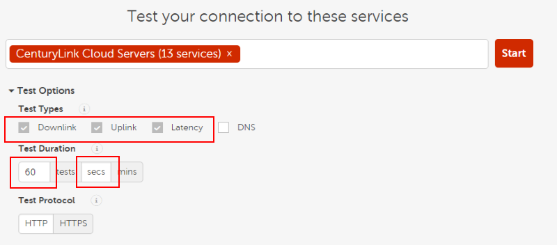
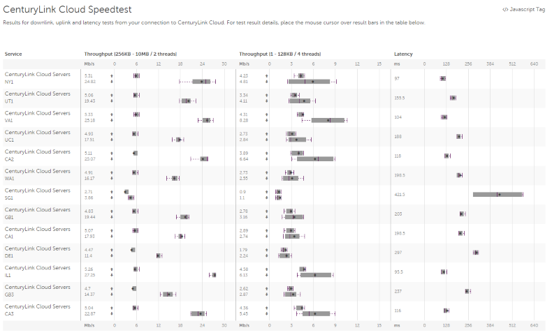

{{{
  "title": "Latency Testing for CenturyLink Cloud Data Center Nodes",
  "date": "7-15-2015",
  "author": "Chris Little",
  "attachments": [],
  "contentIsHTML": false
}}}

### Overview
Customers who wish to test latency to CenturyLink Cloud Data Center Nodes globally can leverage [CloudHarmony's](//cloudharmony.com) cloud speed test.  

### Steps
1. Navigate to the [Cloud Harmony Cloud Speed Test](//cloudharmony.com/speedtest)

2. Use the search term *CenturyLink Cloud* and select *CenturyLink Cloud Servers (13 Services)*.  

    

3. Expand *Test Options* and select *Latency*.  Optionally, you can select *Downlink and Uplink* to get valuable data transfer metrics in the same test.  De-select the DNS field.  You may wish to change the Test Duration to fit your needs.  

    

4. Select the *Start* button to begin your test.  Results will be displayed for the defined tests.

    
