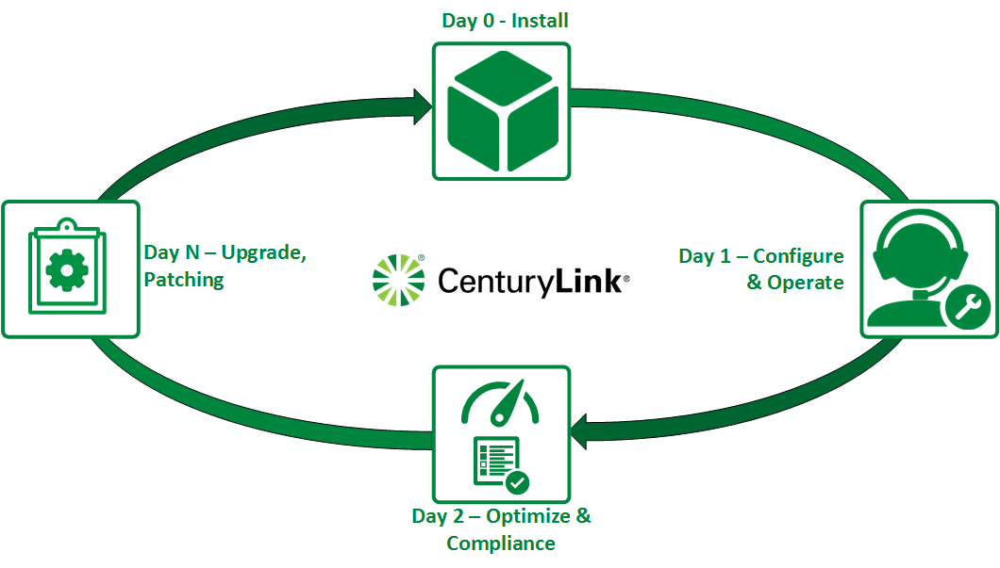

{{{
  "title": "Load Balancing Comparison Matrix",
  "date": "4-24-2018",
  "author": "Chris Little",
  "attachments": [],
  "contentIsHTML": false,
  "sticky": true
}}}

### Overview

CenturyLink Cloud offers customers a wide range of load balancing solutions in our product catalog.  Customers who wish to quickly review the choices along with features and capabilities can use the comparison matrix below.

### Comparison Matrix

**Feature**|**LBaaS (Legacy)**|**LBaaS**|**Citrix VPX4 (Dedicated)**|**Marketplace**
-----------|---------------------|---------|-----------------------------------------|-------------
Control Integration1|Yes|Yes|No|No
High Availability|Yes|Yes|Optional|Optional
Mode/Port|TCP/80 TCP/443|HTTP TCP/Any|Any|Any
Method|Round Robin Least Connection|Round Robin6 Least Connection6 SourceIP6 URL Hash6|[Listing](http://docs.citrix.com/en-us/netscaler/11-1/load-balancing/load-balancing-customizing-algorithms.html)|Varies by Vendor
Persistence|SourceIP|SourceIP|[Listing](http://docs.citrix.com/en-us/netscaler/11-1/load-balancing/load-balancing-persistence/persistence.html)|Varies by Vendor
Health Checks|No|[Yes](../General/LBaaS/getting-started-with-load-balancer-as-a-service.md)|Yes|Yes
SSL Offloading|No|No|Yes|Yes
WAF|No|No|Optional|Optional
Global Server Load Balancing|No|No|Optional|Optional
GeoIP Filtering|No|No|Yes|Yes
[SLA](//www.ctl.io/legal/sla/)2|Yes|Yes|Limited|Limited
[Support](../Support/how-do-i-report-a-support-issue.md)3|Yes|Yes|Limited|Limited
Lifecycle Management7|Day 0 Day 2 Day N|Day 0 Day 2 Day N|Day 0|Day 0
[Locations](../General/CenturyLinkCloud/centurylink-cloud-data-center-locations.md)|CA1 CA2 GB1|VA1 VA2 UC1 WA1 IL1 NY1 CA3 GB3 SG1 DE1 DE3 AU1|Any|Any
OSI Model5|Layer 4|Layer 4|Layer 4 Layer 7|Layer 4 Layer 7

1: Control Integration at a minimum allows a customer to implement the service on-demand, operate it via self-service in the UX (or using API) with a pay as you go model.

2: [SLA](//www.ctl.io/legal/sla/) is defined as an agreement between CenturyLink and the customer to honor service availability for load balancing specific services via a master service agreement. [Limited SLA's include Virtual Machine availability only.](//www.ctl.io/legal/sla/)

3: [Support](//www.ctl.io/support/) is defined as an agreement between CenturyLink and the customer to provide technical support and incident management for the load balancing service. Tracking a Dedicated Load Balancer license expiration date is performed by the customer, please reference our [License Management Article](../Network/dedicated-load-balancer-license-management.md). **Limited Support provides customer service engineers to confirm the infrastructure state and virtual machine state.  Customers are responsible for all Day 1, 2 and N operational support.**

4: [CenturyLink offers](//www.ctl.io/pricing/) various pricing models for the Citrix VPX virtual appliance based on performance and availability needs.  Customers can elect to upgrade **[edition](//www.citrix.com/products/netscaler-adc/platforms.html#editions)** and **availability** configurations at any time.

5: Layer 4 is related to fourth layer of the OSI model: transport level. For example: TCP and UDP protocols are transport level. Layer 7 is related to seventh layer of the OSI model: application level. For example: HTTP, FTP, SMTP, DNS protocols are application level.

6: All algorithms support "weight" concept. The "weight" parameter is used to adjust the server's weight relative to other servers. All servers will receive a load proportional to their weight relative to the sum of all weights, so the higher the weight, the higher the load.

7: CenturyLink provides lifecycle management based on Day 0 (Install: Import, IP Device), 1 (Configure, Operate), 2 (Optimize, Compliance) and N (Upgrade, Patching) methodologies.  Customers are responsible for any operational support that is not included in the base offering.

  

### Additional Details
The links below provide supporting material that can assist a customer with further evaluating the proper load balancing service for their needs.

* [Citrix Netscaler VPX Documentation](http://docs.citrix.com/en-us/netscaler/11-1.html)
* [Citrix Netscaler VPX Editions](//www.citrix.com/products/netscaler-adc/platforms.html#editions)
* [CenturyLink Pricing Catalog](//www.ctl.io/pricing/)
* [CenturyLink Cloud Legal Documentation (SLA, Service Guide etc)](//www.ctl.io/legal/)
