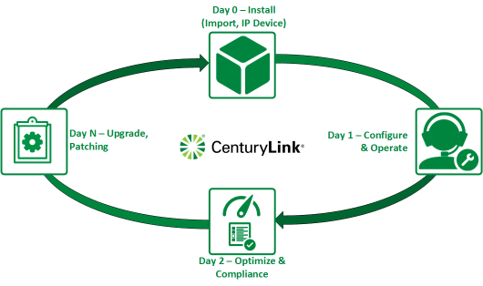

{{{
  "title": "Load Balancing Comparison Matrix",
  "date": "10-05-2016",
  "author": "Chris Little",
  "attachments": [],
  "contentIsHTML": false,
  "sticky": true
}}}

### Overview

CenturyLink Cloud offers customers a wide range of load balancing solutions in our product catalog.  Customers who wish to quickly review the choices along with features and capabilities can use the comparison matrix below.

### Comparison Matrix

**Feature**|**LBaaS (Legacy)**|**LBaaS**|**Citrix VPX4 (Dedicated)**|**[Ecosystem](../Ecosystem Partners\Partner Integration Resources/ecosystem-program-resources.md)**
-----------|---------------------|---------|-----------------------------------------|-------------
Control Integration1|Yes|Yes|No|No
High Availability|Yes|Yes|Optional|Optional
Mode/Port|TCP/80 TCP/443|HTTP TCP|Any|Any
Method|Round Robin Least Connection|Round Robin Least Connection|[Listing](http://docs.citrix.com/en-us/netscaler/11-1/load-balancing/load-balancing-customizing-algorithms.html)|Varies by Vendor
Persistence|SourceIP|SourceIP|[Listing](http://docs.citrix.com/en-us/netscaler/11-1/load-balancing/load-balancing-persistence/persistence.html)|Varies by Vendor
Health Checks|No|Yes|Yes|Yes
SSL Offloading|No|No|Yes|Yes
Global Server Load Balancing|No|No|Optional|Optional
[SLA](//www.ctl.io/legal/sla/)2|Yes|Yes|No|No
[Support](../Support/how-do-i-report-a-support-issue.md)3|Yes|Yes|No|No
Lifecycle Management6|Day 0 Day 2 Day N|Day 0 Day 2 Day N|Day 0|Day 0
Locations|Any|VA1 UC1|Any|Any
OSI Model5|Layer 4|Layer 4|Layer 4 Layer 7|Layer 4 Layer 7

1: Control Integration at a minimum allows a customer to implement the service on-demand, operate it via self-service in the UX (or using API) with a pay as you go model.

2: SLA is defined as an agreement between CenturyLink and the customer to honor service availability via a master service agreement. 

3: Support is defined as an agreement between CenturyLink and the customer to provide technical support and incident management for the load balancing service

4: [CenturyLink offers](//ctl.io/pricing) various pricing models for the Citrix VPX virtual appliance based on performance and availability needs.  Customers can elect to upgrade **edition** and **availability** configurations at any time.

5: Layer 4 is related to fourth layer of the OSI model: transport level. For example: TCP and UDP protocols are transport level. Layer 7 is related to seventh layer of the OSI model: application level. For example: HTTP, FTP, SMTP, DNS protocols are application level.

6: CenturyLink provides lifecycle management based on Day 0 (Install), 1 (Configure, Operate), 2 (Optimize, Compliance) and N (Upgrade, Patching) methodologies.  Customers are responsible for any operational support that is not included in the base offering.

  

### Additional Details
The links below provide supporting material that can assist a customer with further evaluating the proper load balancing service for their needs.

* [Citrix Netscaler VPX Documentation](http://docs.citrix.com/en-us/netscaler/11-1.html)
* [Citrix Netscaler VPX Editions](//www.citrix.com/products/netscaler-adc/platforms.html#editions)
* [CenturyLink Ecosystem Partners](../Ecosystem Partners/ecosystem-partner-list.md)
* [CenturyLink Pricing Catalog](//ctl.io/pricing)
* [CenturyLink Cloud Legal Documentation (SLA, Service Guide etc)](//www.ctl.io/legal/)
