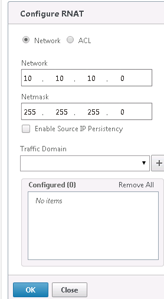
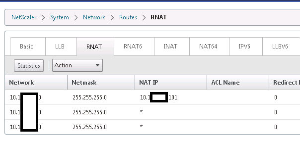

{{{
  "title": "Use Dedicated Load Balancers for Multiple Networks",
  "date": "6-9-2015",
  "author": "Mark Turpin",
  "attachments": [],
  "contentIsHTML": false
}}}

### Load Balance Multiple Networks on Dedicated Load Balancers

Dedicated Load Balancers offer the capability of load balancing traffic destined for servers on multiple networks in your account

### Prerequisites

* HA dedicated Load balancers have been deployed to your account
* Must have an Admin login to the Netscaler
* Additional networks must be provisioned in your account
* Firewall policies have been configured appropriately to allow access between the additional networks and network the dedicated load balancers reside on

### Steps

1. Log into your dedicated load balancer RNAT IP (typically ends with .101)
2. Expand System > Network and click on Routes
3. Select the RNAT tab
4. Select the Action drop down menu, and select Configure RNAT
5. Add the network and subnet mask

  Example:  10.10.10.0 for network, 255.255.255.0 for netmask

  

6. After you have completed adding networks the RNAT page will display the networks (including the network the dedicated LB's were provisioned on):

  

### Notes

* This example was performed on Netscaler VPX version 10.5
* Please review the [Load Balancing Comparison Matrix](../Network/load-balancing-comparison-matrix.md) the review the capabilities of dedicated vs shared load balancers
