{{{
  "title": "Network Exchange Getting Started Guide",
  "date": "06-28-2018",
  "author": "Jason Holland",
  "attachments": [],
  "related-products" : [],
  "contentIsHTML": false,
  "sticky": false
}}}

### Product Overview

[Network Exchange](https://www.ctl.io/network-exchange/) provides secure, high-speed, redundant, automated network connections between disparate IT environments allowing for a true hybrid environment. Common environments include CenturyLink Cloud (CLC), CenturyLink Private Cloud on VMware Cloud Foundation (VCF), Colocation environments, CenturyLink Managed Hosting, CenturyLink Dedicated Cloud Compute, 3rd party networks and customer owned devices. Network Exchange is ideal for your hybrid environment as well as capacity augmentation or cloud bursting, data migration, and disaster recovery. 

An instance of Network Exchange is referred to as an Exchange. An Exchange is an interconnect between two or more IT environments. A Network Exchange customer may have one or more Exchanges. A connectivity point, such as a Colocation, in an Exchange is referred to as an Endpoint.

Network Exchange is offered in a fixed monthly billing model preventing customers from experiencing unexpected charges. Please refer to the Knowledge Base article [Network Exchange Billing Guide ](network-exchange-billing-guide.md) for details on how billing is calculated.

**Note:** Redundancy to all Endpoint types are supported in Network Exchange. Non-redundant connectivity is also available for Colocation environments or Endpoints required Dedicated Access.

### Glossary

* **Network Exchange:** Provides secure, reliable, automated interconnectivity between Endpoints within a metro-area.
    * **Exchange:** An instance of Network Exchange with an interconnect between two or more IT environments. A Network Exchange customer may have one or more Exchanges.
    * **Endpoint:** A connectivity point for a given Exchange.

* Common Provider business models include:
  * **Hosted Service Provider:** Primarily provides SaaS or managed services on infrastructure hosted by CenturyLink o External Managed Service Provider: Primarily provides services to others on infrastructure not operated by CTL, i.e. IaaS clouds, SaaS platforms, Colocation providers.
  * **External Network Service Provider:** Primarily provides WAN services, e.g. Level3, Comcast.
  * **CenturyLink Managed Service Provider:** Any CTL-provided service, e.g. CLC, DCC, Managed Hosting, Network Exchange or CenturyLink Managed Network Provider: Any CTL-provided network, e.g. IQ, CTL-SDWAN
* **On-Net Provider:** A service provider, fitting any of the above sub-models, who is directly or indirectly reachable via Network Exchange

### Prerequisites

* You must be logged in to perform the functions outlined in this guide.
* The desired Endpoint should be verified as supported at the desired data center(s). Please refer to the Knowledge Base article [Network Exchange Availability Matrix](network-exchange-connectivity-matrix-configuration-guide.md).
* The desired Endpoint / data center combination(s) per Exchange should be validated as a supported configuration in the Knowledge Base article [Network Exchange Availability Guide](network-exchange-connectivity-matrix-configuration-guide.md) once Endpoint availability has been validated, per the previous step.
* Each Endpoint type has certain prerequisites, capabilities and caveats that should be understood before setting up an Exchange. Please see the following Knowledge Base documents for details:
	* [Network Exchange CenturyLink Cloud Endpoint Guide](network-exchange-clc-endpoint-guide.md)
	* [Network Exchange Colocation Endpoint Guide](network-exchange-clc-colocation-endpoint-guide.md)
	* [Network Exchange Managed Hosting via HAN Endpoint Guide](network-exchange-clc-managed-hosting-endpoint-guide.md)
	* [Network Exchange Dedicated Access Endpoint Guide](network-exchange-centurylink-private-cloud-endpoint-guide.md)
	* [Network Exchange CenturyLink Private Cloud on VMWare Cloud Foundation Endpoint Guide](network-exchange-clc-endpoint-guide.md)

### Exceptions

Network Exchange is designed to enable connectivity between any supported Endpoint type in any supported data center. Under certain circumstances, not all supported Endpoint types will be available at every supported data center. Any exceptions to this general rule will be noted in the Knowledge Base article [Network Exchange Availability Matrix and Configuration Guide](network-exchange-connectivity-matrix-configuration-guide.md) in the addendum. 

### Log-in to Network Exchange

1. Navigate to the Cloud Application Manager login site and login using your Cloud Application Manager or CenturyLink Cloud username and password.

2. From the left side navigation menu, click on **Products > Network Exchange**.
  
   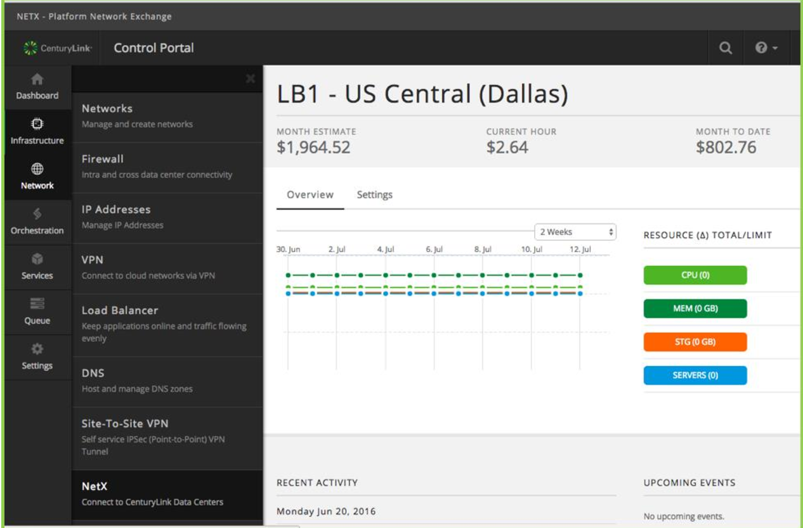

### Creating An Exchange

   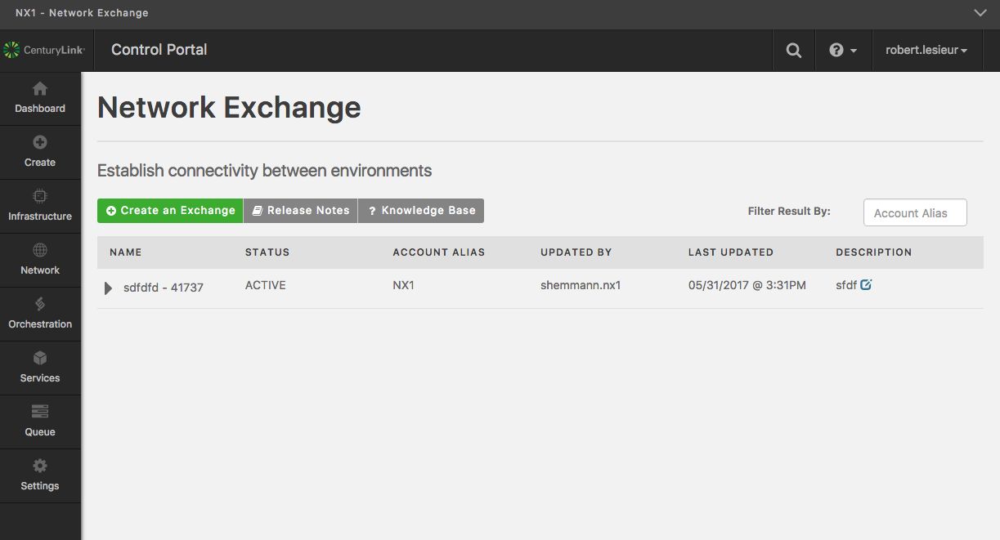

Click on the "Create an Exchange" button.

   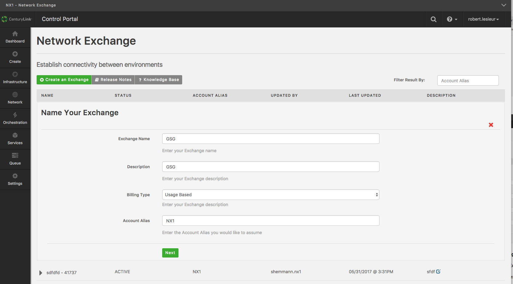

In the top-left corner of the screen, select the (sub)account to be used for this Exchange.

In the **Name Your Exchange** dialogue box:

1. Enter the **Exchange Name**. This name will be appended with a randomly generated
number to create a unique identifier for this Exchange. Note that this field may not contain spaces.

2. Enter the **Description**. This free form text is used to describe the Exchange you are
creating. This field should be utilized to differentiate amongst Exchanges.

43. Only usage-based billing is available at this time and therefore no selection is required for **Billing Type**.

    **Note:** “Account Alias” is a four character ID that will be auto-populated after the first step, and thus does not need to be manually entered.

    **Note:** CenturyLink Service Delivery teams acting on behalf of a customer should enter the customer’s Account Alias here.

4. Click **Next**.

   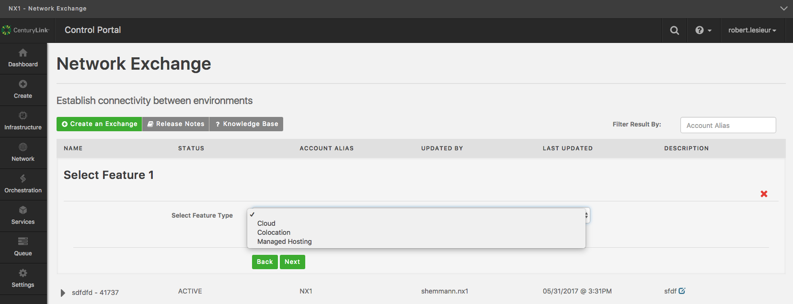

On the Network Exchange **Select Feature 1** screen:

1. Select the endpoint from the drop down menu for **Select Feature Type** from the options of **Cloud**, **Colocation**, **Managed Hosting**. Endpoints may be added in any order.

2. Click **Next**.

Follow the instructions for the selected endpoint type from the options, below. You may add endpoints in any order and in any combination per supported configurations. The desired Exchange Ports / data center combination(s) per Exchange should be validated as a supported configuration in the Knowledge Base article [Network Exchange Configuration Guide](network-exchange-connectivity-matrix-configuration-guide.md).

### Create a Cloud Endpoint

   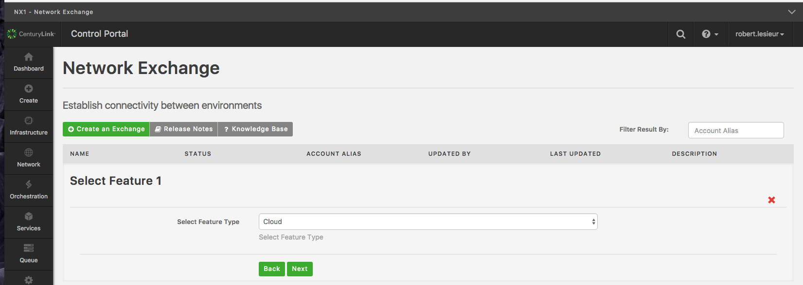

1. Select **Cloud** from the **Select Feature Type** drop down menu.

2. Click **Next**.

    **Note:** You may cancel this operation by clicking the red X on the screen, or, by selecting the **Back** button. 

      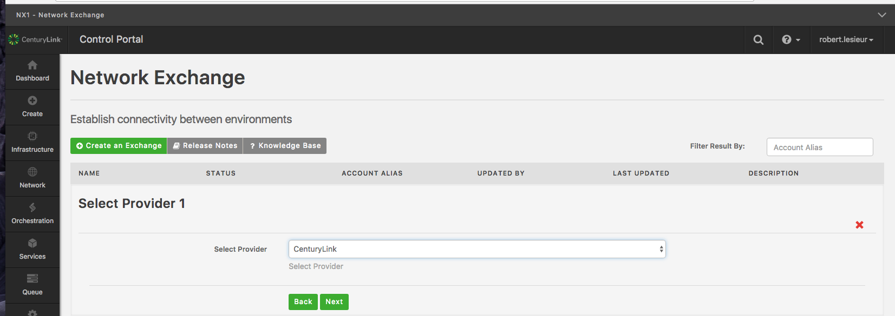

1. Select the provider from the **Select Provider** drop down menu. 

2. Click **Next**.

    **Note:** You may cancel this operation by clicking the red X on the screen, or, by selecting the **Back** button. 
    
     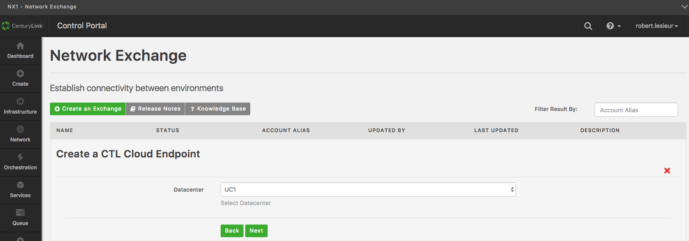

1. Select a data center from the **Datacenter** drop down menu.

2. Click **Next**.

**Notes**

* You may cancel this operation by clicking the red X on the screen, or, by selecting
the "Back" button.
* If this is your first endpoint, you will be prompted to enter a second endpoint. If you have entered an endpoint previously, you will be navigated to the **Review Your Request** flyout. See instructions below on how to proceed.

### Create a Colocation or “Dedicated Access" Endpoint

   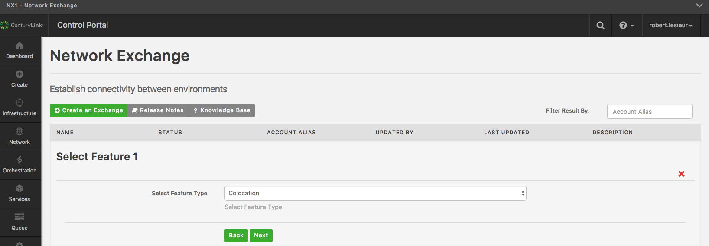

1. Select **Colocation** or **Dedicated Access** from the **Select Feature Type** drop down menu.

2. Click **Next**. You may cancel this operation by clicking the red X on the screen, or, by selecting the **Back** button.

    **Note:** "Dedicated access" refers to a dedicated connection between Network Exchange and a CenturyLink Managed Service, that bypasses HAN.

     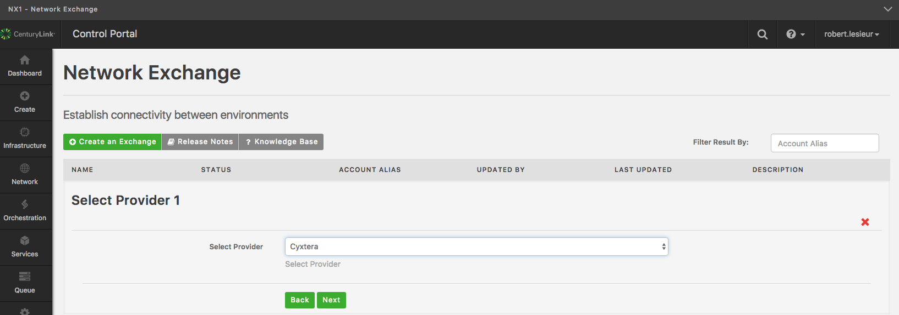

1. Select the provider from the **Select Provider** drop down menu.

2. Click **Next**.

    **Note:** You may cancel this operation by clicking the red X on the screen, or, by selecting the **Back** button.
  
     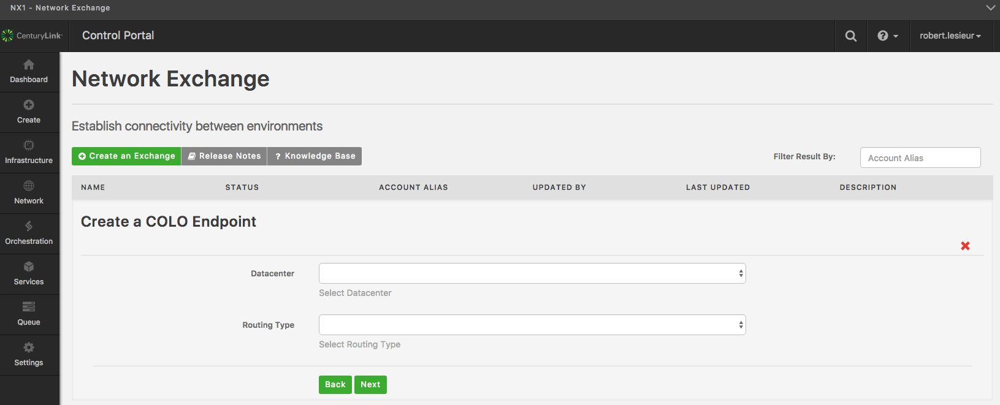

1. Select a colocation data center from the **Datacenter** drop down menu.

2. Select the Routing Type: Static or BGP.

3. Click "**Next**"

     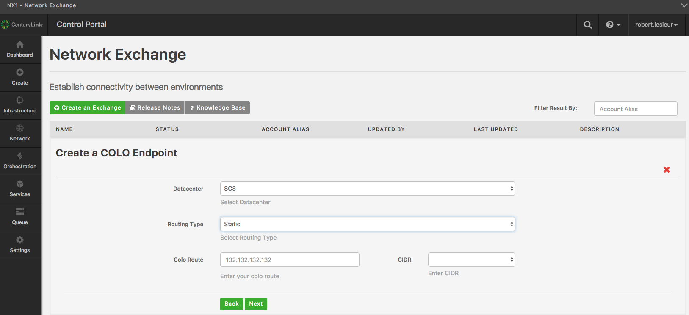

**For static endpoints**

1. Select the static route to be applied to the connection. 

2. Select the CIDR for the route.

3. Click **Next**.

**Notes**

* You may cancel this operation by clicking the red X on the screen, or, by selecting the "Back" button.
* If this is your first endpoint, you will be prompted to enter a second endpoint. If you have entered an endpoint previously, you will be navigated to the **Review Your Request** flyout. See instructions below on how to proceed.

     

**For BGP endpoints**

1. Enter the private ASN for your network.

2. Click **Next**.

**Notes:**

* You may cancel this operation by clicking the red X on the screen, or, by selecting
the **Back** button.
* If this is your first endpoint, you will be prompted to enter a second endpoint. If you
have entered an endpoint previously, you will be navigated to the **Review Your Request** flyout. See instructions below on how to proceed.

### Create a Managed Hosting Endpoint

   

1. Select **Managed Hosting** from the **Select Feature Type** drop down menu.

2. Click **Next**. You may cancel this operation by clicking the red X on the screen, or, by selecting the **Back** button.

   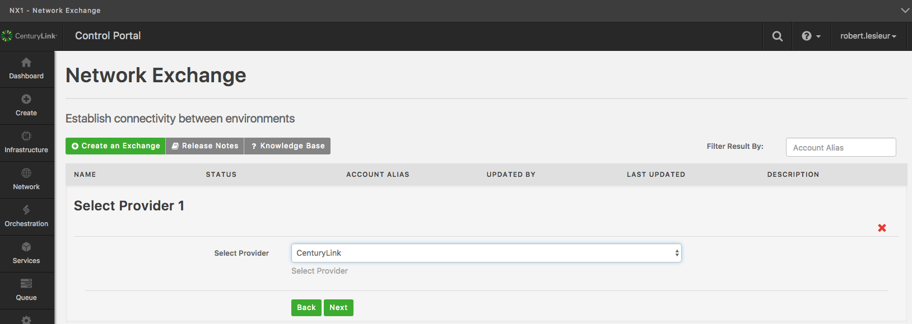
   
Select the **Provider** from the drop down list.

   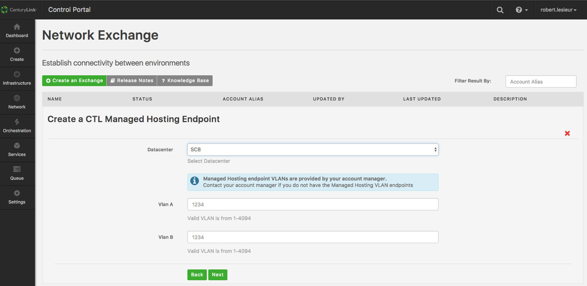

1. Select the **Datacenter** from the drop down list.

2. Enter the **VLAN A** value.

3. Enter the **VLAN B** value.

4. Click **Next**.

**Notes:**

* VLAN "A" and VLAN "B" are provided by a CenturyLink account manager and are based on the VLANs that are set up in the in the CenturyLink data center’s managed hosting network. Please see [Network Exchange Managed Hosting Exchange Ports](network-exchange-clc-managed-hosting-endpoint-guide.md) for details on how to obtain these.
* You may cancel this operation by clicking the red X on the screen, or, by selecting the "Back" button.
* If this is your first endpoint, you will be prompted to enter a second endpoint. If you have entered an endpoint previously, you will be navigated to the **Review Your Request** flyout. See instructions below on how to proceed.

### Completing Your Request

   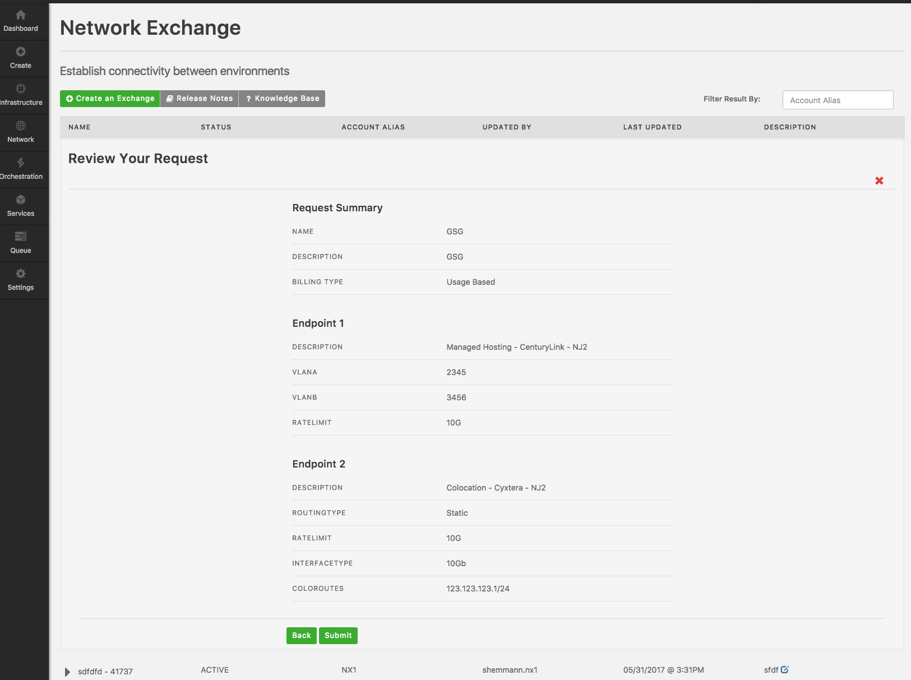

Upon selecting two endpoints, you will reach the “Review Your Request” flyout.

1. Review your request to ensure the specifications for the Exchange you have configured.

2. Click on “Submit”. You will be navigated to the main Network Exchange screen which will display the Exchange you have just created and the status of the build. During creation the status will display “BUILDING” and that Exchange will not be accessible. Upon completion, the status will change to “ACTIVE”.

Note: The values displayed will reflect user selections. The image provided is for reference only.

### Adding an Endpoint to an Exchange

   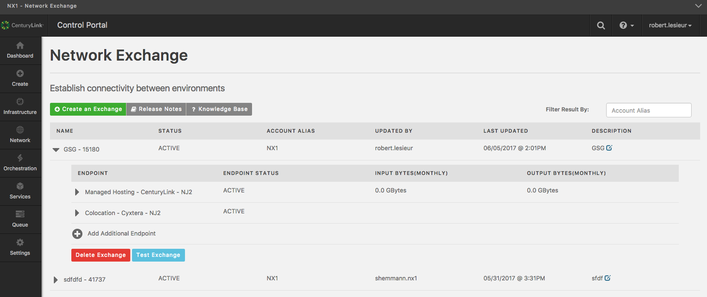

1. Select the desired Exchange, which must have an “ACTIVE” status.

2. Select **Add Additional Endpoint**.

   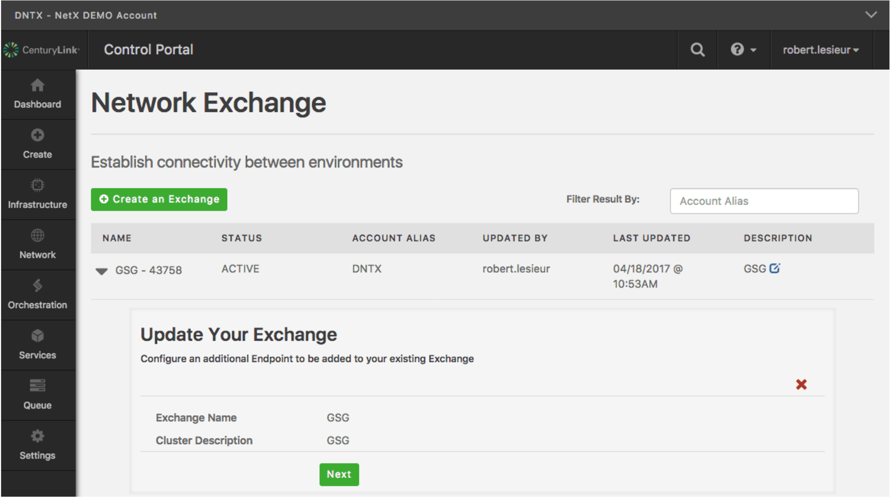

* Click **Next**.

6. Follow the instructions for the particular endpoint type, above. Note that instead of displaying a “BUILDING” status as in the Completing Your Request section above, this action displays a “UPDATING” status.

   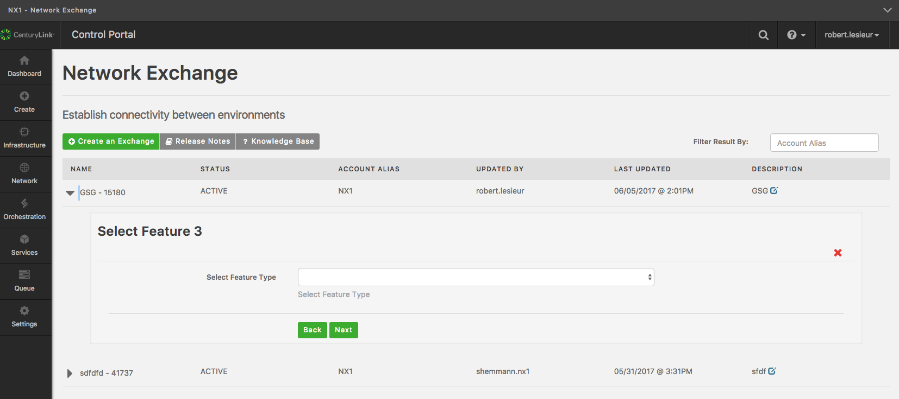

### Removing an Endpoint from an Exchange

   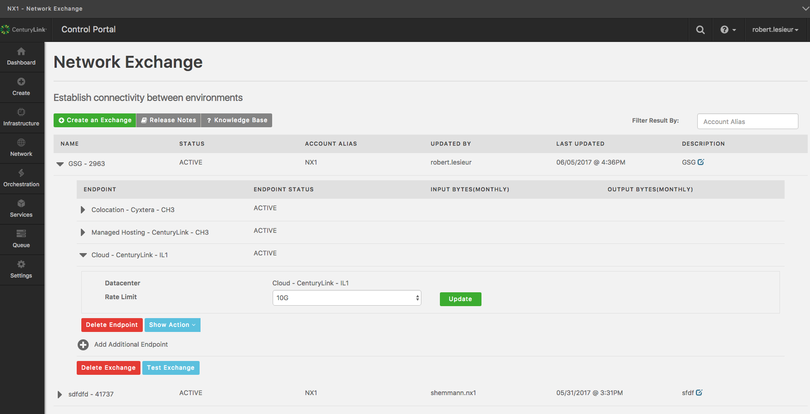

**Note:** Endpoints may not be deleted from an Exchange if there are less than three endpoints.

1. Select the Exchange containing the endpoint you wish to delete.

2. Select the endpoint you wish to delete.

3. Click **Delete Endpoint**.

4. Click **Yes** or **No** when prompted. The status will indicate “UPDATING” during the deletion process.

### Deleting an Exchange

   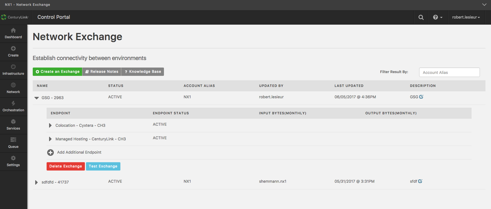 
   
1. Select the Exchange you wish to delete.

2. Click **Delete Exchange**.

3. Click **Yes** or **No** when prompted. The status will indicate “DELETING” during the deletion process.

### Q & A

**Q: How many Exchanges may an End User have?**

**A:** There are currently no limitations on the number of Exchanges per End User. See the Knowledge Base article [Network Exchange Configuration Guide](network-exchange-connectivity-matrix-configuration-guide.md) for more details.

**Q: How many endpoints may be in an Exchange?**

**A:** An Exchange may include a number of endpoints up to the maximum Exchange Port
types available in a metro area served by Network Exchange. See the Knowledge Base article [Network Exchange Configuration Guide](network-exchange-connectivity-matrix-configuration-guide.md) for more details.

**Q: How do I convert from Cloud Network Service to Network Exchange?**

**A:** A Knowledge Base article Migrating from Cloud Network Service to Network Exchange will be provided in the future that will discuss this in detail.

**Q: Can I change the name of an Exchange once it’s created.**

**A:** No. You will have to delete and recreate the Exchange with the name of your choice.

**Q: How do I know when I can use an Exchange?**

**A:** Exchanges will pass traffic any time it has an “ACTIVE” status. Note that for
colocation and direct connect endpoints, cross connects must be in place and the destination networks including the connectivity endpoints must be configured correctly
for traffic to pass.

**Q: Who should I contact for Support?**

**A:** Support requests should be emailed to [help@ctl.io](mailto:help@ctl.io).
