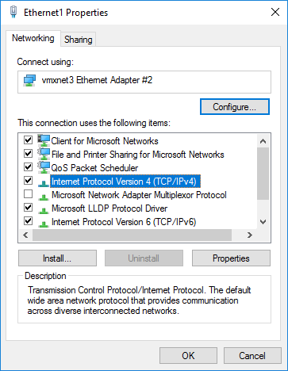
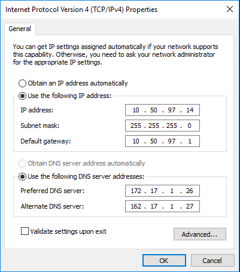

{{{
  "title": "Swap Network Interfaces on Servers using Go CLI",
  "date": "8-25-2018",
  "author": "Jeremy Anderson",
  "attachments": [],
  "contentIsHTML": false
}}}

### Overview
This KB article extends the existing [Add or Remove Network Interface to Server using Go CLI](//www.ctl.io/knowledge-base/network/add-or-remove-network-interface-to-server-using-go-cli/) KB article.  In this article we provide detailed steps to finalize routing changes inside the various operating environments supported inside CenturyLink Cloud, as well as instructions to remove unwanted interfaces as necessary.

This article assumes the user has some familiarity with the operating system they are running, as well as the [Go CLI](//github.com/CenturyLinkCloud/clc-go-cli) interface.

### Prerequisites
* A CenturyLink Cloud Account
* [Go CLI](//github.com/CenturyLinkCloud/clc-go-cli)
* IP address of server you wish to manage.

### Required Data
* Control Portal Username and Password
* Server name you wish to modify
* [Server credentials](//www.ctl.io/knowledge-base/servers/how-to-retrieve-rootadministrator-password/)

### Operating system changes

Follow these steps to modify routes for the following operating systems in the CLC network.

**Note**:  This work must be coordinated with CLC staff.  Changing the routes on servers without Customer Care modifying the primary and secondary network interfaces will result in loss of connectivity to your server.  Please open a ticket by emailing help@ctl.io and schedule a maintenance window with CenturyLink Customer Care prior to performing these operations.

#### Windows

Begin by editing the properties of the secondary network (Ethernet 1)

Select IPv4 properties, and add the gateway for the secondary network.

