{{{
  "title": "Swap Network Interfaces on Servers using Go CLI",
  "date": "8-25-2018",
  "author": "Jeremy Anderson",
  "attachments": [],
  "contentIsHTML": false
}}}

### Overview
This KB article extends the existing [Add or Remove Network Interface to Server using Go CLI](//www.ctl.io/knowledge-base/network/add-or-remove-network-interface-to-server-using-go-cli/) KB article.  In this article we provide detailed steps to finalize routing changes inside the various operating environments supported inside CenturyLink Cloud, as well as instructions to remove unwanted interfaces as necessary.

This article assumes the user has some familiarity with the operating system they are running, as well as the [Go CLI](//github.com/CenturyLinkCloud/clc-go-cli) interface.

### Prerequisites
* A CenturyLink Cloud Account
* [Go CLI](//github.com/CenturyLinkCloud/clc-go-cli)
* IP address of server you wish to manage.

### Required Data
* Control Portal Username and Password
* Server name you wish to modify
* [Server credentials](//www.ctl.io/knowledge-base/servers/how-to-retrieve-rootadministrator-password/)

### Operating system changes

Follow these steps to modify routes for the following operating systems in the CLC network.

**_Note_**:  This work must be coordinated with CLC staff.  Changing the routes on servers without Customer Care modifying the primary and secondary network interfaces will result in loss of connectivity to your server.  Please open a ticket by emailing help@ctl.io and schedule a maintenance window with CenturyLink Customer Care prior to performing these operations.

#### Windows

Begin by editing the properties of the secondary network (Ethernet 1)

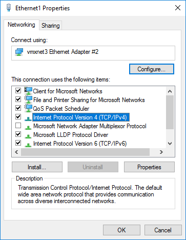

Select IPv4 properties, and add the gateway for the secondary network.

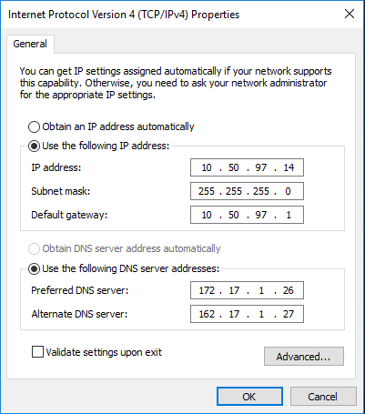

After adding a gateway, and pressing OK, you will see a warning screen

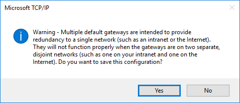

Press OK and continue.

Edit the primary network (Ethernet 0)

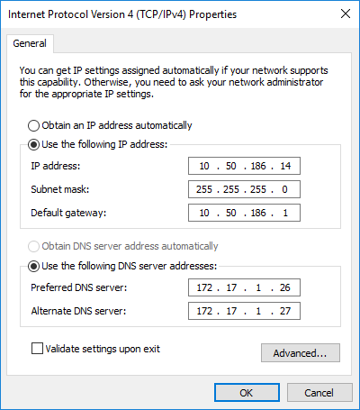

Remove the default gateway and press OK.

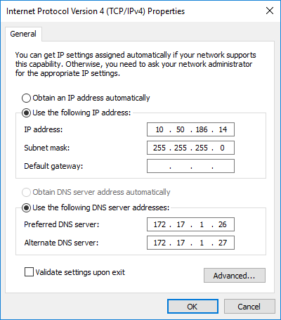

Once this step is completed, you will lose RDP connectivity to the server.  Reconnect on the new primary interface (now Ethernet 1) and you will be able to continue using the server's new primary interface.

#### Centos Linux

The interface configuration files in CentOS will be found in `/etc/sysconfig/network-scripts` 

Begin by editing the primary interface (`ifcfg-ens160`)


Remove the gateway from the interface.

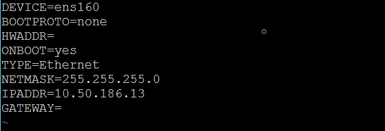

Save and exit this file.

Edit the secondary interface (`ifcfg-ens192`)

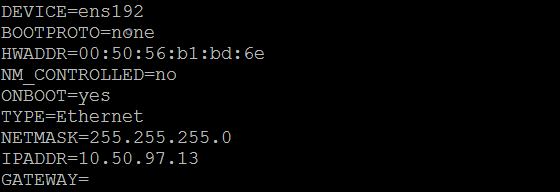

Add a gateway entry to this interface


Save and exit this file.

Once these changes have been made, you can restart networking on the server using the `service network restart` command.

After the restart command is issued, you will likely lose SSH connectivity to the server.  Reconnect on the new primary interface (now ens192) and you will be able to continue using the server's new primary interface.

#### Ubuntu Linux

Ubuntu network interfaces are all stored in `/etc/network/interfaces`.  Bring this file up in a text editor.

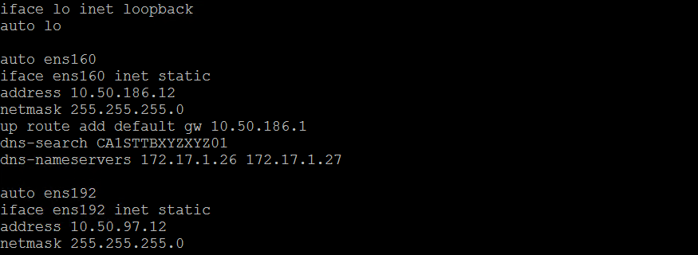

Remove the default gateway from the ens160 interface and add a gateway to the ens192 interface.

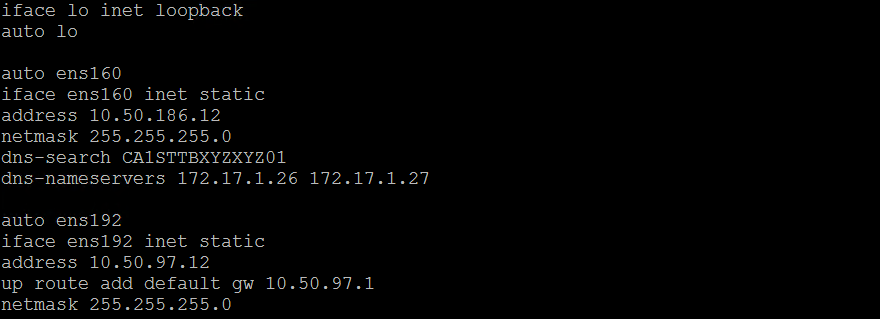

Save and exit this file.

Once these changes have been made, you can restart networking on the server using the `systemctl restart networking` command.

After the restart command is issued, you will likely lose SSH connectivity to the server.  Reconnect on the new primary interface (now ens192) and you will be able to continue using the server's new primary interface.


### Remove a Network Interface from a Server

1. Run the remove-secondary-network Go CLI command.  Use the optional --account-alias field is only required if you wish to remove a network interface from a server in a sub-account

    ```
    clc server remove-secondary-network --server-name XXXXX --network-name XXXXX --account-alias XXXX
    ```

    ```
    {
      "OperationId": "f31a59e3fbff4458a988f00e9a8e97fe",
      "URI": "http://api.ctl.io/v2-experimental/operations/CCVA/status/f31a59e3fbff4458a988f00e9a8e97fe"
    }
    ```

2. Validate the network interface you requested be removed is in fact removed in Control and the Server.

    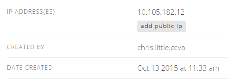

    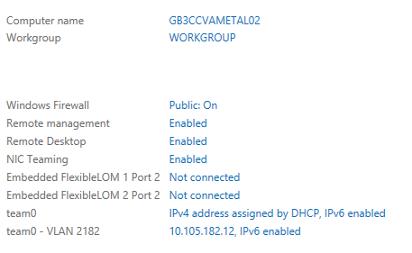
