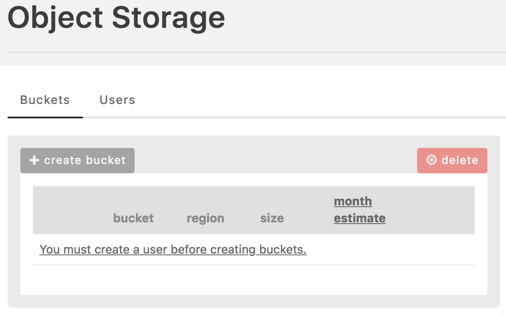
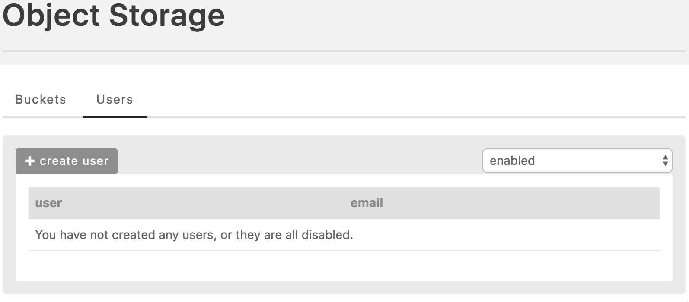
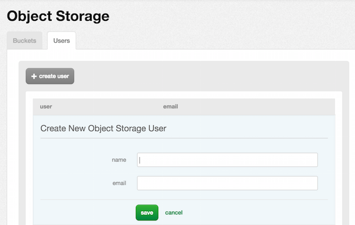
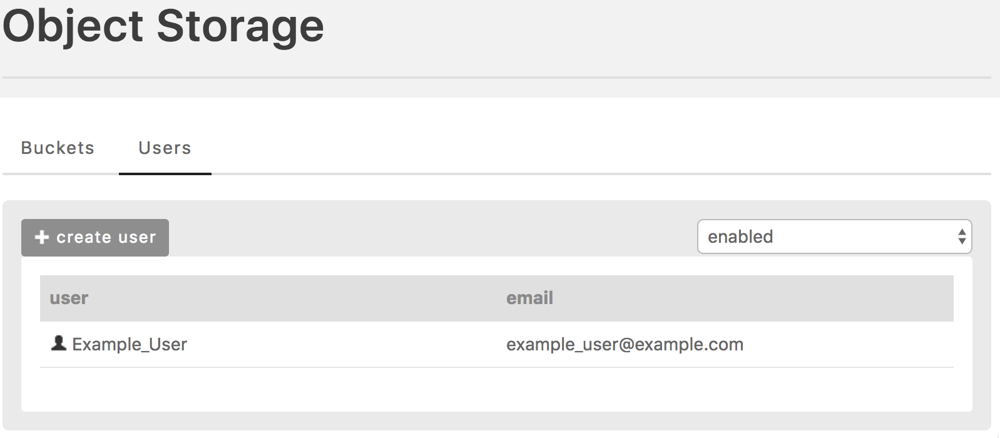
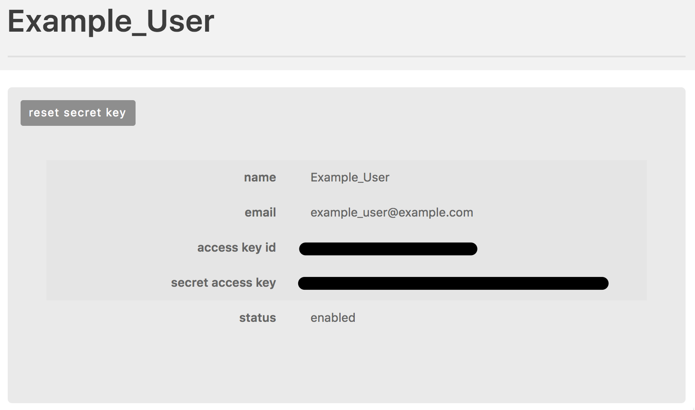
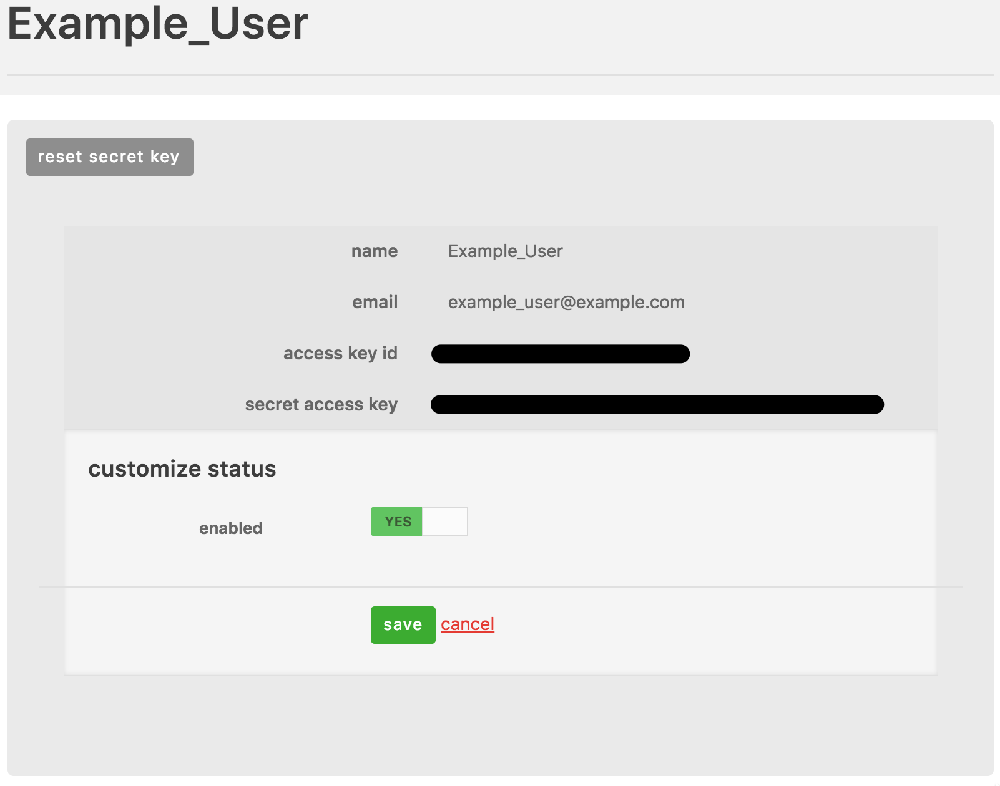

{{{
  "title": "Object Storage User Management",
  "date": "02-14-2018",
  "author": "William Schroeder",
  "attachments": [],
  "contentIsHTML": false
}}}

### Overview

CenturyLink Cloud's Object Storage service allows administrators to manage users on the storage level.  These users are not the same as users in the Control Portal account, and through the S3 protocol, they may be granted limited access to buckets and objects.

### Audience

* Bucket Administrators
* Object Administrators

### List Storage Users

To find the list of Object Storage users associated with your Control Portal account:

1. In the Navigation Menu, click **Services > Object Storage**.  If the account has no active users, you will see a page that looks like this:

    

2. Click on the **Users** tab.

    

### Create a Storage User 

To create a new Object Storage user:

1. Navigate to the list of Object Storage users.  If the account has no active users, you will see a page that looks like this:

    

2. Click the **create user** button.

    

3. Click the **save** button.  After the user is created, it will be listed:

    

    Click on the row with the user in order to get details for that user, including the **access key ID** and **secret access key**:

    

#### Considerations

* The user's email must be globally unique, as the underlying Object Storage implementation uses the email address as the primary means of identification.
* When using tools to access Object Storage, the name and email will not be used; instead, you must use the **access key ID** and **secret access key** provided after the user is created.

### Disable a Storage User

Users may be disabled and re-enabled.  It is not currently possible to delete users.  When a user is disabled, buckets and objects owned by that user will become inaccessible.

* Disabling a user does not stop billing for storage owned only by that user.
* Before disabling a user, be sure to configure ACLs for any entities that only that user has write access to so that you may access those entities.
* If you are trying to delete objects and buckets, do the deletion before disabling the user.

To disable a user:

1. Navigate to the user's details, which may look like this:

    

2. Click the **status** row:

    

3. Flip the toggle to the desired enabled status, and click the **save** button.

### Enable a Storage User

Users may be re-enabled.  To enable a user:

1. Navigate to the list of Object Storage users.  If the account has no active users, you will see a page that looks like this:

    

2. Use the dropdown box to change your view from **enabled** to **disabled** to list disabled users.

3. Click the row with the disabled user to see its details:

    

4. Click the **status** row:

    

5. Flip the toggle to the desired enabled status, and click the **save** button.

### Reset Secret Key

It is possible to change the **secret access key** for a user.  You cannot specify the key, but you can request that the system generates a new one.  To reset the secret key:

1. Navigate to the list of Object Storage users:

    

2. Click the row with the user to see its details:

    

3. Click the **reset secret key** button.  The **secret access key** will change.

