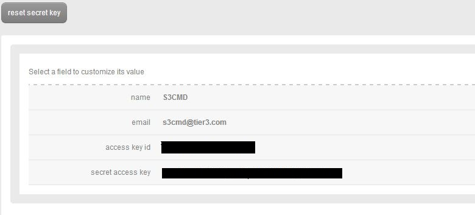
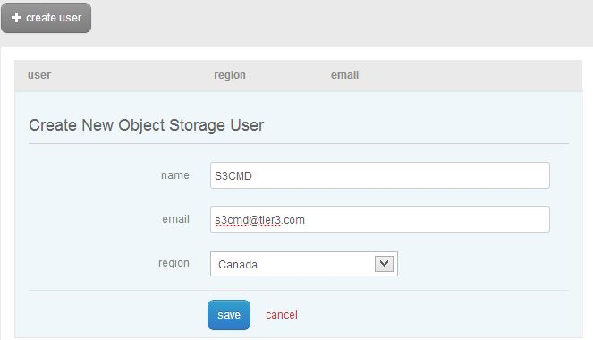
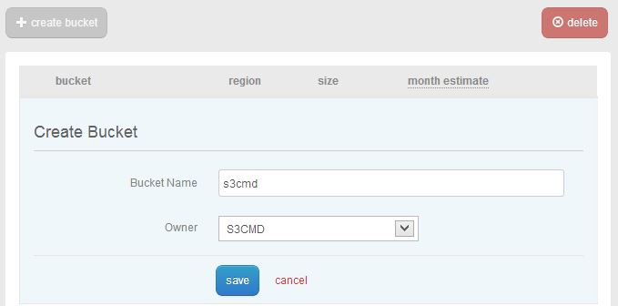

{{{
  "title": "S3CMD - Object Storage Management for Linux Machines",
  "date": "10-27-2015",
  "author": "Daniel Stephan",
  "attachments": [],
  "contentIsHTML": false
}}}

### Description
S3CMD is a Linux command line utility that can be used to interact with and manage your CenturyLink Cloud Object Storage buckets and data, Access Control Lists (ACLs), and associated metadata. S3CMD is an advanced tool to be used for accessing object storage, so care should be taken.

In this knowledge base we will go over the following topics.

* Installing S3CMD
* Configuring S3CMD for CenturyLink Object Storage
* Using S3CMD
* Special note about S3CMD versions
* Way to improve the transfer speed


### Installing S3CMD
Before you can use S3CMD, you'll need to make sure it is installed. At the command line, enter the following: **which s3cmd**. If this command gives  no output, then you do not have S3CMD installed and need to add it.  

The simplest way to add it is to use the package manager for your version of Linux, probably either **yum** or **apt**. While S3CMD is included in many package managers, it is best to manually configure
  the official repository to ensure that you are using the latest version.

**To add the repository to a CentOS or RHEL machine** (note, both instructions assume you are running as root - you will need to add “sudo” where appropriate if not logged in as root):

1. Install wget if not already installed by entering the command: **yum install wget –y**
2. Enter the command: **cd /etc/yum.repos.d**
3. Download the appropriate file for your distribution:
  * For CentOS/RHEL 5 enter the command “**wget [http://s3tools.org/repo/CentOS_5/s3tools.repo](http://s3tools.org/repo/RHEL_5/s3tools.repo)**” (without quotes)
  * For CentOS/RHEL 6 enter the command “**wget [http://s3tools.org/repo/RHEL_6/s3tools.repo](http://s3tools.org/repo/RHEL_6/s3tools.repo)**” (without quotes)
4. Enter the command: **yum install s3cmd -y**

**To add the repository to a Ubuntu/Debian machine:**
1. Install wget if not already installed by entering the command: **apt-get install wget –y**
2. Import the signing key by entering the command: **wget -O - -q [http://s3tools.org/repo/deb-all/stable/s3tools.key](http://s3tools.org/repo/deb-all/stable/s3tools.key) | apt-key add -**
3. Add the repository by entering the command: **wget -O /etc/apt/sources.list.d/s3tools.list [http://s3tools.org/repo/deb-all/stable/s3tools.list](http://s3tools.org/repo/deb-all/stable/s3tools.list)**
4. Refresh your packages and install by entering the command: **apt-get update && apt-get install s3cmd**

### Configuring S3CMD
Once S3CMD has been installed, it must be configured to use CenturyLink Cloud’s Object Storage.

1. S3CMD stores its settings in a configuration file. You can either run **s3cmd –configure** to launch an interactive configuration generation tool, or specify a pre-existing file. You will need both your Access Key and
your Secret Key, which can be found by clicking on the appropriate username in the CenturyLink Cloud Control Panel, under the Services-> Object Storage Section.  

2. Enter your encryption password.
3. Hit enter as the default path to gpg should be correct.
4. Select “Yes” for HTTPS unless explicitly directed otherwise.
5. You will then be asked to test your settings- select NO as it WILL fail.
6. Select “Yes” when prompted to save your configuration file.
7. The .s3cfg file will be created in your users home directory- open it with your favorite text editor, in this example we will use **vi**. Enter the command: **vi ~/.s3cfg**
8. In the configuration file, change the following fields with the appropriate CenturyLink Cloud data center
```
host_base = canada.os.ctl.io
host_bucket = %(bucket)s.canada.os.ctl.io
```
Alternatively, you can modify and save the following file and then specify s3cmd to use it by entering the command **s3cmd –c /path/to/config file**

**Sample configuration file, make sure you update the access key, secret key, gpg_passphrase, host_base, host_bucket, and whether or not to use https**
```
[default]

access_key = YOUR_ACCESS_KEY_HERE

bucket_location = US

cloudfront_host = cloudfront.amazonaws.com

cloudfront_resource = /2010-07-15/distribution

default_mime_type = binary/octet-stream

delete_removed = False

dry_run = False

enable_multipart = False

encoding = UTF-8

encrypt = False

follow_symlinks = False

force = False

get_continue = False

gpg_command = /usr/local/bin/gpg

gpg_decrypt = %(gpg_command)s -d --verbose --no-use-agent --batch --yes --passphrase-fd %(passphrase_fd)s -o %(output_file)s %(input_file)s

gpg_encrypt = %(gpg_command)s -c --verbose --no-use-agent --batch --yes --passphrase-fd %(passphrase_fd)s -o %(output_file)s %(input_file)s

gpg_passphrase = password

guess_mime_type = True

host_base = canada.os.ctl.io

host_bucket = %(bucket)s.canada.os.ctl.io

human_readable_sizes = False

list_md5 = False

log_target_prefix =

preserve_attrs = True

progress_meter = True

proxy_host = localhost

proxy_port = 8080

recursive = False

recv_chunk = 4096

reduced_redundancy = False

secret_key = YOUR_SECRET_KEY_HERE

send_chunk = 4096

simpledb_host = sdb.amazonaws.com

skip_existing = False

socket_timeout = 300

urlencoding_mode = normal

use_https = False

verbosity = WARNING
```

To begin using S3CMD, you'll need have an object storage user and a bucket, which you can create through the CenturyLink Cloud Control Portal:

1. Navigate to “Object Storage” under the “Services” tab of [https://control.ctl.io/](https://control.ctl.io)

2. Click “Create User” and fill out the required fields.  


3. Switch to the “Buckets” tab and click “Create Bucket”. Enter the bucket name and select the owner from the drop-down menu. If you need to add additional users or modify the permissions, you can click on the buck et name after it has been generated to
make said modifications.  


### Using S3CMD
Now that S3cmd has been configured, you can issue normal commands and interact with your storage. Run S3cmd –-man for a full list of commands.

* Make a bucket with `s3cmd mb s3://my-new-bucket-name`
* List the contents of a bucket with `s3cmd ls s3://my-new-bucket-name`
* Upload a file `s3cmd put testfile.xml s3://my-new-bucket-name/testfile.xml`
* Download/Retrieve a file `s3cmd get s3://my-new-bucket-name/testfile.xml testfile_modified.xml`

### Special note about S3CMD versions
S3CMD is an active open-source project, and as such is frequently updated. Depending on the version of S3CMD you installed, the default authentication strategy may have changed. Using the incorrect authentication strategy will result in **403 Not Authorized** or **S3 error: Access Denied** errors for some requests to object storage. You can tell which version of S3CMD you have by running the command **s3cmd --version** and inspecting the output. If the version is before **1.5.0** then s3cmd will operate correctly.

If your version is **1.5.0** or newer, then there are two ways to make this work correctly again. The first is to provide the **--signature-v2** argument to S3CMD, for example like **s3cmd --signature-v2 ls**. The argument tells S3CMD to revert to the original authentication strategy. The more permanent change is to add **signature_v2 = True** to the bottom of your .s3cfg file. That will force S3CMD to use the original authentication strategy every time the command is run.

### Way to improve the transfer speed
When uploading or downloading a large file, consider to put s3cmd in quiet mode ( **--no-progress** option) to minimize the output to console (stdout), as stdout could potentially slow down the transfer process.

Look for the second article in this series which will discuss using advanced S3cmd features such as rsync and encryption!
