{{{
  "title": "Using Object Storage for Backup as a Service",
  "date": "4-20-2015",
  "author": "Chris Little",
  "attachments": [],
  "contentIsHTML": false
}}}

### Overview
CenturyLink Cloud customers may wish to leverage our S3 compatible Object Storage for backup and recovery of file systems or applications. As Object Storage is consumable by any customer in a public fashion, applications or servers can be located within the CenturyLink Cloud or on premise. There are various industry backup tools that support object storage as a repository for data. In this knowledge base we will focus on [Cloudberry Lab](http://www.cloudberrylab.com).

[Cloudberry Backup Enterprise Edition](http://www.cloudberrylab.com/enterprise-cloud-backup-software.aspx) permits backup of Microsoft Windows Server File Systems, Microsoft SQL and Microsoft Exchange data.

### Supporting Information
* Information and details around the CenturyLink Cloud Object Storage services can be found in our [Knowledge Base.](//www.ctl.io/knowledge-base/object-storage)
* It is also important to note that CenturyLink Cloud provides no support for any 3rd party backup software tools. We are simply providing cloud based storage onto which backup software can store data.

### Prerequisites
* A CenturyLink Cloud Account
* Cloudberry Backup software licenses and installation
* [An object storage user and bucket for backups is created in the CenturyLink Cloud Control Portal.](../Object Storage/using-object-storage-from-the-control-portal.md)
* The source VM or Server has internet access

### Configuring File System Backup
1. Open Cloudberry Backup Enterprise Edition, select file, **S3 Compatible**

    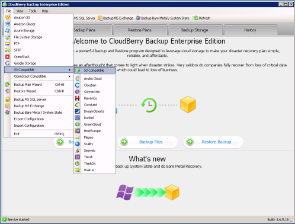

2. Populate the S3 Compatible Account information with your CenturyLink Cloud [Object Storage Access Key, Secret Key, Service Point and bucket name.](../Object Storage/using-object-storage-from-the-control-portal.md)
    * The Service Point for Canada is **ca.tier3.io**

    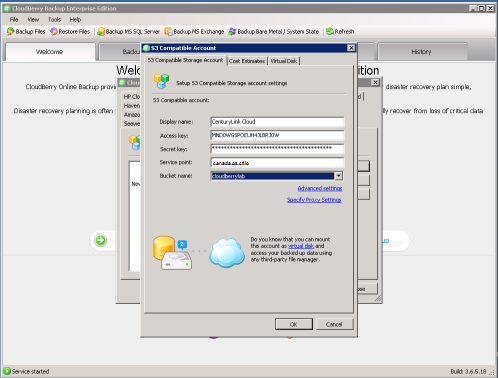

3. Optionally, you may input cost estimate parameters as part of the storage account setup. By using this component the Cloudberry Lab backup software is able to estimate your costs for storage. **This is merely an estimate on storage (excluding bandwidth charges) and does not necessarily reflect actual CenturyLink Cloud Object Storage fees.**

    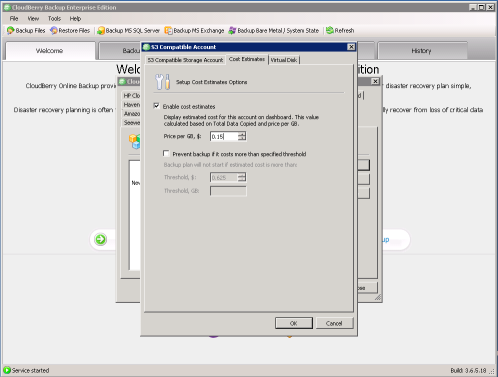

4. Your S3 Compatible Storage Account should now be created successfully.

    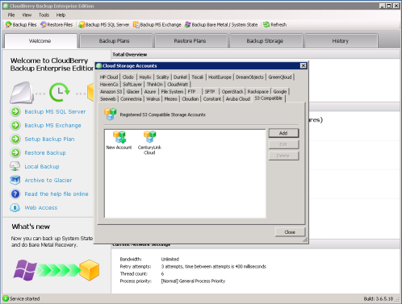

5. At the Welcome screen select **Setup Backup Plan.**

    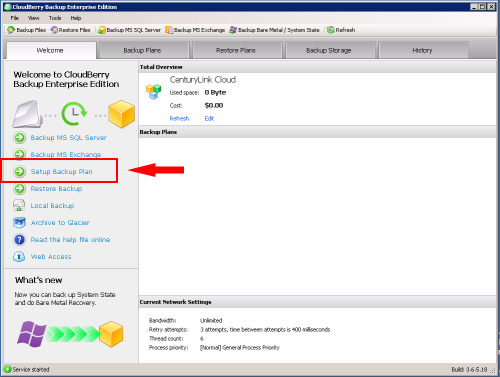

6. Select the S3 Compatible Cloud Storage account you created in steps 1-3 as the destination for backups.

    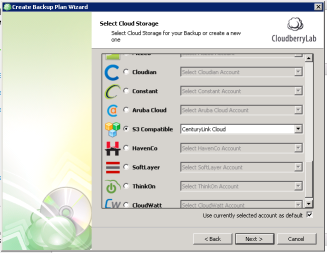

7. Specify a name for the backup plan. We recommend a name that encompasses the server name, backup type (file, SQL etc) as a minimum. Additionally, it is advised that backup plan configurations are saved to the backup storage (Default).

    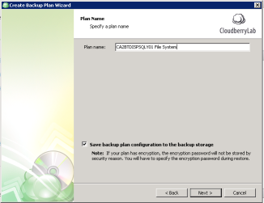

8. Choose an appropriate backup model based on the features you require. Typical enterprise customers will want to leverage the Advanced Mode approach as it provides for Data Encryption and complex retention policies.

    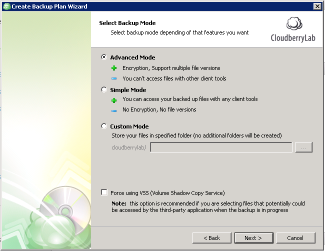

9. Select the backup source. Entire Windows volumes, specific directories or UNC Shares can be added to the backup plan.

    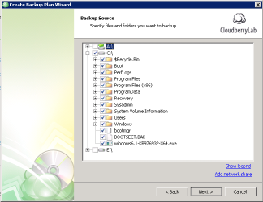

10. The Advanced Filter allows administrators to include or exclude specific file types, folders and large files. Select the appropriate settings based on IT Department or business policies.

    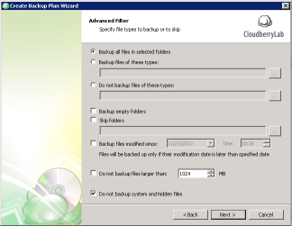

11. In order to secure backup data and reduce cost customers can enable encryption and compression. It is recommended that AES 128bit or higher is implement with long, complex encryption keys. Additionally, file name encryption adds another layer of security.

    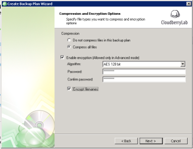

12. Specify the appropriate purge options for backup files. Defaults can be viewed by selecting the 'options' hyperlink. Clients may wish to keep file system backups based on number of versions or based on data set age.

    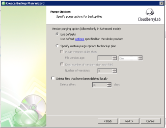

13. Choose a backup schedule that meets IT or business requirements. Generally, its best practice to perform a backup at least once per day during off hours. The Cloudberry Backup software supports recurring scheduled backups and even real-time backup of data.

    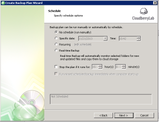

14. In this example we selected recurring, and set the schedule for Daily at 8 PM.

    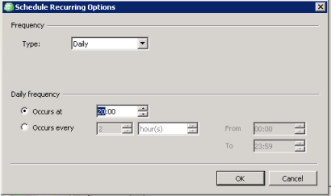

15. Support is provided for Pre / Post commands if required.

    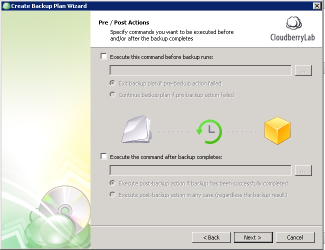

16. Notification Options provide backup administrators with alerts for success or failure for each backup plan. Clients can leverage the the Cloudberry backup messaging service or specify an SMTP server.

    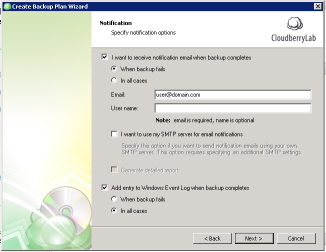

17. A summary of the backup plan is provided once configurations are complete.

    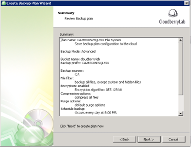

18. You have now configured a file system backup plan.

    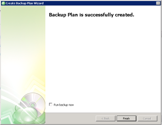

### Configuring Microsoft SQL Database Backup
1. Open Cloudberry Backup Enterprise Edition, select **Backup MS SQL Server.**

    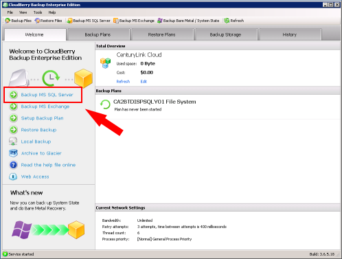

2. Select the S3 Compatible Cloud Storage account you created earlier in this KB as the destination for backups.

    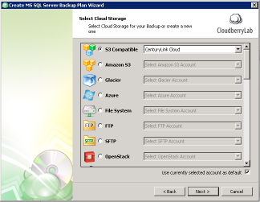

3. Specify a name for the backup plan. We recommend a name that encompasses the server name, backup type (file, SQL etc) as a minimum. Additionally, it is advised that backup plan configurations are saved to the backup storage (Default).

    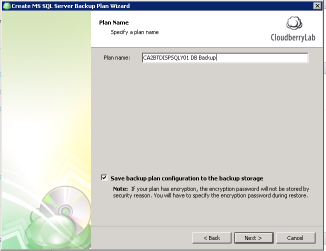

4. Select the Microsoft SQL Instance you wish to backup and the appropriate authentication for your environment.

    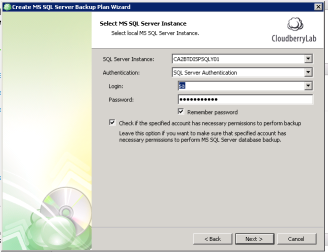

5. Select the database in the Microsoft SQL Instance you wish to backup. Cloudberry Backup permits backup administrator to select databases on a granular level.

    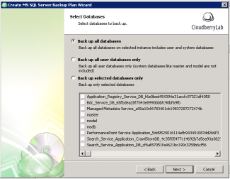

6. Choose the appropriate Compression and Encryption options for your environment. It is recommended that AES 128bit or higher encryption is implement with long, complex encryption keys.

    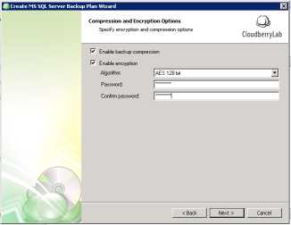

7. Specify the appropriate purge options for backup files. Defaults can be viewed by selecting the 'options' hyperlink. Clients may wish to keep SQL backups based on number of versions or based on data set age. A version age methodology was used in this example.

    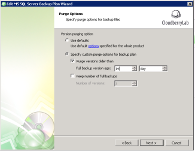

8. Configure a SQL Server backup schedule. Depending on the recovery needs of the database environment an advanced schedule may be required. In this example we will use the advanced schedule.

    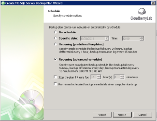

9. As part of this example backup plan, we will configure a Daily Full backup at 11 PM first.

    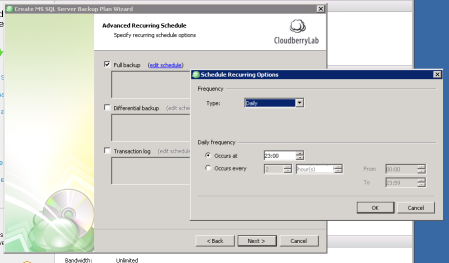

10. Secondary to this Daily Full backup, we will configure an hourly transaction log backup to provide a 1 hour RPO for the database environment.

    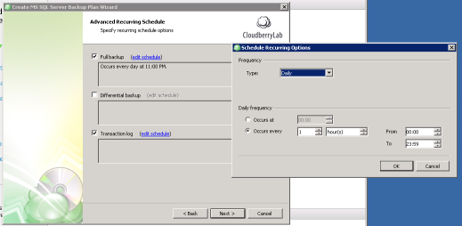

11. Below is a final summary view of the Full and Transaction Log backup schedules.

    

12. Support is provided for Pre / Post commands if required.

    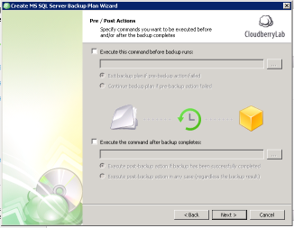

13. Notification Options provide backup administrators with alerts for success or failure for each backup plan. Clients can leverage the the Cloudberry backup messaging service or specify an SMTP server.

    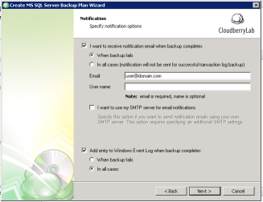

14. A summary of the backup plan is provided once configurations are complete.

    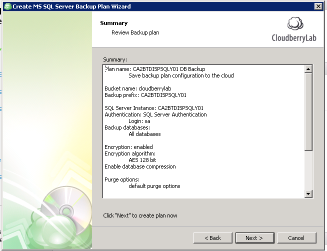

15. You have now configured a SQL Database backup plan.

    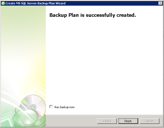

### Review Backup Logs
Customers should review backup logs for details on failure events.

