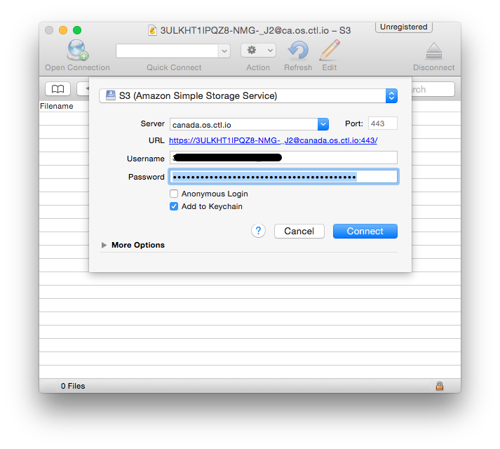
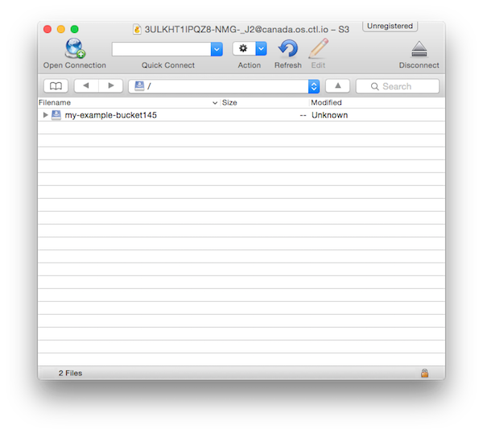
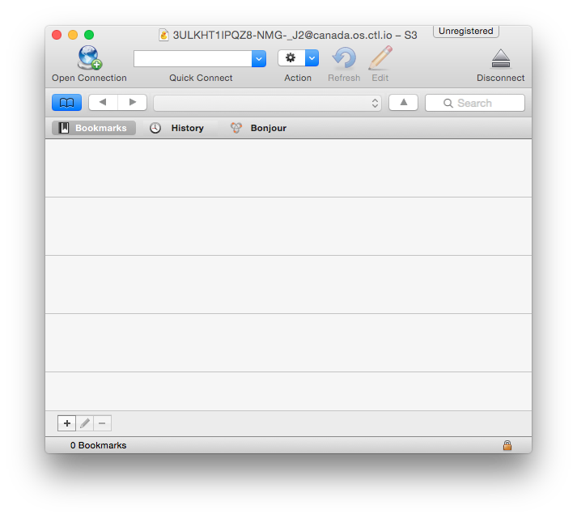

{{{
  "title": "Using Object Storage from 3rd Party Tools",
  "date": "1-7-2015",
  "author": "Richard Seroter",
  "attachments": [],
  "contentIsHTML": true
}}}

<h3>Description</h3>

CenturyLink Cloud now has a robust, geo-distributed Object Storage service capable of storing any type of digital content. Perfect for data backups, media distribution, and file transfers, the Object Storage is Amazon S3-compatible and accessible from the Control Portal or via API. CenturyLink Cloud Object Storage is Amazon S3 compatible, which means that a host of tools are readily available for maintaining buckets and interacting with bucket objects.
   
  <strong>This KB article explains how to interact with Object Storage from 3rd party tools.</strong>

<h3>Audience</h3>
<ul>
  <li>Bucket Administrators</li>
  <li>Object Administrators</li>
  <li>Developers</li>
</ul>
<h3>Pre-requisites</h3>
<ul>
  <li>Have already created an Object Storage user account in the Control Portal</li>
  <li>Have already created a new bucket or have access permissions to an existing bucket</li>
</ul> 
<h3>Using Cloudberry&#39;s <a href="http://www.cloudberrylab.com/">Explorer for Amazon S3</a>&nbsp;on Windows</h3>
  
<a href="http://www.cloudberrylab.com/">Explorer for Amazon S3</a>&nbsp;is a freeware tool for Windows (paid version also available) that works with CenturyLink Cloud Object Storage.
  

<ol>
  <li><a href="http://www.cloudberrylab.com/free-amazon-s3-explorer-cloudfront-IAM.aspx">Download a copy of Explorer for S3</a> from their product website.
  </li>
  <li>Install Explorer for Amazon S3 and run the program.
    

    

  </li>
  <li>In the Control Portal, navigate to the Object Storage service and view the user record that you want to configure Explorer for Amazon S3 with. Copy/save the&nbsp;<strong>access key id</strong>&nbsp;and&nbsp;<strong>secret access key</strong>.
    

    

  </li>
  <li>You&#39;ll also need to get the &#34;Service Point&#34; (e.g. server name) where your bucket exists (or will exist). In the Control Portal, in the Object Storage bucket listing, either create a new bucket, or click on an existing bucket. Either way, when the &#34;Bucket Info and Settings&#34; page is displayed, copy/save the portion of the <strong>bucket URL</strong> that follows the bucket name. In this example, my bucket&#39;s&nbsp;<strong>Service Point</strong>&nbsp;was: <strong>ca.tier3.io</strong>. 
  </li>
  <li>Back in Explorer for Amazon S3, click the <strong>File, S3 Compatible</strong> menu option in order to add the connection details for Object Storage.
    

    

  </li>
  <li>Enter a friendly name in the&nbsp;<strong>Display Name&nbsp;</strong>field (this does not correspond to any value in CenturyLink Cloud Object Storage), and populate the <strong>Service Point</strong>,&nbsp;<strong>Access Key ID</strong>&nbsp;and&nbsp;<strong>Secret Access Key</strong>&nbsp;fields with the corresponding values from the Control Portal.
    

    

  </li>
  <li>
    
Return to the Explorer for Amazon S3 main window and change <strong>Source</strong> to the newly Created Storage Account. Using the drag and drop model of the software or use the Copy command to Upload data to Object Storage.

    

    

  </li>
  <li>Permissions can be applied at both the bucket and object level. A user could have &#34;read&#34; rights for the bucket (and thus be able to list objects) but NOT have &#34;read&#34; rights to an individual object (and therefore couldn&#39;t open that object).
    

    

  </li>
  <li>Explorer for Amazon S3 also lets users download objects, delete objects, view bucket/object properties, and preview objects.
  </li>
</ol>
<h3>Using CyberDuck on Mac OS X</h3>
  
<a href="https://cyberduck.io/?l=en">CyberDuck</a>&nbsp;is a freeware product for Mac OS X (paid version also available) that works with CenturyLink Cloud Object Storage.
  

<ol>
  <li><a href="https://update.cyberduck.io/Cyberduck-4.7.2.zip">Download a copy of CyberDuck for OS X</a> from the product website.</li>
  <li>Install CyberDuck and run the program. It looks like this when it starts up without any <strong>Connections</strong> (aka: Service Points or Servers) configured.
    

    

  </li>
  <li>In the Control Portal, navigate to the Object Storage service and view the user record that you want to configure CyberDuck to use. Record the&nbsp;<strong>Access Key ID</strong>&nbsp;and the&nbsp;<strong>Secret Access Key</strong>&nbsp;for use in the tool.
    

    

  </li>
  <li>Also you will need the &#34;Service Point&#34; (e.g. server name) where your bucket exists (or will exist). In the Control Portal, on the Object Storage bucket listing page, either create a new bucket, or click on an existing bucket. When the &#34;Bucket Info and Settings&#34; page is displayed, copy/save the portion of the&nbsp;<strong>bucket URL</strong>&nbsp;that follows the bucket name. In this example, my bucket&#39;s&nbsp;<strong>server name</strong>&nbsp;was: <strong>canada.os.ctl.io</strong>. 
    

    

  </li>
  <li>Back in CyberDuck, click the <strong>Open Connection</strong> icon (upper left corner) in order to configure the connection details for your Object Storage bucket. Select &#34;S3 (Amazon Simple Storage)&#34; from the drop down. In the&nbsp;<strong>Server</strong>&nbsp;field, enter the name of the &#34;Service point&#34;. Leave Port field set to <strong>443</strong>. Populate the <strong>Username</strong> field with your&nbsp;<strong>Access Key ID</strong>&nbsp;and populate the&nbsp;<strong>Password</strong>&nbsp;field with your&nbsp;<strong>Secret Access key</strong>. 
    

    

  </li>
  <li>
    
After you have configured the Object Storage connection, CyberDuck will list the available buckets at that &#34;Connection&#34;. You can double-click on a bucket to upload files or even drag-and-drop files into the bucket.

    

    

  </li>
  <li>Now that CyberDuck is configured to quickly connect to your CenturyLink Cloud Object Storage account and access the stored buckets, you should bookmark the account for easy access. Click the Bookmark icon  to navigate to the Bookmark page. 
    

    

     
    Click the Add Connection button  to add this Object Storage account to your Bookmarks. 
    

    

  </li>
  <li>Permissions can be applied at both the bucket and object level. A user could have &#34;FULL ACCESS&#34; rights for the bucket (and thus be able to add and remove objects) but only have &#34;READ&#34; rights to an individual object (and therefore couldn&#39;t update that object).
    

    

        
    

    

  </li>
</ol>
