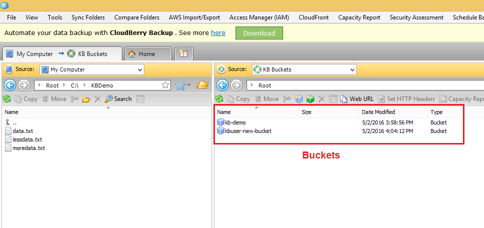
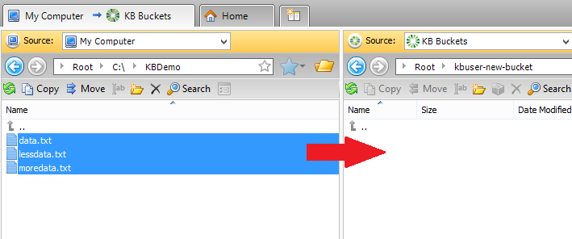
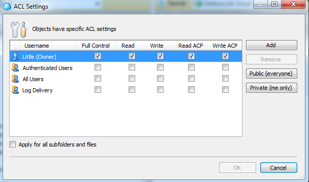

{{{
  "title": "Using Object Storage from 3rd Party Tools",
  "date": "10-23-2015",
  "author": "Daniel Stephan",
  "attachments": [],
  "contentIsHTML": false
}}}

### Description
CenturyLink Cloud now has a robust, geo-distributed Object Storage service capable of storing any type of digital content. Perfect for data backups, media distribution, and file transfers, the Object Storage is Amazon S3-compatible and accessible from
the Control Portal or via API. **This KB article explains how to interact with Object Storage from 3rd party tools.**

### Audience
* Bucket Administrators
* Object Administrators
* Developers

### Using Explorer for Amazon S3 on Windows
CenturyLink Cloud Object Storage is Amazon S3 compatible which means that a host of tools are readily available for maintaining buckets and interacting with bucket objects. [Cloudberry Explorer](http://www.cloudberrylab.com/) is
a freeware product (that also has a paid version) that works with CenturyLink Cloud Object Storage.

* [Download a copy of Explorer for Amazon S3](http://www.cloudberrylab.com/free-amazon-s3-explorer-cloudfront-IAM.aspx) from their product website.
* Install Explorer for Amazon S3 and run the program.  

* In the Control Portal, navigate to the Object Storage service and view the user record that you plan to configure Explorer for Amazon S3 with. Record the **access key id** and **secret access key** for use in the tool.  

* Back in Explorer for Amazon S3, click the **File, S3 Compatible** menu option in order to add the connection details for Object Storage.  

* Enter a friendly name in the **Display Name** field (this does not correspond to any value in CenturyLink Cloud Object Storage), and populate the **Service Point**, **Access Key ID** and **Secret Access Key**
fields with the corresponding values from the Control Portal.  

* Return to the Explorer for Amazon S3 main window and change **Source** to the newly Created Storage Account. Using the drag and drop model of the software or use the Copy command to Upload data to Object Storage.  

* Permissions can be applied at both the bucket and object level.  By right clicking the bucket or object(s) and choosing **ACL Settings**, you can add/remove users and change what permissions they have.  A user could have "read" rights for the bucket (and thus be able to list objects) but NOT have "read" rights to an individual object (and therefore couldn't open that object).  

* Explorer for Amazon S3 also lets users download objects, delete objects, view bucket/object properties, and preview objects.
