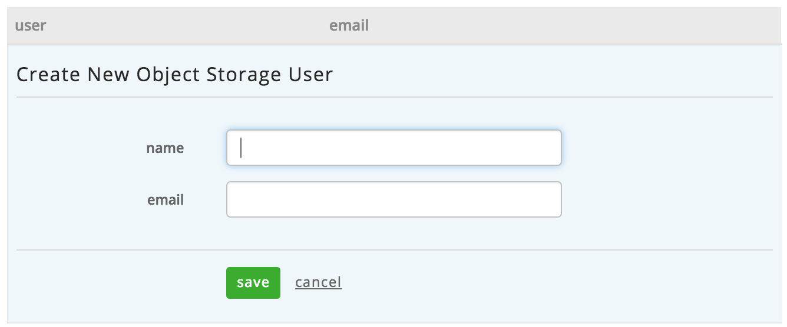
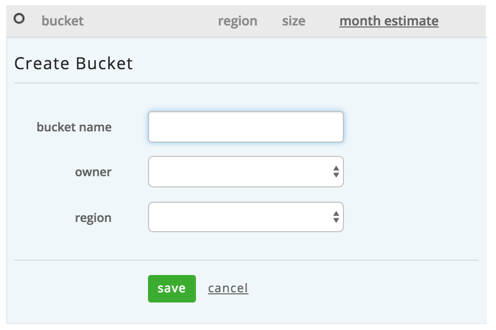

{{{
  "title": "Using Object Storage from the Control Portal",
  "date": "1-7-2015",
  "author": "Richard Seroter",
  "attachments": [],
  "contentIsHTML": false
}}}

### Description
CenturyLink Cloud now has a robust, geo-distributed Object Storage service capable of storing any type of digital content. Perfect for data backups, media distribution, and file transfers.  The CenturyLink Cloud Object Storage is Amazon S3-compatible and accessible from the CenturyLink Cloud Control Portal or via API. **This KB article explains how to interact with Object Storage from the CenturyLink Cloud Control Portal.**

### Audience
* Bucket Administrators

### Actions Supported in the CenturyLink Cloud Control Portal
Below, each action available in the Control Portal is explained and demonstrated.

#### Create Object Storage Users
1. Navigate to Object Storage from the top navigation menu.     

2. On the Object Storage page, switch to the **Users** tab.  
  

3. Click the **create user** button and enter the user's details. The **name** field should contain a friendly alphanumeric identifier for the user. Enter an **email** address for the user. Note that this value must be unique across the platform and can't be reused.  The account cannot be deleted and the email address cannot be changed.  We recommend using a distribution email address, rather than the email address of a single person.  If needed, we will use this email address to reach out to the technical contacts who manage the bucket.  Click **save**.  
  

4. Click the created user record to view the **access key id** and **secret access key** values which act as the username and password for this Object Storage user.  
  

#### Reset Object Storage User Secret Key
1. Navigate to the record for the chosen Object Storage user.  

2. Click the **reset secret key** button.  
  

3. Refresh the page to see the new **secret access key**  

#### Create a New Object Storage Bucket and View Bucket Details
1. Navigate to the Object Storage service page and locate the **Buckets** tab. Click the **create bucket** button.  
  

2. Enter a **bucket name** value.The name has to start and end with lowercase letters or numbers, and can only contain lowercase letters, numbers, dashes, and dots. This value must be unique globally. Next, select an **owner** from the list of Object Storage users created in the account. The owner is an important decision as the API retrieves lists of buckets by the owner name.  Finally, choose which Object Storage region to add this bucket to. Click the **save** button to create the bucket. If the name of the bucket is not unique, you will receive an alert asking you to choose a new bucket name.  
  

3. View the list of all buckets created by all users in this CenturyLink Cloud account. Note that for each item in the list below, you can see the name of the bucket, the owner of the bucket (in the text below the bucket name), the region of the bucket, size of the bucket, and estimated cost of the bucket.  
  

4. Click on a bucket name to view the details of the bucket. This page shows read-only details such as the bucket name, owner, region and API URL. It also contains the list of active permissions associated with the bucket.  
  

#### Manage Object Storage Permissions
1. View the details for an individual bucket.  

2. Click the **permissions** section to activate the **customize permissions** view.  
  

3. Click **add grantee** to update the Access Control List (ACL) for this bucket. This list shows all of the users in this CenturyLink Cloud account, and two built in groups, **All Users** and **Authenticated Users**.  When you add **All Users** to a bucket -- and give it read permissions -- you are giving public Internet access to the bucket. If you add the **Authenticated Users** group to the bucket, then any Object Storage user can access the bucket.  
  

4. For any existing user, you can modify their permissions by selecting/de-selecting checkboxes associated with each permission. Note that the bucket owner always has full control. To delete the user from the grantee list, click the red "x" at the far right of the record. Changes made to a bucket are instantly committed. For instance, if you add **All Users** with read permissions, then the buckets (and contained objects) are immediately available to anyone. Likewise, if you use a 3rd party tool to manage Object Storage, changes to the grantee list are instantly visible in the Control Portal.  
  
