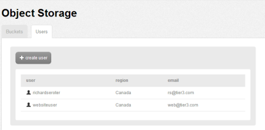
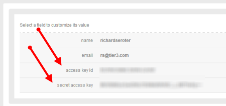
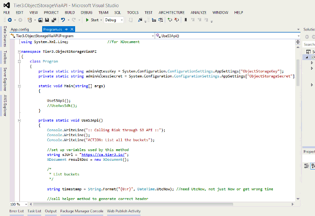
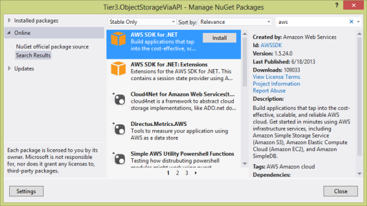
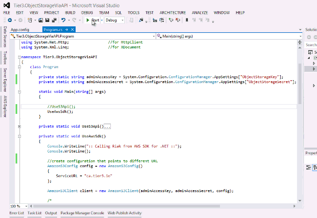
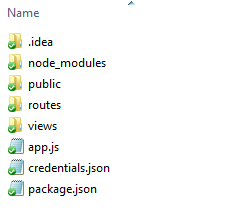
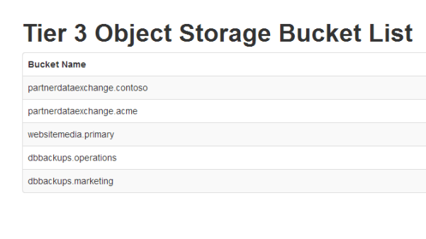

{{{
  "title": "Using Object Storage via REST API, AWS SDK",
  "date": "10-27-2015",
  "author": "Daniel Stephan",
  "attachments": [],
  "contentIsHTML": false
}}}

### Description
[CenturyLink Cloud 3 Object Storage](http://www.ctl.io/object-storage) is an ideal repository for unstructured data ranging from media files to database backups. The Object Storage service is Amazon S3 compatible which means that code and tools that work with Amazon S3 should work seamlessly with CenturyLink Cloud Object Storage. In this KB article, we'll show you how to use the raw REST API and the AWS SDK (for .NET and Node.js) to interact with Object Storage.

### Audience
* Developers

### Prerequisites
* Have users and buckets created in Object Storage. See the KB article [Using Object Storage from the Control Portal](using-object-storage-from-the-control-portal.md) for a walkthrough of users and buckets.

### Using the Object Storage REST API from .NET
The CenturyLink Cloud Object Storage service offers an Amazon S3-compatible web services endpoint. The endpoint has the same authentication, resources, and payloads as defined in the [Amazon S3 documentation](http://docs.aws.amazon.com/AmazonS3/latest/API/APIRest.html). The steps below show how to consume Object Storage from a custom .NET application.**Note that the [source code for this sample application](https://github.com/Tier3/Examples/tree/master/ObjectStorage/Tier3.ObjectStorageViaAPI.DotNet) can be downloaded from GitHub.**

#### Detailed Steps
1. Go to the CenturyLink Cloud Control Portal to acquire your user credentials. First, find the **Users** tab on the Object Storage page.  


2. Click on the user who owns the buckets (or has access to an individual bucket) that you want to access. Locate and record the **access key id** and **secret access key** values. These act as your credentials for all API operations.  


3. Create a new Visual Studio project. In this example, the project is a **Console** application.

4. Define a new "helper" function that can generate the [proper authentication header](http://docs.aws.amazon.com/AmazonS3/latest/dev/RESTAuthentication.html#ConstructingTheAuthenticationHeader) that the service expects. The function below accepts values used to generate the authentication string, and is encoded and signed.

  ```
  ///

  /// Helper function to generate the required authentication header for messages to S3 endpoint

  ///

  private static string GenerateApiAuthHeader(string verb, string timestamp, string contentType, string resource, string secret)

        {

            string authHeader = verb + "\n" +       //HTTP verb

            "\n" +                                  //content-md5

            contentType + "\n" +                    //conten-type

            "\n" +                                  //date

            "x-amz-date:" + timestamp + "\n" +      //optionally, AMZ headers

            resource;                               //resource

            Encoding encoding = new UTF8Encoding();

            HMACSHA1 signature = new HMACSHA1();

            signature.Key = encoding.GetBytes(secret);

            byte[] bytes = signature.ComputeHash(encoding.GetBytes(authHeader));

            return Convert.ToBase64String(bytes);

        }

  ```

5. Define variables to hold the authentication credentials for Object Storage. In the example below, these values are stored in the application's configuration file.

  ```
  private static string adminAccessKey = System.Configuration.ConfigurationManager.AppSettings["ObjectStorageKey"];
  
  private static string adminAccessSecret = System.Configuration.ConfigurationManager.AppSettings["ObjectStorageSecret"];
  ```

6. Write the code that calls the Object Storage endpoint and requests a list of all buckets. The code below sets the URL for object storage (which is based on which region you are querying; this URL can be seem by looking at the settings for one of your buckets). The authorization header [requires a timestamp](http://docs.aws.amazon.com/AmazonS3/latest/dev/RESTAuthentication.html#RESTAuthenticationTimeStamp) (as authentication is only valid for a certain period) and this value is formatted in the manner expected by the endpoint. After the authentication header is generated by our helper function, the appropriate headers are added to the request and an HTTP GET request is issued against the Object Storage URL.  The response is retrieved as a string and loaded into an XML object for formatting.

  ```
  //set up variables used by this method

  string s3Url = "https://canada.os.ctl.io/";

  XDocument resultDoc = new XDocument();

  string timestamp = String.Format("{0:r}", DateTime.UtcNow); //need UtcNow, not just Now or get wrong time

  //call helper method to generate correct header

  string authHeader = GenerateApiAuthHeader("GET", timestamp, string.Empty, "/", adminAccessSecret);

  //make RESTful call to S3-compliant endpoint

  using (var client = new HttpClient())
  {
    HttpRequestMessage request = new HttpRequestMessage(HttpMethod.Get, s3Url);

    //add token to header

    request.Headers.Add("Authorization", "AWS " + adminAccessKey + ":" + authHeader);

    request.Headers.Add("x-amz-date", timestamp);

    var response = client.SendAsync(request);

    if (response.Result.IsSuccessStatusCode)
    {
      //synchronous call

      var responseContent = response.Result.Content;

      //synchronous read

      string responseString = responseContent.ReadAsStringAsync().Result;

      //throw into XDocument to get nice XML formatting

      resultDoc = XDocument.Parse(responseString);

      Console.WriteLine(resultDoc.ToString());
    }
    else
    {
      //error

      Console.WriteLine("ERROR: " + response.Result.StatusCode.ToString());
    }
  }

  ```

7. Add code that queries Object Storage for the objects contained within an individual bucket. This is slightly different than the previous action in that the resource name (in this case, the bucket name) is added to the URL and passed into the helper method.

  ```
  Console.WriteLine("ACTION: Enter the name of a bucket to open: ");

  string inputbucket = Console.ReadLine();

  //url updated to include the resource (bucket) value

  s3Url = "https://canada.os.ctl.io/" + inputbucket;

  timestamp = String.Format("{0:r}", DateTime.UtcNow); //need UtcNow, not just Now or get wrong time

  //call helper method to generate correct header

  authHeader = GenerateApiAuthHeader("GET", timestamp, string.Empty, "/" + inputbucket, adminAccessSecret);

  //make RESTful call to S3-compliant endpoint

  using (var client2 = new HttpClient())
  {
    HttpRequestMessage request2 = new HttpRequestMessage(HttpMethod.Get, s3Url);

    //add token to header

    request2.Headers.Add("Authorization", "AWS " + adminAccessKey + ":" + authHeader);

    request2.Headers.Add("x-amz-date", timestamp);

    var response2 = client2.SendAsync(request2);

    if (response2.Result.IsSuccessStatusCode)
    {
      //synchronous call

      var responseContent2 = response2.Result.Content;

      //synchronous read

      string responseString2 = responseContent2.ReadAsStringAsync().Result;

      //throw into XDocument to get nice XML formatting

      resultDoc = XDocument.Parse(responseString2);

      Console.WriteLine(resultDoc.ToString());
    }
    else
    {
      //error
      Console.WriteLine("ERROR: " + response2.Result.StatusCode.ToString());
    }

    Console.ReadLine();
  }

  ```

8. Run the application and first see that all Object Storage buckets are returned, and then ask for the contents of a single bucket.


### Using Amazon SDK for .NET to Interact with Object Storage
The Amazon Web Services team created and maintain a set of SDKs for developers to use when interacting with their cloud platform. Because CenturyLink Cloud Object Storage is S3-compatible, developers can reuse these existing SDKs when interacting with Object Storage. An SDK is typically MUCH easier to work with than a raw API as much of the complexity is hidden.  **Note that the [source code for this sample application](https://github.com/Tier3/Examples/tree/master/ObjectStorage/Tier3.ObjectStorageViaAPI.DotNet) can be downloaded from GitHub.**

#### Detailed Steps
1. Download the [AWS SDK for .NET](http://aws.amazon.com/sdkfornet/) and install it. Or, open Visual Studio and install the SDK as part of a [NuGet package](http://nuget.org/). To install the NuGet package, right click the Visual Studio project, choose "Manage NuGet Packages", search for "AWS" and install the package into this project.  


2. Add code that uses the AWS SDK to read the list of buckets from Object Storage. First, a configuration object is instantiated and the CenturyLink Cloud Object Storage URL is provided. Then, the client object is created and provided the credentials and configuration. The SDK uses strong typing, so the client object specifically calls "ListBuckets" and gets back a list of buckets with properties such as "BucketName."

  ```
  //create configuration that points to different URL

  AmazonS3Config config = new AmazonS3Config()
  {
    ServiceURL = "https://canada.os.ctl.io"
  };

  AmazonS3Client client = new AmazonS3Client(adminAccessKey, adminAccessSecret, config);

  /*
  * List buckets
  */

  Console.WriteLine("ACTION: List all the buckets");

  ListBucketsResponse resp = client.ListBuckets();

  foreach (S3Bucket bucket in resp.Buckets)
  {

    Console.WriteLine("-" + bucket.BucketName);

  }
  ```

3. Add a second action that queries the contents within a given bucket. This code reuses the client object created earlier, and calls the "ListObjects" operation to get back a list of objects.

  ```
  /*
  * List objects in a single bucket
  */

  Console.WriteLine("ACTION: Enter the name of a bucket to open: ");

  string inputbucket = Console.ReadLine();

  ListObjectsRequest objReq = new ListObjectsRequest() { BucketName = inputbucket };

  ListObjectsResponse objResp = client.ListObjects(objReq);

  foreach (S3Object obj in objResp.S3Objects)
  {
    Console.WriteLine("-" + obj.Key);
  }
  ```

4. Run the application and see the list of buckets and then the list of objects in a selected bucket.


### Using the Amazon SDK for Node.js to Interact with Object Storage
Node.js is a popular platform for building high-performing JavaScript-friendly applications. Amazon Web Services also ships an SDK for Node.js, and that SDK works perfectly with CenturyLink Cloud Object Storage.  **Note that the [source code for this sample application](https://github.com/Tier3/Examples/tree/master/ObjectStorage/Tier3.ObjectStorageViaApi.Node) can be downloaded from GitHub.**

#### Detailed Steps
1. Create a [new Node.js project](http://nodejs.org/). This example solution uses the [Express framework](http://expressjs.com/) to provide an MVC foundation to the application.  


2. Use the Node Package Manager (npm) to install the [AWS SDK for Node](http://aws.amazon.com/sdkfornodejs/) by using the **npm install aws-sdk** command.

3. Create a **credentials.json** file that contains the Object Storage credentials and region.

  ```
  {
    "accessKeyId": "KEYID",
    "secretAccessKey": "SECRET",
    "region":"Canada"
  }
  ```

4. In the route (controller), add the code to respond to the page load event. This code queries Object Storage via the AWS SDK for Node. See that it loads the credentials file, and passes the Object Storage URL into the object constructor. The [listBuckets operation](http://docs.aws.amazon.com/AWSJavaScriptSDK/latest/AWS/S3_20060301.html#listBuckets-property) returns an array of buckets. Here, that array is returned to the view.

  ```
  var AWS = require('aws-sdk');

  exports.index = function(req, res){

    AWS.config.loadFromPath('./credentials.json');

    var s3 = new AWS.S3({endpoint:'https://canada.os.ctl.io'});

    s3.listBuckets(params = {}, function(err, data){

      console.log(data.Buckets);

      res.render('index', { title: 'CenturyLink Cloud Object Storage Bucket List', buckets: data.Buckets });

      });
    };
    ```

5. On the Express view, the code loops through each bucket and prints the name of the bucket in a table cell.

  ```
  table(class="table table-striped table-bordered table-hover")

  thead

    tr

      th Bucket Name

        tbody

          each bucket in buckets

            tr

              td.cell

                | #{bucket.Name}
  ```

6. Run the Node.js application and see that the list of CenturyLink Cloud Object Storage buckets is retrieved and displayed on the page.  

