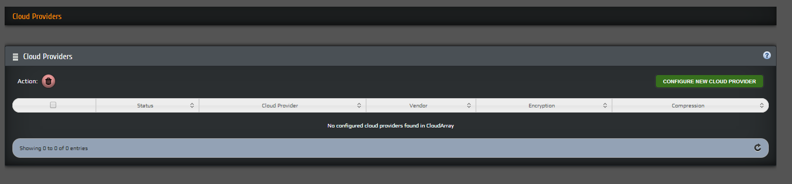
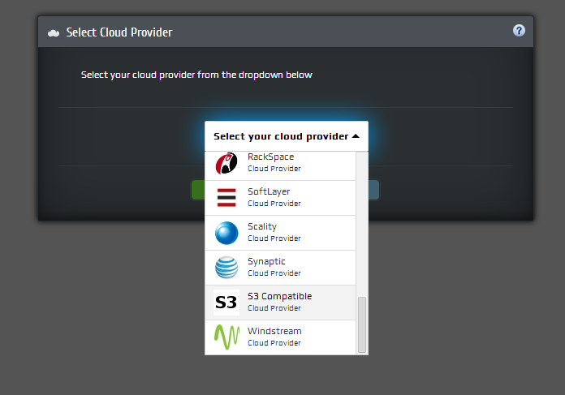
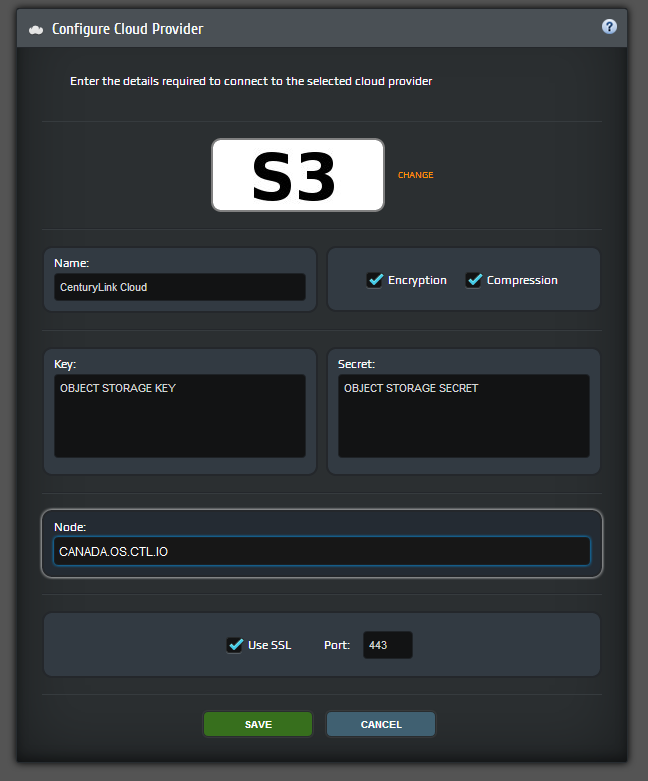

{{{
  "title": "Using Object Storage with a Cloud Storage Gateway",
  "date": "10-27-2015",
  "author": "Daniel Stephan",
  "attachments": [],
  "contentIsHTML": false
}}}

### Description
CenturyLink Cloud customers may wish to leverage our S3 compatible Object Storage with Cloud Storage Gateway appliances. A cloud storage gateway is a network appliance or server which resides at the customer premises and translates cloud storage APIs such as SOAP or REST to block-based storage protocols such as iSCSI or file-based interfaces such as NFS or CIFS. Unlike the cloud storage services which they complement, cloud storage gateways use standard network protocols which integrate with existing applications. Cloud storage gateways can also serve as intermediaries to multiple cloud storage providers. Some cloud storage gateways also include additional storage features such as backup and recovery, caching, compression, encryption, storage de-duplication and provisioning.

There are many Cloud Storage Gateway appliances on the market today. In this knowledge base we will focus on [TwinStrata](http://www.twinstrata.com/). The TwinStrata CloudArray provides customers various delivery models for the CloudArray product and Cloud Storage. Customers should validate with their Cloud Storage Gateway provider the support of an S3 compatible Object Storage.

### Supporting Information
Information and details around the CenturyLink Cloud Object Storage can be found in our **[Knowledge base](https://t3n.zendesk.com/forums/20789095-Object-Storage)**. It is also important to note that CenturyLink Cloud provides no support for any 3rd party Cloud Storage Gateways. We are simply providing cloud based storage for use with these Cloud Storage Gateways.

### Prerequisites
* A CenturyLink Cloud Account
* TwinStrata CloudArray Virtual or Physical Appliance Base Configuration
* An object storage user is created in the CenturyLink Cloud Control Portal. <a href="https://t3n.zendesk.com/entries/21648384-Using-Object-Storage-from-the-Control-Portal">See this KB</a>
* The Cloud Storage Gateway has internet access ports as defined by the TwinStrata Installation Documentation.

### Configuring CenturyLink Cloud as a Cloud Provider
1. Select the Cloud Providers link in the TwinStrata CloudArray Dashboard  

2. Select Configure New Cloud Provider and Select **S3 Compatible**  

3. Enter the details required to connect to the selected Cloud Provider.
 * Currently Object Storage is only available out of our Canada Region. **The Node URL is canada.os.ctl.io**
 * Provide the **access key id** and **secret access key** for the user created in the prerequisites
 * Encryption, Compression and SSL are recommended

### Configuring TwinStrata CloudArray
Customers should consult best practices and installation guides from TwinStrata to finalize the configuration of the TwinStrata Cloud Array appliance. This includes, but is not limited to, Cache, Provisioning Policies and NAS or iSCSI services.
