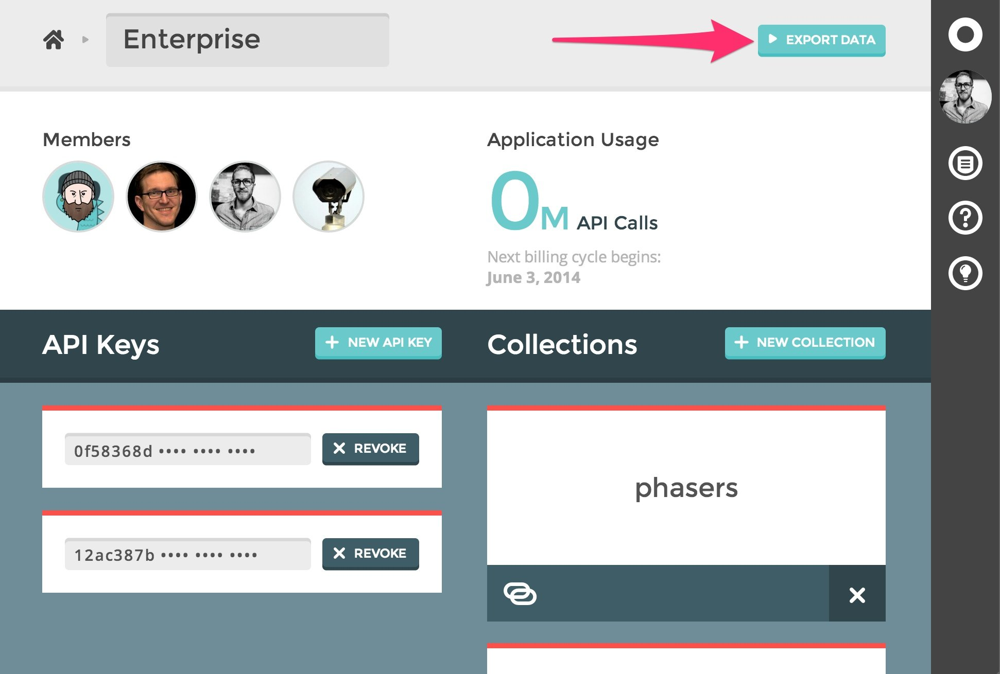

{{{
  "title": "Data Export",
  "date": "4-20-2015",
  "author": "Adam DuVander",
  "attachments": [],
  "related-products" : [],
  "contentIsHTML": false,
  "sticky": false
}}}

Orchestrate offers data exports through the [Dashboard](https://dashboard.orchestrate.io/). To export an application's data, navigate to that application's page and click the "Export Data" button. This will start the export process.



When the export is complete, you will receive an email with a download link containing your application data. The download will be in compressed ([gzip](http://en.wikipedia.org/wiki/Gzip)) JSON format. Once uncompressed, you should have a standard JSON file containing all the data from your application.

Here is an example of an exported Key/Value item:

```
{
  "kind":"item",
  "path": {
    "collection":"products",
    "key":"blue-jeans",
    "ref":"6047d9475ad5f6e5",
    "reftime":1418683227236
  },
  "value": {
    "price":34,
    "stock":99
  },
  "reftime":1418683227236
}
```
