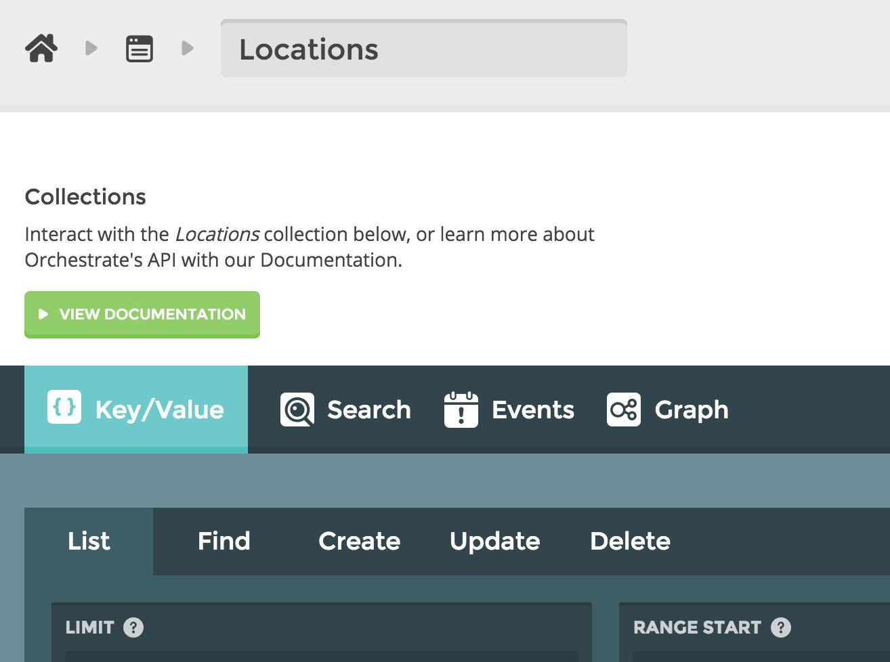

{{{
  "title": "Orchestrate Dashboard Walk-through",
  "date": "12-23-2015",
  "author": "Adam DuVander",
  "attachments": [],
  "related-products" : [],
  "contentIsHTML": false,
  "sticky": false
}}}

There are several ways to become familiar with Orchestrate, which unifies multiple databases through a simple REST API. The easiest way is to [create an account in the dashboard](https://dashboard.orchestrate.io/) and run example queries. With these queries you can explore the major features of Orchestrate from an interactive form that builds and executes your API calls.

In this walk-through, you'll use the **five key queries** of Orchestrate (Key/Value, Search, Geospatial, Time Series, and Graph) from the dashboard by following the use-case of a fictional company wanting to track its locations and employees.

### Create an account or login

You can find the orchestrate dashboard [here](https://dashboard.orchestrate.io). [Create an account](https://dashboard.orchestrate.io/users/register) if you do not have one or [login](https://dashboard.orchestrate.io/sessions/login) to the Orchestrate Dashboard. 

### 1. Create an application

Once you have an account, create a new application through the [Orchestrate Dashboard](https://dashboard.orchestrate.io).


**Note:** Every application on Orchestrate must have a unique name. It's best to prefix your application name with your organization name (e.g. My Company: Awesome App).

### Deleting an application
You must login to the [Orchestrate Dashboard](https://dashboard.orchestrate.io) to delete an application. Locate the application you want to delete on the main dashboard page. In the bottom right-hand corner of the application, click **X**.


Confirm that you want to delete the application by typing its name and clicking the green check mark.

**Note:** Once you delete an application the application name is available for re-use.

#### API Keys
An **API Key** is a code passed from your application to our API that identifies your application. Keys should be kept secure and should not be made available publicly. An API Key is automatically generated for your application when you create it.

**Note:** If you're more comfortable in code, you can skip the dashboard walk-through and learn about integrating [JSON Key / Value](https://orchestrate.io/docs/key-value) and the other features of Orchestrate into your applications.

### 2. Create a collection

Collections are a grouping of JSON objects that you can store and query. They are similar to tables in a relational database or buckets in object storage.

Since our example will track the multiple locations of the company, we are going to create a new collection called "Locations" to represent the different offices.

Select your newly-created application from the main Orchestrate dashboard.

Click the **+New Collection** button.


Type a name for the collection (e.g. "Locations") and click the green check mark.

The "Locations" collection now appears on the dashboard.



### 3. Add locations

Now that you have a "Locations" collection to hold details about your office locations, you need to add actual locations to the collection.

**Note:** Each item (location) contains a key that is unique to the collection and is used for identification. Each item must also have JSON data (can be an empty JSON object, but what fun is that?)

From the "Locations" collection, select the Create tab under Key/Value.

Name the key "scranton" in the Key area and add the following JSON to the Body area:

```
{
  "city": "Scranton",
  "state": "PA",
  "employees": 200,
  "coordinates":
  {
    "latitude": 41.4089,
    "longitude": -75.6624
  }
}
```


**Note:** There are many other data fields you can use to provide more information about the location. Orchestrate requests can be up to 2MB, which leaves room for a lot of text.

Click the **Send Request** button to execute the API call and add the new location.

You should see **201 Created** in the History section at the bottom of the screen.


Add two more locations to the collection by following the same steps.

Use the key "albany" for the following:

```
{
  "city": "Albany",
  "state": "NY",
  "employees": 300,
  "coordinates":
  {
    "latitude": 42.6525,
    "longitude": -73.7562
  }
}
```

And "buffalo" for this one:

```
{
  "city": "Buffalo",
  "state": "NY",
  "employees": 100,
  "coordinates":
  {
    "latitude": 42.8864,
    "longitude": -78.8783
  }
}
```

### 4. Retrieve locations

What good is putting data in if we don't bother to get it out?

Select the **Find** tab of Key/Value and try retrieving a single location.

Type "scranton" in the key box and click **Send Request**. The location should be returned in the **Response** section under the History tab:


If you want to see all the items in a collection, use the **List** tab.


**Note:** By default, the dashboard shows the first 10 items with lexicographically ordered keys. When you make calls from your application, you'll be able to get up to 100 items at a time, paging through by following the "next" field in the response. In this case, we only have three items, so Orchestrate returns the entire collection.

Speaking of keys, if you don't want to create keys, Orchestrate can do this for you within your application. [Auto-generated keys](https://orchestrate.io/docs/apiref#keyvalue-post) are unique within a collection and roughly time-ordered. To do this, check **server generated key** in the **Create** tab on the main dashboard.

### 5. Search location details

Perhaps the most powerful feature of Orchestrate is search. Every item added to a collection is automatically indexed for full-text search. You don't have to plan ahead for how you'll search your data. Just load it in and Orchestrate takes care of the rest.

Let's say you want to find the locations of the company that have more than 100 employees. In the dashboard of your location collection, click the **Search** tab and run this query in the **Query** box.

```
employees: [101 TO *]
```


There should be only two results because Buffalo only has 100 employees.


**Note:** For most queries you'll search on particular fields (identified in this example with the "employees:" prefix), though it is not required. For some text search use cases, you might want to look in every field, which can be achieved by removing the field prefix.

Let's search another field to find all the locations in New York:

```
state: `NY`
```


**Note:** Notice the "backticks" around the state. That looks for an exact match. For this set of data, removing the backticks would still find the same two New York locations. However, it's good to use this when looking for an entire value, because otherwise the tokenization process could return results you don't expect.

Finally, let's combine these two searches to really restrict the results:

```
employees: [101 TO *] AND state: `NY`
```


The above should return only the Albany location, which is both in New York and has more than 100 employees.

### 6. Search geospatial data

When we created our three locations, the data included a "coordinates" field that had two fields within it. Those decimal numbers make up geographic coordinates for the locations of our example offices. Along with indexing data for text and numeric queries, Orchestrate also can search geographically.

Let's say you're considering taking a job at this company and you live in Poughkeepsie, NY. You're willing to travel up to 100 miles and want to find the locations where you could work. That sounds like a geographic query.

In the "Locations" collection dashboard, run this query in the **Search** tab:

```
coordinates:NEAR:{latitude:41.7003 longitude:-73.9209 radius:100mi}
```


**Note:** As part of the field prefix, NEAR signifies a geo query. Then you include the latitude and longitude coordinates or Poughkeepsie, along with the 100 mile radius you're willing to consider.

The results should be the Albany and Scranton locations--Buffalo is out again.

### 7. Add some employees

Now that you've organized your company's locations, you might want to think about doing the same with your employees. Go back to the application dashboard, where you'll see the lonely locations collection. Let's give it a companion and create a new collection called "employees."

Click on the new employees collection to get to its dashboard. Under **Key/Value** choose the **Create** tab so we can add some employees.

Add the following data for the "dschrute" key:

```
{
  "fname": "Dwight",
  "lname": "Schrute",
  "title": "Assistant to the Regional Manager"
}
```


Again, you can probably think of many more things to track about employees, but we'll keep the data simple for this example.

Add two more employees:

The "jhalpert" key:

```
{
  "fname": "Jim",
  "lname": "Halpert",
  "title": "Salesman"
}
```

And then the "dwallace" key:

```
{
  "fname": "David",
  "lname": "Wallace",
  "title": "CFO"
}
```

Try retrieving specific keys and all keys, just like we did with locations. Try searching by first name or other fields. Now let's use these employees to explore other Orchestrate features.

### 8. Track employee time

Let's say you want to track when your employees are working. Why buy time cards when you could go digital? We'll create a log using Orchestrate's **Events** feature for time series data.

In the employees collection dashboard, click the **Event** tab, then select the Create tab below. Type "jhalpert" as the key and use "time_clock" as the type (you can create any "type" you want). Then we'll give it the following simple JSON:

```
{"clock": "in"}
```


When you submit the query you'll see **204 No Content** in the response data, confirming your event has been written. Go ahead and write one more event for this key with the same type, but include the clock out JSON:

```
{"clock": "out"}
```

Switch over to the **List** tab to query your new time clock. Type "jhalpert" in the key field and "time_clock" as the type field. You can leave the start and end timestamps empty. Run the query and you should see the two events you just created, along with its timestamp.


Now you can subtract clock outs from clock ins and pay your employees down to the second for their work.

### 9. Connect employees and locations

The Graph feature of Orchestrate creates relations between two items. Those items can be in the same collection, or in different collections. Let's use it to store the locations where an employee works.

In the **employee** collection dashboard, click the **Graph** tab, then select the **Create** tab. This is where we will create a relationship.

Type "dschrute" for the Key and create a "works_at" relation in the Kind box (as with event types, you can create any kind of relation you want).

For the next two fields, declare the collection and key for this relation. Let's use "locations" as the Related Collection and "scranton" as the Related Key.


Send the request and you'll see a **204 No Content** in the response to confirm the relation has been created.

Change the Key to "jhalpert" and keep the rest the same to point another employee to the Scranton location.

Since the "dwallace" employee is CFO, he works at all the locations. First type "scranton" as Related Key to point him to Scranton. Then change the Related Key to "albany" and then to "buffalo" to complete the trio.

Let's query the new graph relationships we created. Click the **List** tab of the **Graph** dashboard and query for the "jhalpert" key and the "works_at" relation. You should see one location listed.


Change the key to "dwallace" and run the query, which should return all three locations.


### 10. Connect locations to employees

It's important to note that Orchestrate graph relations are one-directional. In the previous section we connected employees to one or more locations. In this section, we'll do the reverse.

Go to the **locations** collection dashboard, because we need to be within the collection where the graph relationship originates. Click the **Graph** tab, then select the **Create** tab.

Let's say you were responsible for making sure a location has a desk for everyone who needs it. Type "scranton" as the Key and create a "desk_for" relation in the Kind box. For the destination collection use "employees" and use "dschrute" as the Related Key.


Now repeat the same process using "jhalpert" as the Key.

That "dwallace" guy always seems to be the outlier. Make sure "albany" has the "desk_for" him.

Switch over to the **List** tab to under the **Graph** section. Let's search the "scranton" key and "desk_for" relation. We should see two employees as a result.


Search the "albany" key and there's one result. If you look at "buffalo" there are zero results. I hear they're closing the Buffalo location anyway.

### 11. Move on to code

Now that you've explored the five features of Orchestrate in the dashboard, you're ready to move on to your favorite programming language. There are [five official client libraries](https://orchestrate.io/docs/clients) that we support, along with a handful of community and experimental libraries. Have fun!

