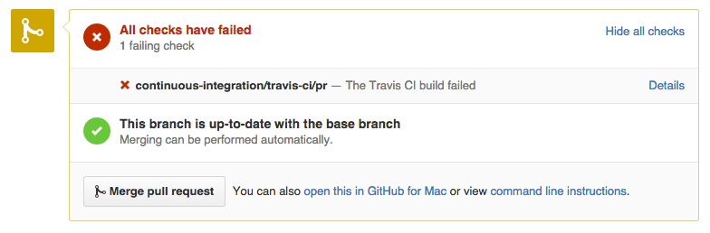
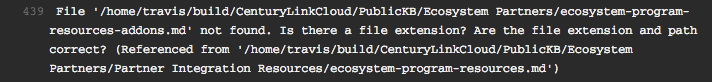
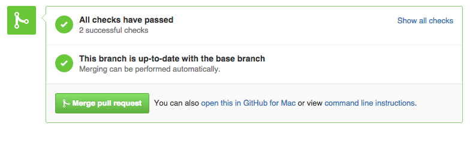

#CenturyLink Cloud Knowledge Base
========

Welcome to the [CenturyLink Cloud](http://www.ctl.io) knowledge base repository. This is the source of information on all of our products and services available today. Please follow the guidelines below to contribute or make changes.

If you are new to Git and Github, we highly recommend spending 5 minutes reading this great article on [Understanding the Github Flow](https://guides.github.com/introduction/flow/). This repo follows the Github Flow.


# Overview

The repository is organized by category, and each folder represents a category. Within each category folder are markdown (.md) files that represent an individual knowledge base article.

## How To Make Contributions

1. [Fork](https://guides.github.com/activities/forking/) the https://github.com/CenturyLinkCloud/PublicKB repository. This will produce a personal copy of this repo.

1. Then Clone the repo to your desktop.

1. **Anything in the `master` branch is always deployable.** Create a [new branch](https://github.com/blog/1377-create-and-delete-branches) from `master`. Your branch name should be descriptive (e.g., `january-release-notes`, `anti-affinity-policy-faq`) so that others have an idea of what the branch is for.

1. Once your branch has been created, make your changes (add, edit, delete) your knowledge base article in your favorite Markdown editor (we like [Atom](https://atom.io/)).

1. Commit your change(s) locally to your fork/branch.

1. Push or sync your commit(s) to the remote repository on Github.

1. Create a [pull request](https://help.github.com/articles/creating-a-pull-request) to merge your changes into the `master` branch.
  * [Create a pull request using Github for Windows](https://github.com/blog/1969-create-pull-requests-in-github-for-windows)
  * [Create a pull request using Github for Mac](https://github.com/blog/1946-create-pull-requests-with-github-for-mac)

1. This repository contains a [commit analyzer](https://github.com/CenturyLinkCloud/KB-Commit-Analyzer) that runs against each file in the repository validating that the following are true:

  * File's JSON [front-matter](#front-matter) parses correctly and contains the required fields (title, date, autor)
  * File's markdown successfully parses
  * All [links](#links-kb-article-to-kb-article) and [images](#images) are valid (doesn't return 404)

  Issuing a pull-request will automatically trigger the commit analyzer to validate any changes to the repository as part of continuous integration with [travis-ci](http://travis-ci.org). If you try to commit changes in which there are syntax errors or broken links, the build log from travis-ci will display which files contain errors, and you will receive an email notification that the build failed.

  A pull-request containing errors will look like this:
  

  Any error(s) will be displayed in the Travis-CI build log. The build log is accessible at [https://travis-ci.org/CenturyLinkCloud/PublicKB](https://travis-ci.org/CenturyLinkCloud/PublicKB) or by clicking on the "Details" link on the pull request page on Github. Here's an example of a broken link:
  

  Pushing/syncing additional commits to your fork/branch will trigger the analyzer to re-check your changes.

  A pull-request without errors will also look like this:
  

  **Content authors are responsible for making their pull requests pass the commit analyzer. Once they pass, pull requests will be merged.**

1. CenturyLink Cloud Team reviews your pull request. If accepted, it will be added to the [Knowledge Base on CenturyLinkCloud.com](http://www.ctl.io/knowledge-base).


#### Run the Commit Analyzer locally

To run this check locally, `cd` into the root of this project and run:

```shell
node lib/index.js
```

_Note that the first time you wish to run the commit analyzer, you'll have to run `npm install` from the `lib` directory. This assumes you have [Node.js](http://nodejs.org) installed._

## KB Article Format

### Front Matter


The top of each .md file contains metadata about the knowledge base article itself. It is used to list things such as author, date created, modified, keywords, title, etc. It looks like this:

```code
{{{
  "title": "ARTICLE TITLE",
  "date": "01-15-2015",
  "author": "Author Name",
  "attachments": [],
  "related-products" : [],
  "contentIsHTML": false,
  "sticky": true
}}}
```

#### `contentIsHTML`

Generally this should be set to `false`. Only when a document is written entirely in HTML syntax should this be set to true.

#### `sticky` (optional)

If you would like to pin a kb article so that it always appears at the top of it's category, set `"sticky":true`. By default, it's set to `false`.


  ### Sub-Categories

  Within the top level categories, additional tags can be assigned to articles based on the name of the articles parent folder name. Keep in mind the need for an additional level of folders when linking to images or other articles when authoring an article in a sub-category folder.

  ### Links (KB article to KB article)

  Links to articles should follow this format:

    ```
    [Link Text](../category/kb-article-name.md)
    [Link Text](../category/sub-category/kb-article-name.md)
    ```

    so like this (folder names are case-sensitive):

    ```
    [Packages Best Practices](../Blueprints/packages-best-practices.md)
    [Using SAML for Single-Sign-On](../Control Portal/using-saml-for-single-sign-on-to-the-centurylink-platform-control-portal.md )
    ```

  Links to external sites should follow this format:

    ```
    [Managed Microsoft SQL](//www.ctl.io/managed-services/ms-sql)
    ```

  ### Images

  When adding an image to an article, place the image file in the `images/` directory in the root of this repo. In the article itself, set the image source path like so:

    ```
    /* Top Level Category Article */
    ../images/[image file]

    /* Sub-Category Article */
    ../../images/[image file]
    ```

  Be sure the file name does not include any spaces.

  ### Attachments

  When adding an attachment to an article, place the file in the 'attachments/' directory at the root of this repo. In the article itself, add the file information to the front-matter data at the top of the article like so:

    ```
    "attachments": [
      {
        "file_name": "Attached File",
        "url": "../attachments/Balancing Agility Cost and Control.pdf",
        "type": "application/pdf"
      }
    ]
    ```

  `"file_name"` will be the human readable output of the file which will appear on the page

  Be sure the file name does not include any spaces.

  `"url"` needs to be set exactly like the above example, like so:

    ```
    ../attachments/[file name]
    ```

  `"type"` is simply the MIME type of the file and is used to check which sort of icon to present on the front end.

  ### Tables

  Tables in articles should follow this format:

  ```
  **Bold Text**|**Bold Text**|**Bold Text**
  -------------|-------------|-------------
  TEXT COLUMN A|TEXT COLUMN B|TEXT COLUMN C
  TEXT COLUMN A|TEXT COLUMN B|TEXT COLUMN C
  ```
