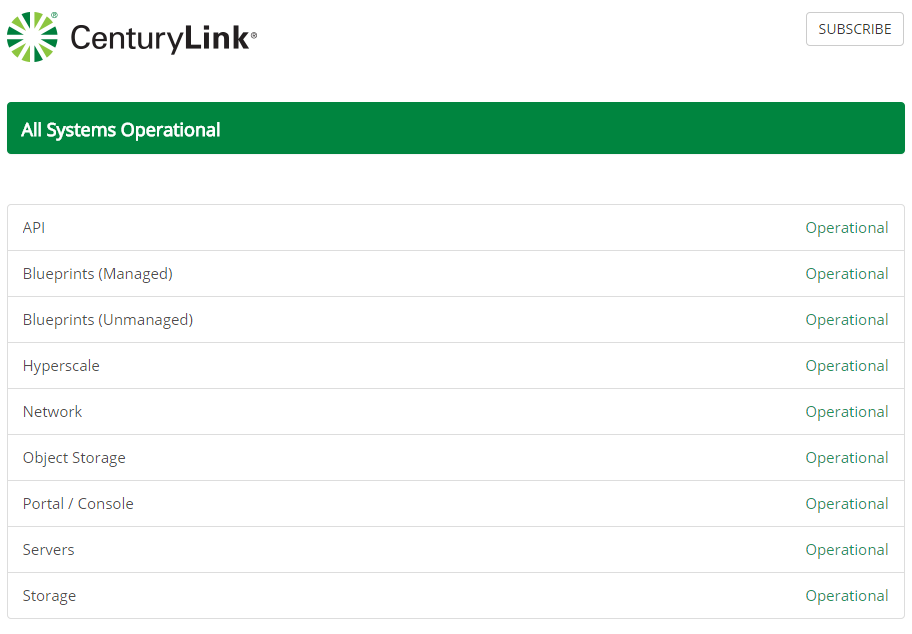

  {{{
  "title": "Cloud Platform - Release Notes: April 6, 2015",
  "date": "4-6-2015",
  "author": "Mary Cadera",
  "attachments": [],
  "contentIsHTML": false
}}}

###New Features (1)

* **Shared Load Balancer APIs.** The creation and management of load balancer pools is now available via self-service API. All the capabilities that are available for shared load balancing in the Control Portal - including create, configure, and delete - can now be done via API. Documentation can be found [here](//www.ctl.io/api-docs/v2/#shared-load-balancers).

###Minor Enhancements (6)

* **Price Decreases on selected services.** Prices have been lowered for both Managed SQL and Cloudera.

* **No charge for Managed OS services when servers are powered off.** Virtual machines with a managed OS will NOT incur hourly managed OS fees when the server is powered off. Charges will re-start after the VM is powered back on.

* **CenturyLink Cloud Status.** A new portal - [status.ctl.io](http:./status.ctl.io) - includes real-time updates on the status of CenturyLink Cloud services, and upcoming maintenance notifications. Accordingly, maintenance and outage notifications will no longer come from communications@centurylinkcloud.com; instead they will come from noc@ctl.io. More information about this service can be found [here](../General/centurylink-cloud-status-faq.md).

* **Account Service Level now retrievable by API.** *Account.ServiceLevel*, a v1 API, can now be used to retrieve an account's support level, in addition to other billing data.

* **Usage History "download CSV" button returns.** By popular demand, the button that allows a user to download a CSV file containing details of an account's usage history has been reenabled. Navigate to Account.Billing/Usage History, then select the month for which detail is desired. The "download CSV" button is back at the top of the screen!

* **Service Level Defaults to "Developer."** For all accounts created via the Activate site, the service level will be automatically set to Developer.

###Notifications (1)

* **OS Retirement.** The following operating systems have been removed from the "Create Server" experience in the Control Portal and via API: Windows Server 2003, CentOS 5 & 6 **32 bit**, Ubuntu 10, FreeBSD, and Windows Server 2008 **32-bit**. The next phase of retirement for these operating systems will be completed in 60 days. For more information about this, please, see this [Knowledge Base article](../Servers/operating-system-retirement-notice-feb-3-2015.md). What does "retirement" mean? You can get more details [here](../Servers/operating-system-template-retirement-policy.md).

###Online Tools (2)

* **Account Activation.** The "activate" experience on [activate.centurylinkcloud.com](https://activate.centurylinkcloud.com) has been enhanced with two-factor authentication and a simplified user flow.

* **Data center-specific Pricing Catalog and Cloud Price Estimator.** Region-specific pricing is now reflected in these tools. Simply select a data center using the drop-down, and prices will update automatically.

  Data Center can be selected when using the estimator:

  

  Or it can be selected when viewing the Pricing Catalog:

  

###Ecosystem: New Blueprints (5)

* [**Orchestrate**](../Ecosystem Partners/Marketplace Guides/getting-started-with-orchestrate-blueprint.md) - Online database web service designed to support modern cloud-based application development. Includes support for search, time-ordered events, geospatial or graph queries with a performant REST API. CenturyLink helps customers get started with a sample application that signs up for Orchestrate and allows customers to begin working with the Orchestrate API.

* [**XtremeData**](../Ecosystem Partners/Marketplace Guides/getting-started-with-xtremedata-dbx-blueprint.md) - High performance, full-featured ANSI SQL database engine designed for performance at scale, up to hundreds of terabytes. Simple to deploy, simple to administer, simple to scale up using CenturyLink Cloud Blueprints.

* [**Pivotal Gemfire**](../Ecosystem Partners/Marketplace Guides/getting-started-with-pivotal-gemfire-blueprint.md) - An in-memory distributed database for low-latency, high-scale custom applications. GemFire provides in-memory access for all operational data spread across hundreds of nodes with a “shared nothing” architecture.

* [**Pivotal Greenplum**](../Ecosystem Partners/Marketplace Guides/getting-started-with-pivotal-greenplum-blueprint.md) - Enterprise-grade analytical data warehouse featuring in-database compression technology. Powerful and rapid analytics on very large volumes of data. Shared-nothing architecture that automates parallel processing of data and queries.

* [**Chef**](../Ecosystem Partners/Marketplace Guides/getting-started-with-chef-server-blueprint.md) - Chef turns infrastructure into code, allowing users to automate how they build, deploy, and manage cloud-based infrastructure using the same software development practices as they use for their primary codebase. CenturyLink has integrated Chef Server in to a Blueprint that will automatically install and configure Chef Standalone Server on Red Hat Enterprise Linux.

###Open Source Contributions (4)
Selected highlights include:

* **Panamax UI v0.2.15** - Added support for Docker Private Repositories and Private Registries behind Basic Auth and Certificates of Authority. Users can now provide an absolute URL path to access images on private registries.repositories. Notification added to Registry management page for secure/insecure registry support. Wiki available [here]( https://github.com/CenturyLinkLabs/panamax-ui).

* **Dray v0.10.0** - A Docker Workflow Engine, essentially Unix pipes for Docker. [Dray](http:./dray.it) allows users to break a workflow into discrete steps, each handled by a separate container. Check out [this post](http://www.centurylinklabs.com/dray-docker-workflow-engine/) for more details or review the [project notes](https://github.com/CenturyLinkLabs/dray).

* **Kubernetes Adapter v0.2.0 and PMX-Remote-Agent-Installer v0.1.4** - The Kubernetes adapter (re-written in Go for a smaller footprint), in combination with the Panamax remote deployment capability, enables multi-container deployments to a Kubernetes cluster and includes load-balancer support. Check out [this post](http:./www.centurylinklabs.com/deploying-to-kubernetes-with-panamax/) for more details or view the [readme](https://github.com/CenturyLinkLabs/panamax-kubernetes-adapter-go).

* **Panamax API v0.3.0** - API now interacts with Fleet API v0.9.0 directly. [View the change log here](https://github.com/CenturyLinkLabs/panamax-api/blob/master/CHANGELOG.md).
