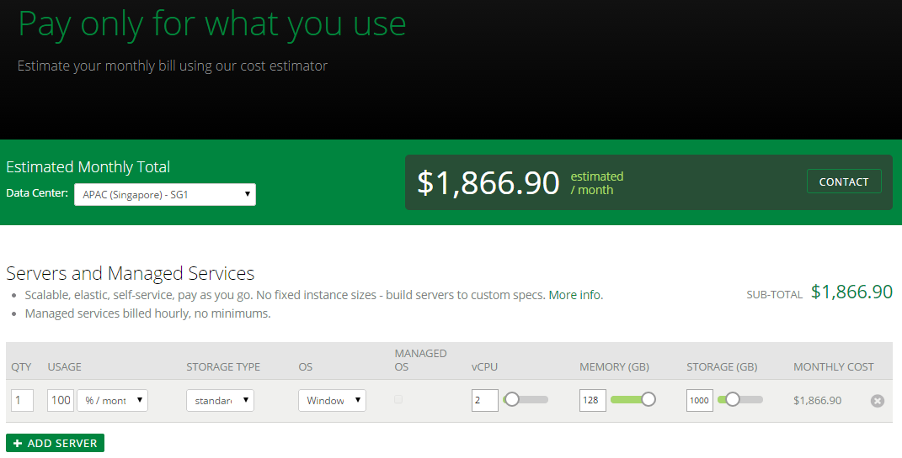
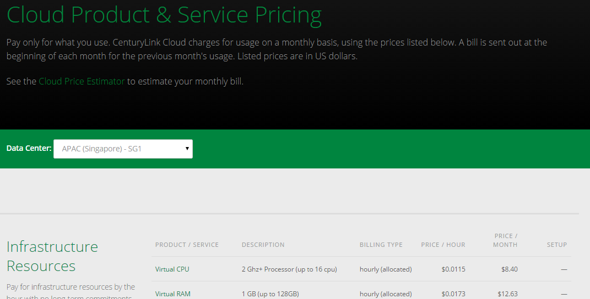

{{{ 
  "title": "Cloud Platform - Release Notes: April 6, 2015", 
  "date": "4-6-2015", 
  "author": "Mary Cadera", 
  "attachments": [], 
  "contentIsHTML": false
}}}

###New Features (1)

* **Support for Custom Price Lists & Displays.** Administrators who want to show a custom price for services in the Control Portal can now do so. Contact CenturyLink Cloud to learn more.

###Minor Enhancements (1)

* **Managed OS billing on powered off servers.** Managed OS will not be billed when a server is powered off.

###Notifications (1)

* **OS Retirement.** Full retirement of the following operating systems is complete: Windows Server 2003, CentOS 5 & 6 **32 bit**, Ubuntu 10, FreeBSD, and Windows Server 2008 **32-bit**. Users can no longer install these OS on new virtual machines. For more information about this initiative, please, see this [Knowledge Base article](../Servers/operating-system-retirement-notice-feb-3-2015.md). What does "retirement" mean? You can get more details [here](../Servers/operating-system-template-retirement-policy.md).

###Online Tools (3)

* **CenturyLink Cloud Status.** This is a portal that allows users to gain insight into the health of the cloud platform, stay in tune with service incidents, and learn about upcoming maintenance. The site address is: http://status.ctl.io (a "Status" link also appears in the footer of centurylinkcloud.com). In addition, maintenance and outage notifications will no longer come from communications@centurylinkcloud.com, instead they will come from noc@ctl.io. More information about this service can be found [here](../General/centurylink-cloud-status-faq.md).

* **Activate site.** We updated the sign up experience on centurylinkcloud.com to reduce potential fraud, simplify user flow, and make it easier to make improvements. Please note that the old activate URL is still online, but will eventually redirect to the new sign up process.

* **Data center-specific Pricing Catalog and Cloud Price Estimator.** With the rollout of the new Singapore datacenter, we’ve introduced region-specific pricing. To ensure transparency, we’ve updated our price catalog and estimator tool with a data center-specific dropdown list. Users can adjust their view to clearly see the pricing for the data center they are most interested in.

###Managed Services (1)

* **Managed Backup available in GB3.** Newly created servers in GB3 can now have data protected with the [Managed Backup Service](https://www.centurylinkcloud.com/managed-services/backup/). More details on the service are [here](../Managed Services/managed-backup-frequently-asked-questions.md).

###Ecosystem: New Blueprints (5)

* [**Orchestrate**](../Ecosystem Partners/getting-started-with-orchestrate-blueprint.md) - Online database web service designed to support modern cloud-based application development. Includes support for search, time-ordered events, geospatial or graph queries with a performant REST API. CenturyLink helps customers get started with a sample application that signs up for Orchestrate and allows customers to begin working with the Orchestrate API.

* [**XtremeData**](../Ecosystem Partners/getting-started-with-xtremedata-dbx-blueprint.md) - High performance, full-featured ANSI SQL database engine designed for performance at scale, up to hundreds of terabytes. Simple to deploy, simple to administer, simple to scale up using CenturyLink Cloud Blueprints.

* [**Pivotal Gemfire**](../Ecosystem Partners/getting-started-with-pivotal-gemfire-blueprint.md) - An in-memory distributed database for low-latency, high-scale custom applications. GemFire provides in-memory access for all operational data spread across hundreds of nodes with a “shared nothing” architecture.

* [**Pivotal Greenplum**](../Ecosystem Partners/getting-started-with-pivotal-greenplum-blueprint.md) - Enterprise-grade analytical data warehouse featuring in-database compression technology. Powerful and rapid analytics on very large volumes of data. Shared-nothing architecture that automates parallel processing of data and queries.

* [**Opscode Chef**](../Ecosystem Partners/getting-started-with-chef-server-blueprint.md) - Chef turns infrastructure into code, allowing users to automate how they build, deploy, and manage cloud-based infrastructure using the same software development practices as they use for their primary codebase. CenturyLink has integrated Chef Server in to a Blueprint that will automatically install and configure Chef Standalone Server on Red Hat Enterprise Linux.

###Open Source Contributions
Panamax enhancements from CenturyLink Labs - selected highlights include:

Full release notes from CenturyLink Labs are available [here](https://github.com/CenturyLinkLabs/panamax-ui/wiki/Release-Notes)
