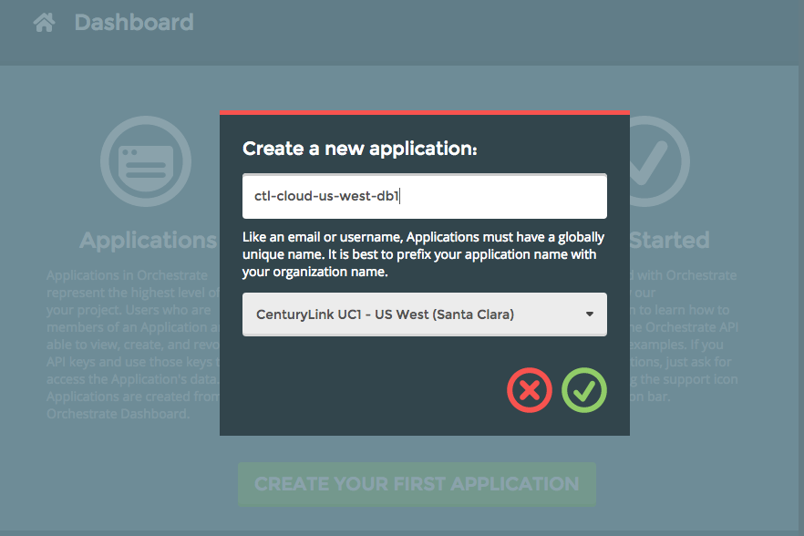
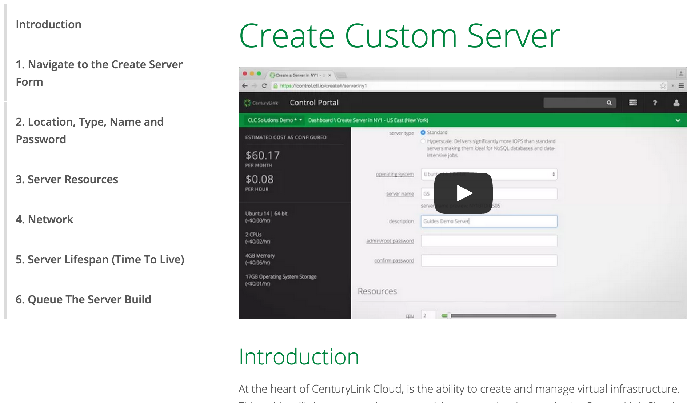

  {{{
  "title": "Cloud Platform - Release Notes: May 6, 2015",
  "date": "5-6-2015",
  "author": "Jared Ruckle",
  "attachments": [],
  "contentIsHTML": false
}}}

###New Features (3)

* **Orchestrate.io.** This new database-as-a-service offering is available in four CenturyLink Cloud datacenters: VA1, UC1, GB3, and SG1. The service supports many popular client libraries like Node.js, Java, Ruby, Go, Python, .NET, PHP, and Erlang. Orchestrate can be integrated with other CenturyLink Cloud deployments via API. Sign-up for the service at [dashboard.orchestrate.io](https://dashboard.orchestrate.io/sessions/login). For more information on the Orchestrate service, please read [this blog entry](https://www.centurylinkcloud.com/blog/post/cen]turylink-acquires-orchestrate/).

* **Network APIs.** Networking functions are now available via self-service API. Specific capabilities include:
 * Get a list of available networks
 * Get a list of IP addresses for networks
 * Update names of networks and their descriptions
 * Claim & release of networks

 Review the documentation for [APIs here](https://www.centurylinkcloud.com/api-docs/v2/).

* **AppFog v2 Limited Beta.** This new platform for creating and managing cloud-native applications is available as a Limited Beta.  Based on Cloud Foundry v2, the service makes it easier for developers to build and scale applications.  If you are interested in becoming a beta tester, please contact [the AppFog team](mailto:appfog-feedback@ctl.io).

###Minor Enhancements (3)

* **Cloud Network Services (CNS) available in NY1.** CenturyLink Cloud deployments in NY1 can now be connected to other environments using Cloud Network Services. This capability delivers private, secure, and high-speed connectivity between traditional and cloud environments.

* **Object Storage User & Management Enhancements.** Today object storage is available in one region (Canada), but multiple regions will be available in the coming months. To accommodate the forthcoming multi-region service, several changes have been made.
 * **Users are no longer tied to object storage regions.** they now exist across the management layer for this service. So the "region" drop-down has been removed from the object storage UI when creating users, and the region is no longer shown alongside users in the user list view.
 * **Buckets are now tied to regions.** When creating a new bucket, you must now specify the region that bucket belongs to. This can be done with a new drop-down menu that lists available regions.  Similarly, a new region column appears when viewing a list of your object storage buckets, displaying the region associated with a given bucket.

* **Server Scheduler Role** A new role in CenturyLink Cloud offers more flexibility for administrators. The Server Scheduler Role includes all the capabilities of the Account Viewer role, plus the ability to perform power ops as well as to create and manage schedule tasks on servers and Groups.

###Online Tools (2)

* **Microsoft SQL 2014 AlwaysOn Reference Architecture** Achieve high availability for MS SQL instances using [**these best practices**](https://www.centurylinkcloud.com/architecture/sql2014-alwayson/).

* **Getting Started Guides** A [library of tutorial videos](https://www.centurylinkcloud.com/guides/) is now online. Each short clip shows how to perform a common activity in the Platform.

###Ecosystem: New Blueprints (5)

* [**Cohesive Networks**](../Ecosystem Partners/getting-started-with-cohesiveft-vns3-partner-template.md)
* [**Saratoga Flume**](../Ecosystem Partners/getting-started-with-saratoga-data-flume-blueprint.md)
* [**MongoDB**](../Ecosystem Partners/getting-started-with-mongodb-blueprint.md)
* [**AlertLogic**](../Ecosystem Partners/getting-started-with-alert-logic-threat-manager-partner-template)
* [**DoubleTake**](../Ecosystem Partners/getting-started-with-double-take-availability-blueprint.md)

###Open Source Contributions (XX)

Selected highlights include:

* **imagelayers.io.** [ImageLayers.io](https://imagelayers.io/) is a utility that helps developers visualize Docker images and the layers that compose them.  With this open-source project, engineers can see how each command in the Dockerfile contributes to the final image, and discover which layers are shared by multiple images.  For more information, visit the [ImageLayers UI repo](https://github.com/CenturyLinkLabs/imagelayers-graph) and the [ImageLayers API repo](https://github.com/CenturyLinkLabs/imagelayers).

* **Total Cost of Ownership Tool** - Comparing clouds across providers can be difficult, due to differences in performance and the underlying capabilities of each vendor. This open source tool makes it easier to understand these subtleties and variations. complicate API now interacts with Fleet API v0.9.0 directly. [**View the repository on Github**](https://github.com/CenturyLinkCloud/EstimatorTCO).
