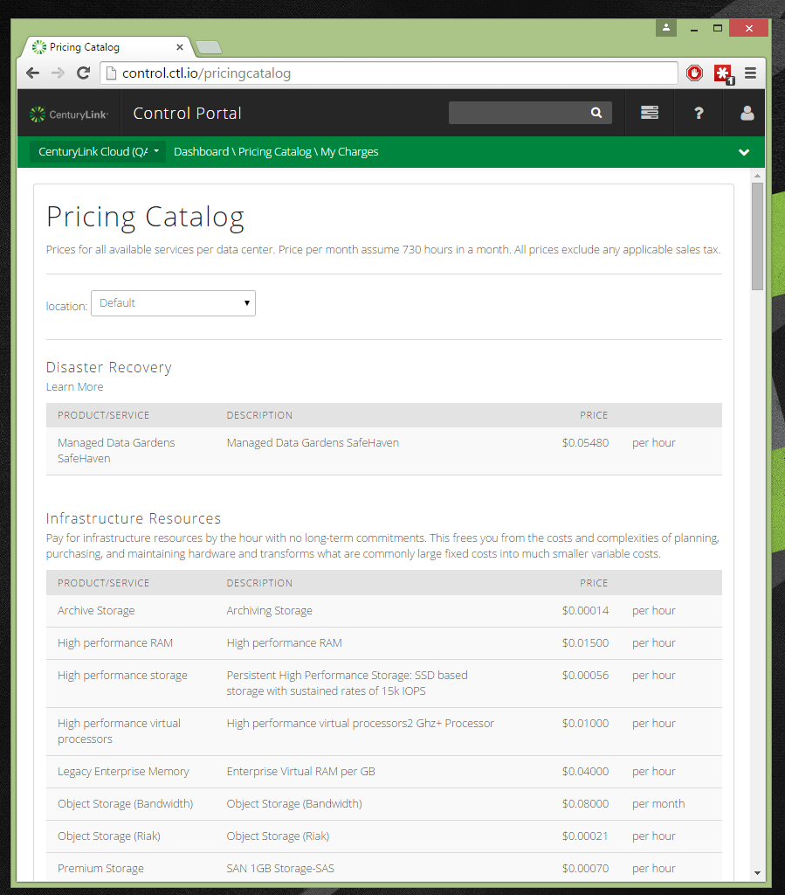

{{{
"title": "Cloud Platform - Release Notes: July 15, 2015",
"date": "7-15-2015",
"author": "Richard Seroter",
"attachments": [],
"contentIsHTML": false
}}}

###New Features (5)###

* __Bare Metal servers.__ Get the isolation and performance you need by building and managing physical machines in the CenturyLink Platform. Pay by-the-hour for modern hardware available in three different sizes with all three offering data encryption at rest. Build servers using the same UI and API available for virtual machines.  
  
As you choose the machine size (up to 20 cores and 128 GB of memory) and Operating System (options include: CentOS 6, Red Hat Enterprise Linux 6, Windows Server 2012 R2), the Control Portal gives you a cost estimate.  
  
The service is available today in Sterling, VA (VA1) and will soon be online in Slough, UK (GB3). Please see our [Product Page](//www.ctl.io/bare-metal/) for more details, and [Knowledge Base for articles](../Servers/bare-metal-faq.md) on how to use Bare Metal today.

* __AppFog v2.__ Deploy and manage web applications easier with the new, Control Portal-integrated AppFog service based on the open source Cloud Foundry (v2) project. Deploy web applications to a multiple regions and host them in a managed fabric that supports Java, Ruby, Node.js, Go, Python and PHP. Available now in the US-East and US-West region, AppFog offers a scalable runtime for cloud-native applications at only $0.04 per GB hour.  
  
Check out the [Product Page](//www.ctl.io/appfog) and [AppFog section of the Knowledge Base](//www.ctl.io/knowledge-base/appfog/#1) for everything you need to know to get started!

* __WordPress-as-a-Service (Beta).__ WordPress powers tens of millions of websites worldwide, but it can be challenging to set up and maintain yourself. CenturyLink is delivering WordPress-as-a-Service where you can rapidly create sites, map to custom domains, and store configuration information in a provided Git account. WordPress-as-a-Service is available for free in our Virginia data center during beta. Check out our [Product Page](//www.ctl.io/wordpress) and [these KB articles](../WordPress/getting-started-with-wordpress-as-a-service.md) for further details on signing up and using the service!  

* __Mobile applications for cloud management.__ Manage your CenturyLink Cloud environment on the go using the new iOS and Android application. Log into your account, view servers, change server sizes, view alerts, and more! Read [this KB article](//www.ctl.io/knowledge-base/general/mobile-app-overview-faq/) for more details.  

* __SDK for .NET and Java.__ Are you a .NET or Java developer who is integrating cloud infrastructure capabilities into your apps? Now you can use our open source [.NET SDK](//github.com/CenturyLinkCloud/clc-net-sdk) or [Java SDK](//github.com/CenturyLinkCloud/clc-java-sdk) to easily consume the CenturyLink Cloud API in a straightforward way.

### Enhancements (9)###

* __"Price sheet" user interface.__ Transparency matters. CenturyLink Cloud is a leader in price visibility, and we've extended this further by showing the per SKU costs that apply to any given account. This shows you exactly what you pay for any particular aspect of cloud. Log in and go to directly to  [https://control.ctl.io/pricingcatalog](https://control.ctl.io/pricingcatalog) to quickly review the price you pay for cloud services!  

* __SafeHaven 3.1.__ The latest version of SafeHaven &#151; the disaster recovery service from CenturyLink &#151; is available! It includes new capabilities around local cache in the production data center, supports resizing of protection groups and checkpoint groups, and a refresh of the console and administration wizards.

* __Managed backup in UK and Singapore.__ Managed backup provides you fine-grained file and folder level backup and restore capabilities in the cloud. This service has been extended to our United Kingdom (GB3) and Singapore (SG1) locations.

* __Orchestrate - Properties on graph relationships.__ Graph relationships are a powerful way to define searchable connections between entities. Now, developers can add (searchable) metadata properties to define useful characteristics about the relationship.

* __Orchestrate - Blob storage (Beta).__ It's now possible to store images or other binary content along with your Orchestrate data. Blob storage makes it simple to store large objects right next to your transactional data. This is for paying customers and available upon request.

* __Orchestrate - Integration with AppFog v2.__ The magic of Platform-as-a-Service comes alive when you can define apps with scalable app AND data tiers. AppFog developers can add Orchestrate databases to their applications through the AppFog marketplace.

* __Patch Management for Linux.__ Building upon [last month's release](2015-06-11-cloud-platform-release-notes.md) of the cloud's first patching-as-a-service offering, we've added support for patching Linux servers on demand. Choose one or more servers to yum update!  

* __Control Portal dashboard updates.__ Our team continues to update the Control Portal experience. This month, you'll see changes to the Dashboard. If you provision AppFog spaces, you will now see the space count and quota usage on the Dashboard. If you have virtual servers in the CenturyLink Cloud, the Dashboard will now only show you data centers that you're currently using.

* __Control Portal "more actions" menu on servers and groups page.__ The Control Portal is constantly evolving to complement different screen sizes. On the group and server overview pages, the actions menu now adjusts to your screen size and puts items into a "more items" menu if your screen can't fit all the icons.  

###Online Tools (1)###
* [__Cloud Dev Center.__](//www.ctl.io/developers) Developers now have a primary destination for all the info needed to build apps in the CenturyLink Cloud. Find links to developer tools, video tutorials, and a constant barrage of articles that show you how to deploy scalable, highly available apps in the cloud.

###Ecosystem: New Blueprints (5)###

* [__Cavirin.__](../Ecosystem Partners/Marketplace Guides/getting-started-with-cavirin-automated-risk-analysis-platform-partner-template.md)
Delivering continuous IT audit and operational compliance isn't easy.  Cavirin's Automated Risk Analysis platform can help, available to deploy to your CenturyLink Cloud account via Service Task.  This technology provides a visual, effective way to constantly monitor your security posture against the profile most appropriate for your organization. Cavirin’s “Big Picture” view serves as a pass-fail “report card” that grades the security of your environment and lets you share the results with customers.  Cavirin continuously checks clouds, devices, and IPs against the policies you define and alerts you to changes and violations.

* [__Liferay.__](../Ecosystem Partners/Marketplace Guides/getting-started-with-liferay-blueprint.md)
The leading open source portal technology for enterprise applications, Liferay is used to build modern workflow portals to engage with customers, partners and employees. Liferay is an all-in-one package with broad capabilities and integrations that include Microsoft Office® integration, web publishing, social networking and mashups support.  Users can spin up their own Liferay server in minutes using a CenturyLink Cloud Blueprint.

* [__Elasticsearch.__](../Ecosystem Partners/Marketplace Guides/getting-started-with-elasticsearch-blueprint.md)
Elasticsearch is a search server based on Lucene. It provides a distributed, multitenant-capable, full-text search engine with a RESTful web interface and schema-free JSON documents. Elasticsearch is developed in Java and is released as open source under the terms of the Apache License. Elasticsearch is the second most popular enterprise search engine and allows you to start small and scale horizontally as you grow. Simply add more nodes, and let the cluster automatically manage resources.  CenturyLink Cloud makes it easy to get started with ElasticSearch, simply deploy our Blueprint that will automatically install and configure your Elasticsearch server in minutes.

* [__Moodle.__](../Ecosystem Partners/Marketplace Guides/getting-started-with-moodle-blueprint.md)
Moodle (modular, object-oriented, dynamic, learning environment) is an open-source learning management system written in PHP.  It’s commonly used by higher learning and human resource organizations.  With customizable management features, it is used to create private websites with online courses for educators and trainers to achieve learning goals.  Moodle  allows for extending and tailoring learning environments using community sourced plugins.  CenturyLink has integrated Moodle in to a Blueprint for easy deployment by users.

* [__Redmine.__](../Ecosystem Partners/Marketplace Guides/getting-started-with-redmine-blueprint.md)
Redmine is an open-source, browser-based project management and issue tracking tool. It allows users to manage multiple projects and associated subprojects. It features per project wikis and forums, time tracking, and flexible role based access control. It includes a calendar and Gantt charts to aid visual representation of projects and their deadlines. Redmine integrates with various version control systems and includes a repository browser and diff viewer.  Use Redmine in minutes by creating a Redmine server using the CenturyLink Cloud Blueprint.

###Open Source Contributions (5)###

* [__Ansible Adapter for CenturyLink Cloud.__](//github.com/CenturyLinkCloud/clc-ansible-module) The CenturyLink Cloud Ansible Modules allow devops to utilize the popular provisioning tool Ansible to define and manage infrastructure resources on the CenturyLink Cloud platform. Among other capabilities, the adapter lets you pull server inventory, create policies, create and manage groups, create and manage servers, execute scripts packages against servers, and much more.

* [__Java (Spring-Data) adapter for Orchestrate.__](//github.com/CenturyLinkCloud/clc-adapter-orchestrate) The Orchestrate Adapter implements the standard Spring-Data interfaces so that using the Orchestrate adapter is exactly like using any other Spring-Data adapter.  This also allows for an easy change from the backend your project might be using now, like Mongo, to use Orchestrate by simply updating your Spring configuration. The Adapter provides the basic find, find-all, and other out of the box queries you would expect to have.  The adapter also supports the ability to define your own custom queries as needed.  We also added some additional features that can be utilized via annotations in your service implementations.  One of the most popular features we added was the ability to encrypt/decrypt data at the attribute level by simply applying the @Encrypted annotation to the variable declaration.

* [__Lorry.io__](//lorry.io/). UI improvements for ease-of-use; added compatibility for new Docker-compose 1.3 features: container affinities and constraints; added support for hash and sequence values for environment key. See wiki notes [here](//github.com/CenturyLinkLabs/lorry-ui).

* [__ImageLayers.io__](//imagelayers.io/). UI fixes; added ability to browse Docker Hub from image leaf node. Review wiki notes [here](//github.com/CenturyLinkLabs/imagelayers-graph).

* [__Panamax.io__](//panamax.io/) Deeper integration with ImageLayers.io and Lorry.io; added docker-compose.yml support: conversion API,
export PMX file as Compose YAML, copy-to-clipboard and preview functionality. Check out the release notes for the [Panamax UI v2.20](//github.com/CenturyLinkLabs/panamax-ui/) and [Panamax API v0.3.3](//github.com/CenturyLinkLabs/panamax-api/) updates.

###Bug Fixes (4)###

* __Operations that release IP address will get null reference exception.__ We've fixed a bug where some users would get an error when releasing a public IP.

* __Server details - Hyperscale - action dropdown - add public ip missing.__ Hyperscale users can now see the menu item to add public IPs to a server.

* __Roles - DNS - DNS Manager is unable to add a new DNS zone - "You do not have Blueprints/Blueprint:Deploy permission to this resource".__ The DNS Manager role can now create zones without error.

* __Monitoring metrics appear stale and autoscale events are not triggered.__ The platform was updated to improve the reliability of metric collection and customers should see improved reliability of the alerting and autoscale services!
