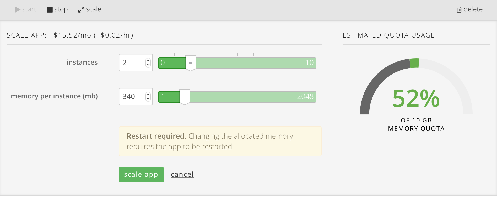
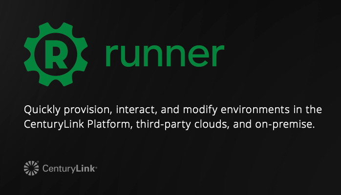
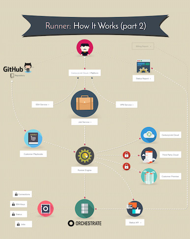

{{{
"title": "Cloud Platform - Release Notes: November 3, 2015",
"date": "11-03-2015",
"author": "Chris Sterling",
"attachments": [],
"contentIsHTML": false
}}}

### New Features (6)

* __Intrusion Prevention has been released for General Availability.__ The [Intrusion Prevention or IPS Product](https://www.ctl.io/intrusion-prevention-service/) is now available in all CenturyLink Cloud Data Centers, except for UC1.  

  The product installs the Trend Micro host-based IPS Agent to protect your host against known and unknown vulnerabilities on operating systems and over 100 applications.  The agent is automatically updated with protection against new vulnerabilities and automatically scans your host for newly installed applications every 24 hours.  Details on installing IPS and configuring your event notification destinations are available in the [Security section of our knowledge base](https://www.ctl.io/knowledge-base/security/#1).

  Highlights of the Product:
  * Installation of the Trend Micro IPS Agent, protecting against known and unknown vulnerabilities on operating systems and over 100 applications.  
  * Ability to install via blueprint to CenturyLink Cloud servers
  * Ability to send event notifications via WebHook and Email
  * Ability to send event data to a syslog server
  * Data retention of 90 days for all Event Data

* __AppFog.__ [AppFog](https://www.ctl.io/appfog/) has added capabilities available from the CLI and API into the Control Portal UI:
  
  * __Scale AppFog apps from Control__. AppFog apps can be scaled up or down from the control portal. Select the amount of memory, number of instance, and see a cost estimate for the change.
  
  

  * __Delete AppFog apps from Control.__ Easily delete defunct AppFog applications from the control portal.
  
  

  * __List all of an apps routes.__ All of an AppFog space's routes can now be displayed in the control portal.
  
  

* __Orchestrate.__ [Orchestrate](https://www.orchestrate.io/) made the following improvements:
  
  * __Cross collection search.__. Orchestrate's search can now query across collections in the same application. Simply provide a search query at the root endpoint, for example: `api.orchestrate.io/v0?query=*`.

  * __"api.orchestrate.io" now directs requests automagically to the correct data center.__ Clients no longer need to be configured to connect to the appropriate data center. The "api.orchestrate.io" is now intelligent and will route your request to your Orchestrate app.
  
### Early Adopter Program Updates (6)

* __Runner Beta Launched.__ We are beta launching Runner on 11/2 to select customers.  
  
  CenturyLink is excited to announce the upcoming launch of Runner, a product that enables teams, developers, and engineers to quickly provision, interact, and modify their environment in not only the CenturyLink Platform, but third-party clouds, as well as on-premise. Runner brings together state-based and massive parallel job execution, with multi-cloud and multi-data center execution. All within one powerful engine.

  

  Our goal was to make automation easy and accessible to everyone. From the most advanced users to those new to the Cloud, Runner makes it easy to create jobs and execute them regardless of your environment or provider. It’s never been easier. Automation made simple.

  

  * __Runner Job Service.__ The Job Service is the primary component of the Runner product.  Users can create, modify, and execute jobs at anytime.  The Job Service accepts a payload the references a playbook to be used, whether that is using a public GitHub repository or private (GitHub credentials required), as well as other information like login or bearer token, environments, etc.
  
  * __Runner SSH Service.__ The SSH Service allows for Key Pair management within CenturyLink Cloud.  Users can create, retrieve, deploy, and import Key Pairs, as well a remove or "undeploy."  The SSH Service is a valuable standalone service as well, as is not directly tied to the Job Service (but is only accessible via Runner end points).
  
  * __Runner VPN Service.__ The VPN Service allows users to create connection definitions to be used in parallel with jobs.  The VPN Service allows for the Job Service to access remote hosts and establish connections during job execution.
  
  * __Runner Status Service.__ The Status Service allows for users to retrieve the status of jobs they have executed.  This status will return the information of the latest update.  For completed jobs, this will return the entire history. The statuses are accessible via webhooks for real-time status reporting and updating.
  
  * __Runner Scheduling Service.__ The Schedule Service allows for users to schedule jobs, as well as run any endpoint, using cron expressions. The service accepts URLS and endpoints, so the service is not tightly coupled with job service, but does integrate seamlessly. The Service also allows for schedule modification, which includes discontinuing (deleting).

* __MySQL Beta Configurable Database Subscriptions.__ DBaaS customers provisioning through our UI can now select the specific amount of CPU, RAM and Storage to fit their needs rather than being limited to pre-defined plans.  

  *Note: AppFog users will continue to select pre-defined plans through the AppFog Add-On Engine marketplace.*

### Enhancements (5)

* __Object Storage - Performance Enhancements & New Pricing.__ The object storage service in Canada now offers improved performance and reliability, while continuing to provide the familiar S3 interface. Existing customers will automatically receive these new capabilities. More details are available on the [Object Storage product page](https://www.ctl.io/object-storage/), including new pricing, and the [knowledge base](https://www.ctl.io/knowledge-base/object-storage).

* __Added Year to Activity History.__ The Cloud Control Portal now shows the year for each event in Activity History.

* __Additional Server Group APIs.__ The following Cloud Server Group APIs have been added to our public API documentation:

  * __Server Group Horizontal Autoscale Policy__. Retrieve and set the details of a horizontal autoscale policy associated with a group. 
    - https://www.ctl.io/api-docs/v2/#groups-get-group-horizontal-autoscale-policy
    - https://www.ctl.io/api-docs/v2/#groups-set-group-horizontal-autoscale-policy

  * __Server Group Scheduled Activities.__ Gets the scheduled activities associated with a group.
    - https://www.ctl.io/api-docs/v2/#groups-get-group-scheduled-activities
  
  * __Server Group Defaults.__ Sets the default settings to be used when building servers in a group.
    - https://www.ctl.io/api-docs/v2/#groups-set-group-defaults

### Ecosystem (TODO)

### Open Source Contributions

* __CLC-Ansible Cloud Module clc_server_snapshot.__ Ansible module for managing server snapshots in CenturyLink Cloud - (http://docs.ansible.com/ansible/clc_server_snapshot_module.html)

* __CLC-Ansible Cloud Module: clc_alert_policy.__ Ansible module to manage alert policies in CenturyLink Cloud - (http://docs.ansible.com/ansible/clc_alert_policy_module.html)

* __CLC-Ansible Cloud Module: clc_aa_policy.__ Ansible module to manage anti affinity policies in CenturyLink cloud -  (http://docs.ansible.com/ansible/clc_aa_policy_module.html)

### Announcements

* __Retirement of IPMonitor Service.__ IPMonitor is a legacy tool used to monitor legacy Tier 3 managed servers. This service will be shut down on December 1, 2015 and servers will no longer be monitored with this service.

  Customers should consider using the built-in CPU/memory/storage monitoring available in Platform (https://www.ctl.io/knowledge-base/network/monitors-that-are-supported/).

  Additional options include managed servers (https://www.ctl.io/knowledge-base/managed-services/managed-operating-system-frequently-asked-questions/) or any number of our powerful ecosystem options (https://www.ctl.io/knowledge-base/ecosystem-partners/ecosystem-partner-list/#management-and-monitoring).

### Selected Bug Fixes (TODO)

* __CLC-Ansible Cloud Module Fixes and Enhancements.__ Bug fixes and minor enhancements: 
  - Added RETURN doc string for all modules
  - Fixed few typos
  - Fixed a bug with clc_group module to return the right group dict
  - Added the capability to create/update/delete bare metal servers with clc_server module
