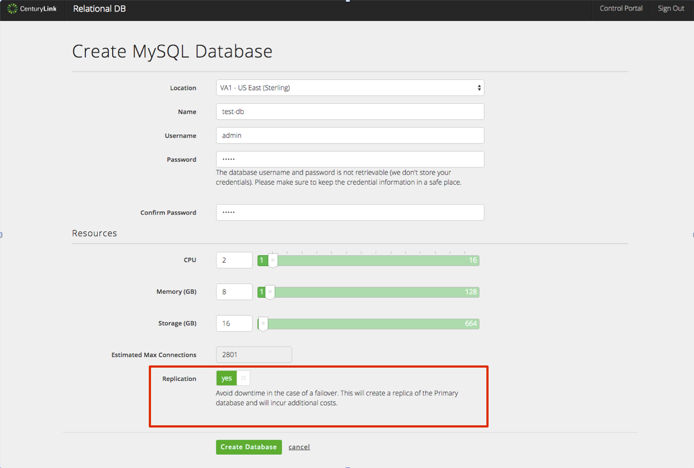

{{{
"title": "Cloud Platform - Release Notes: November 24, 2015",
"date": "11-24-2015",
"author": "Mary Cadera",
"attachments": [],
"contentIsHTML": false
}}}

### New Features (1)

* __Placeholder.__ blah blah blah.  
 

### Early Adopter Program Updates (1)

* __MySQL DBaaS.__ The MySQL-compatible Database-as-a-Service is currently in beta and is available to select customers.   

  * __In datacenter replication.__ Coming November 30th, customers can enjoy a more highly available solution by choosing to replicate their database instance within datacenter with logic that ensures the primary and replica instances do not share the same host or storage infrastructure.
  
  
  * __New UI.__ Starting November 30th, customers will notice a change in the look, feel, and functionality of the MySQL DBaaS user interface. The UI will be more consistent with the CenturyLink Cloud Control Portal. __Relational DB__ will now be a menu option within the green navigation bar, and Database Instances can be created and monitored in a single window.
  
  

### Enhancements (2)

* __Intrusion Prevention/IPS.__ Installation of the [Intrusion Prevention or IPS Product](https://www.ctl.io/intrusion-prevention-service/) can be done via blueprint.  Details on the installation process and other [information on Intrusion Prevention](https://www.ctl.io/knowledge-base/security/#1) can be found in the Security section of our knowledge base.

  * __Now Available in UC1.__ The Intrusion Prevention or IPS Product is now available in all CenturyLink Cloud Data Centers, including UC1.

  * __Intrusion Prevention API Documentation Released.__ [Details for utilizing the API for the Intrusion Prevention or IPS Product](https://www.ctl.io/knowledge-base/security/ips-api/) has been released.

* __SafeHaven__. We created SafeHaven for CenturyLink Cloud to protect your enterprise data and production systems. We're releasing two enhancements this cycle:

  * __Cluster Installer Integration with SafeHaven Console.__ 

  * __Disk Mapping Structure Updates.__ This change prevents a VM from freezing when a new disk is mapped.

* __Bare Metal Support for Execute Package.__ Packages can now be executed on Bare Metal servers using the [Execute Package](https://www.ctl.io/knowledge-base/servers/using-group-tasks-to-install-software-and-run-scripts-on-groups/) action available at the server group level.
  
### Ecosystem (3)

* __Placeholder 1__ blah blah blah
* __Placeholder 2__ blah blah blah

### Announcements (1)

* __Removal of "Under Construction" Server Policy__ Awaiting copy from Mr. Jared Ruckle

### Selected Bug Fixes (1)

* __Placeholder__ blah blah blah
