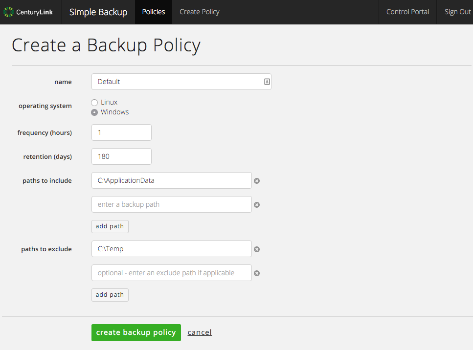
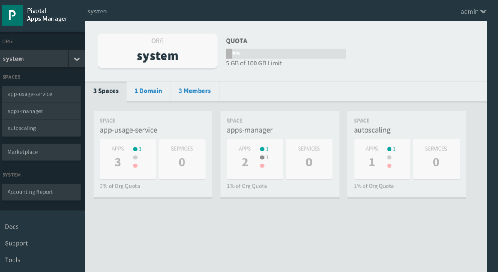

{{{
"title": "Cloud Platform - Release Notes: December 15, 2015",
"date": "12-15-2015",
"author": "Jared Ruckle",
"attachments": [],
"contentIsHTML": false
}}}

### New Features (2)

* __Object Storage - Now Available in US East Region.__ CenturyLink Cloud's object storage service is now available in US East. Like the recently improved Canadian offering, object storage in US East will provide the same high availability and redundancy over the familiar S3 interface. More details are available on the [object storage product page](https://www.ctl.io/object-storage/), including pricing, and the [knowledge base](https://www.ctl.io/knowledge-base/object-storage).

* __Orchestrate.io - Randomized Sorting.__ Now, equally scored results can show up in different orders. By adding `sort=_random` to the URL query string, the search results will now have an equal chance at being displayed first. Users can choose to randomize sort within an existing search query, i.e. randomize the results of searching for "last name Twain, first name Mark" `sort=value.last_name,value.first_name,_random`. Also, users have the option to randomize results with a predictable seed (by setting `sort=_random:somevalue`), and any subsequent calls to the same seed will result in the same random ordering.

### Early Adopter Program Updates (4)

* __NEW - Simple Backup Service available as Beta.__ This new self-service product offers protection for your data with file-level backups hosted in secure object storage. Control every aspect of your backups - including retention period, frequency of backup, and location - with policies you create and manage. The service is now in beta and is available to select customers. To request an invitation to the beta program, [visit the product page](https://www.ctl.io/simple-backup-service/) or send an email to [help@ctl.io](mailto:help@ctl.io). Note that this service will replace [the Standard and Premium storage services in Q1 2016](https://www.ctl.io/knowledge-base/support/backup-service-changes-faq/).

* __NEW - Managed Pivotal Cloud Foundry available as Beta.__ Many enterprises are building cloud native applications with Cloud Foundry. With this [new managed service](https://www.ctl.io/managed-services/pivotal-cloud-foundry/), the experts at CenturyLink will administer and maintain important elements of Cloud Foundry clusters running on CenturyLink Cloud. To request an invitation to the beta program, send an email to [help@ctl.io](mailto:help@ctl.io).

* __NEW - Load Balancer as a Service available as Beta.__ This new shared load balancer service expands the features available to [our current production service](https://www.ctl.io/load-balancing/). New capabilities include TCP load balancing, support for load balancing on any port, and configurable health checks. The beta is available via API only. To request an invitation to the beta program, send an email to [help@ctl.io](mailto:help@ctl.io) or visit the product page.

* __MySQL DBaaS] Notification Subscription.__ Beta users can now select to receive email notifications when CPU or Storage exceed defined thresholds. This can be done at the time of provisioning; notifications can also be added or changed from within the details page your subscription.

### Enhancements (1)

* __Private routing of traffic between servers using public IPs provided by CenturyLink Cloud .__ Traffic between servers using public IPs provided by CenturyLink Cloud are now routed over our private MPLS network between CenturyLink Cloud Data Centers. This approach offers increased performance and reliability as well as lower cost, compared to using the public Internet.

### Ecosystem (4)

* __Mesosphere:__ Coming from Ecosystem [provisioned via blueprint on the CenturyLink platform today.](https://www.ctl.io/knowledge-base/ecosystem-partners/marketplace-guides/getting-started-with-mesosphere/)

* __Ruxit:__ Coming from Ecosystem [get started with Heirloom via single-click blueprint](https://www.ctl.io/knowledge-base/ecosystem-partners/marketplace-guides/getting-started-with-ruxit/), reducing their costly dependency on mainframe skill-sets.

* __FortyCloud:__ Coming from Ecosystem [Get started with the TFS blueprint today](https://www.ctl.io/knowledge-base/ecosystem-partners/marketplace-guides/getting-started-with-fortycloud/).

* __aiScaler:__ Coming from Ecosystem [Get started with the TFS blueprint today](https://www.ctl.io/knowledge-base/ecosystem-partners/marketplace-guides/getting-started-with-aiscaler/).
