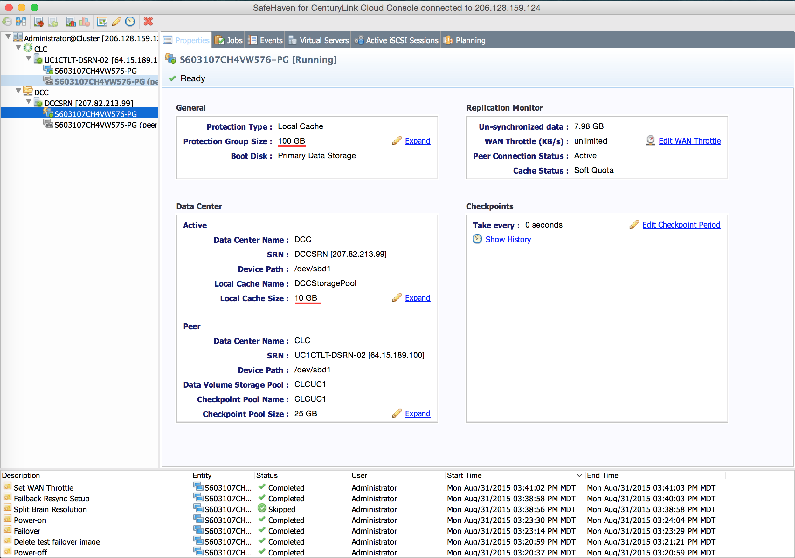

{{{
"title": "Cloud Platform - Release Notes: September 1, 2015",
"date": "9-1-2015",
"author": "Chris Sterling",
"attachments": [],
"contentIsHTML": false
}}}

### New Features (4)

* __SafeHaven Cloud Disaster Recovery.__ Our [Lumen Cloud Disaster Recovery product SafeHaven](https://www.ctl.io/disaster-recovery/) now supports the following:

    + __Local Protection Group Cache__ Added the ability for production sites to add a small cache and finish the sync of protection groups.
    + __Resize the checkpoint pool size__ Now able to resize the checkpoint pool size.
    + __Add/Remove Server__ Now can add and remove Servers from existing Protection Group.
    + __Automation__ Added automation of LRA (Local Replication Agent) and makestub.

    

* __Intrusion Prevention: Limited Beta.__ The Intrusion Prevention Beta has launched. Participants will be able to install instances of host-based Intrusion Prevention on their RHEL 5/6 (64 bit) or Window 2008/2012 (64-bit) virtual machines during the beta program. Our Intrusion Prevention will monitor and use data on the incoming and outgoing server traffic of your host to detect and block known vulnerabilities. For more information, visit our [product page on the Lumen Cloud website](https://www.ctl.io/intrusion-prevention-service/).

* __MySQL-compatible Database-as-a-Service: Limited Beta.__ The MySQL-compatible database-as-a-service Beta has launched. Participants can access an active 1vCPU/1GB MySQL instance with the click of a button. Each free beta subscription includes up to 100MB of storage and up to 100 concurrent connections. We offer the option to secure the connection using a provided self-signed certificate and will maintain daily backups held locally for 7 days. For more information and to sign up, visit our [product page on the Lumen Cloud website](https://www.ctl.io/dbaas/).

* __WordPress Limited Beta Updates.__ The WordPress Beta is continuing to evolve based on program participant feedback and production environment learnings. There have been a few updates noteworthy to discuss here:

    + __New default URLs for WordPress sites__ Newly created WordPress sites are now given the default domain of <customer site>.<region>.wordpress.ctl.io.  This replaces the former AppFog-based domain name. PHPMyAdmin URLs for newly created sites are now given the default domain of <customer site>-phpmyadmin.wordpress.ctl.io and are secured with HTTPS.
    + __Upgraded to WordPress 4.3 "Billie"__ WordPress 4.3 was released on August 18th. All new WordPress sites in the Beta program will include version 4.3.
    + __Servers upgraded to Nginx 1.9__ WordPress web servers have been upgraded to Nginx version 1.9. Additionally, the Vagrant server for local development has also been upgraded to Nginx version 1.9 to ensure Development and Production parity.

### Enhancements (6)

* __SafeHaven.__ Along with new capabilities listed above, additional enhancements include:
    + Improved rsync script for Linux protection
    + Support protection of servers with multiple GPT (GUID Partition Table) disks
    + Solved the zero sync issue after reboot

* __OS Template Updates.__ The following templates were updated with the latest vendor recommended patches. These enhancements add functions and make servers less susceptible to security vulnerabilities. The updates are live for the following operating systems:
    + RHEL 6
    + Ubuntu 12
    + Ubuntu 14
    + Windows 2012 R2
    + Windows 2012 DC

* __New Naming Convention for Automated OS Patching.__ The automated patching names have been updated so that they are more intuitive. The new Blueprint names are:
    + Auto Patching for RHEL and CentOS
    + Auto Patching for Windows 2012

    

* __Managed Hadoop.__ Minor changes have been made to improve the reliability of Managed Hadoop builds.

* __Managed Backup.__ The service has been extended to our CA3 data center.

* __Cloud Platform.__ The Lumen Cloud platform is releasing with some updates including:

    + __Drive Extensions Now Prohibited When A Snapshots Exists__ Control Portal no longer allows extending a drive when there is an existing snapshot.
    + __Set Your Own Price: Edit Price Adjustments__ Users with System Billing Manager privileges (or above) can now edit a price adjustment that has been added to the Control Portal.

    

### Ecosystem: New Blueprints (5)

* __[Commvault](../../Ecosystem Partners/Marketplace Guides/getting-started-with-commvault-storage-blueprint.md)__ Commvault has integrated their enterprise backup technology software, Simpana, with the Lumen Cloud. In addition to installing the software, the Lumen Cloud Blueprint deployment include Commvault configuration best practices.  If you need to address the business challenges of data growth, data protection, end user protection or need a file-level backup solution that uses de-dupe technology, check out Commvault.  The Blueprints make it easy to deploy to your environment.

* __[Lagrange CloudMaestro](https://www.lagrangesystems.com)__ CloudMaestro is an Application Delivery Controller delivered with a Softe-as-a-Service control plane for exceptional performance and availability in cloud infrastructure.  Deploying the CloudMaestro Agent Blueprint on your existing server in the Lumen cloud enables CloudMaestro to monitor, alert, replace and scale your application in response to traffic or unforeseen downtime.

* __[Waratek](../../Ecosystem Partners/Marketplace Guides/getting-started-with-waratek-appsecurity.md)__ Defense-in-depth is important.  Waratek's AppSecurity provides a secure Java execution environment that traps attempts to hack applications using techniques such as SQL injection and buffer overflows at the Java Virtual Machine (JVM) level.  AppSecurity for Java from Waratek protects applications from sophisticated attacks without having to install network devices or make code changes. AppSecurity can be added to your environment in minutes using a Lumen Cloud blueprint.

* __[Avni](../../Ecosystem Partners/Marketplace Guides/getting-started-with-avni-software-defined-cloud-partner-template.md)__ Avni offers a compelling Software Defined Cloud management framework to automate the deployment of applications and network services to private, public or hybrid clouds. Avni easily orchestrates new or existing multi-tier applications, gathers metrics from application and network services, derives intelligent insights, and takes proactive actions to ensure availability, performance, and application/network SLA based on policy. Companies in retail, financial services and media industries rely on Avni’s platform to bring new services to market quickly.

### Open Source Contributions (2)

* __[Watchtower](https://labs.ctl.io/watchtower-automatic-updates-for-docker-containers/)__ Lumen Labs launched Watchtower, a pull-based deployment service. Watchtower automatically updates running Docker containers when the underlying images change. Integrates with Docker tooling (Compose, Swarm). See [wiki notes](https://github.com/CenturyLinkLabs/watchtower) for more information.

* __[Zodiac](https://github.com/CenturyLinkLabs/zodiac/)__ Released v0.3.0 providing Docker Compose 1.4 compatibility. Check out the [release notes](https://github.com/CenturyLinkLabs/zodiac/releases/tag/0.3.0).

### Selected Bug Fixes (5)

* __Blueprint that builds server then adds public IP address can fail__ We fixed an issue where the asynchronous nature of Blueprint server builds occasionally caused the addition of a public IP address to fail.

* __Delete all Account Servers does not delete 'Queued For Delete Servers'__ The delete all Account Servers did not check the queue for delete servers; it now does, and deletes the pending builds.

* __Blueprint: Snapshots for Hyperscale Servers should not succeed__  Requesting a snapshot of a Hypserscale server is no longer permitted.

* __Installing Open VPN on Mac instruction is pointing to a really old version of Tunnelblick__ Updated instructions on using Tunnelblick for OpenVPN on Mac are now listed in the Control Portal.

* __Sidebar hides tool tips__ Sidebar tool tips are no longer hidden behind other UI elements.
