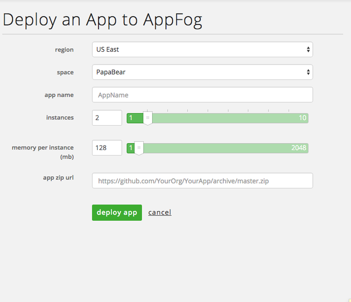
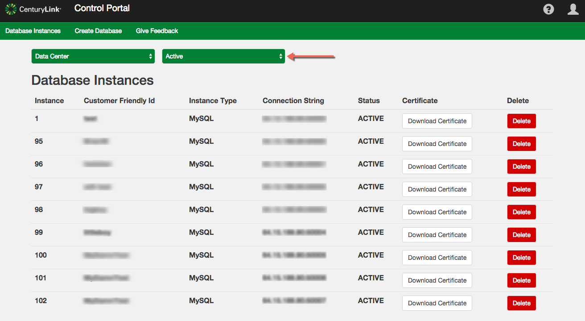

{{{
"title": "Cloud Platform - Release Notes: September 22, 2015",
"date": "9-22-2015",
"author": "Jared Ruckle",
"attachments": [],
"contentIsHTML": false
}}}

### New Features (1)

* __AppFog - New "Push App" page.__ [AppFog](https://www.ctl.io/appfog/) now offers a single page UI for the deployment of applications. Users can pick their region, space, app name, and specify the number of instances (as well as the memory per instance), all from a _single_ page. Just supply a url (e.g. Github, https://github.com/CenturyLinkCloud/af-nodejs-jumpstart), and the application will deploy in seconds.

    

### Enhancements (9)

* __Cloud Platform.__ The Lumen Cloud platform updates include:
  * __Subaccounts in the Service Catalog__. Administrators now have the ability to toggle permissions for showing and hiding sub-accounts using the Lumen Cloud Service Catalog.
  * __Reboot Message Upon Storage Removal.__ Users that remove a storage volume from a cloud server will now see a "reboot required" message.
  * __Set Your Own Price: Default Price Sheet.__ Users with System Billing Manager privileges (or above) can now create a "default" price sheet that can then be inherited by all sub-accounts.

* __Windows 2008 R2 OS Template Updates.__ The following templates were updated with the latest vendor recommended patches. These enhancements add functions and make servers less susceptible to security vulnerabilities. The updates are live for both Windows 2008 R2 Standard and Windows 2008 R2 DataCenter.

* __New Blueprint - Cloudera (Unmanaged).__ Cloudera Express can now be deployed via Blueprints. This version is unmanaged, and designed for users interested proof of concept deployments.

* __Bare Metal.__ Administrative passwords for bare metal servers can now be updated from the Control Portal.

* __Managed MySQL Version Upgrade.__ The Managed MySQL version on Lumen Cloud has been updated to version 5.6.24.

* __SafeHaven.__ Stability enhancements were introduced:
    * The Storage Backing Device (SBD) now re-sends relevant metadata to the remote location during the Protection Group (PG) creation. This also improves the reliability of of ROW-COW PG creation.
    * Stability has improved when connecting to iSCSI targets, as well as when adding iSCSI database items during the on-boarding of Ubuntu 12.

### Early Adopter Program Updates (3)

* __MySQL Limited Beta__. This service has several new features available, including:
  * __Additional Instance Sizes__. Beta users can now select from four sizes: micro, small, medium, and large. The sizes range from 1 CPU / 1 GB RAM / 1 GB storage all the way to 4 CPU / 16 GB RAM / 256 GB storage.
  * __Backup location & encryption__. The daily backups that are part of the service are now de-coupled from their original VMs, and encrypted.
  * __New default URL for sites.__ Newly created MySQL DBaaS sites are now given the default domain of `[customer-specified-db].datacenter.dbaas.ctl.io`.
  * __New filters.__ The listing of your DB instances now allows you to filter based on status, specifically `active` and `terminated`.

  

  For more information and to sign up for the beta, visit our [product page on the Lumen Cloud website](https://www.ctl.io/dbaas/).

* __WordPress Limited Beta.__ The WordPress Beta is continuing to evolve based on program participant feedback and production environment learnings. A few of the recent enhancements:
    + __Integration with Lumen Cloud object storage buckets.__ Users can now link Lumen Cloud object storage buckets to a WordPress site during site creation. This helps with persistent storage of image uploads, and other media files.
    + __SMTP Email Support.__ Each new WordPress site now has SMTP email configured automatically to assist with administrative emails such as password resets, new accounts, and other emails sent from WordPress.

  For more information and to sign up for the beta, visit our [product page on the Lumen Cloud website](https://www.ctl.io/wordpress/).

* __Intrusion Prevention Limited Beta.__ The Intrusion Prevention Beta service now supports additional Windows versions. Customers can now use IPS on the following Windows operating systems:
  * Microsoft Windows Server 2008 Standard R2 (64-bit)
  * Microsoft Windows Server 2008 Enterprise (64-bit)
  * Microsoft Windows Server 2008 Enterprise R2 (64-bit)
  * Microsoft Windows Server 2012 Datacenter (64-bit)
  * Microsoft Windows Server 2008 Datacenter R2 (64-bit)
  * Microsoft Windows Server 2012 Datacenter (64-bit)
  * Microsoft Windows Server 2012 Datacenter R2 (64-bit)

  For more information and to sign up for the beta, visit our [product page on the Lumen Cloud website](https://www.ctl.io/intrusion-prevention-service/).

### Online Tools (1)

* __Customers can now choose their "home" datacenter during free trials & online sign-up.__ New customers [signing up via the web](http://www.ctl.io/free-trial/) can now choose one of several public cloud sites as their "home" location. Previously, each new account was assigned the VA1 location by default.

### Selected Bug Fixes (3)

* __Deleting a Site-to-Site VPN with an identical subnet configuration__...no longer deletes all Site-to-Site VPNs with the shared subnet configuration.

* __Adding Storage Volumes when Building Servers__...would in rare cases fail due to resource limits being incorrectly enforced. That no longer happens.

* __Associating anti-affinity policies with when creating hyperscale servers__...will now work more reliably.
